# Slay the Spire 2 — ５人女性化 MOD

Ironclad / Silent / Regent / Necrobinder / Defectを、人の顔・髪・表情を持つ女性キャラクターへ翻案するMODです。

**v0.2の対象範囲の実機QAと0.2.0のローカル導入を完了（2026-10-09）。** 選択画面はMiniMax-H3 / 768Pの５本の動画、戦闘・商人・休憩は場面専用の15姿勢とGodotの所作を使います。対象は所有Windows版 **v0.107.1 / 59260271**。

**[導入・有効化・更新・削除の手順 →](docs/usage/installation.md)**　このPCでは配置済みです。手順書の「ゲーム内で有効にする」から進めます。

[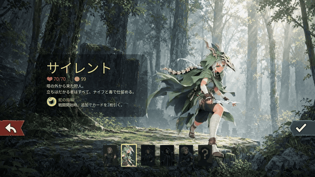](docs/validation/media/motion-v02-runtime/select-silent-candidate01.mp4)

**Silentの選択画面 — 実ゲーム、QA candidate01、2026-10-09撮影。** 約10.04秒・無音。[MP4（1280×720）](docs/validation/media/motion-v02-runtime/select-silent-candidate01.mp4) / [撮影版・時刻と変換の記録](docs/validation/media/motion-v02-runtime/README.md#実録の時間と変換)。先頭GIFは640×360・約2.80MB、約5fpsのプレビューです。元の収録時刻を保ち、形式による最大5msの丸めを記録しています。

## ５人の選択画面 — 実機画像と録画

以下は同じ **v0.2 QA candidate01** の実ゲームviewportです。画像は原寸PNGへ、MP4は各約10秒の実録へリンクします。選択動画のloop・人物の二重表示なし・情報パネルの余白をQA担当が確認済みです。[v0.2実機QA](https://github.com/Motoki0705/slay_the_spire_2_mods/blob/19ed278fb58ff1807b7e01e3f6c496133f17a0c9/docs/validation/motion-v02.md)。

| キャラ | 実機画像 → 原寸PNG | 動き |
| --- | --- | --- |
| Ironclad / アイアンクラッド |  | [無音MP4](docs/validation/media/motion-v02-runtime/select-ironclad-candidate01.mp4) · 炎を抑え、視線を上げる |
| Silent / サイレント |  | [無音MP4](docs/validation/media/motion-v02-runtime/select-silent-candidate01.mp4) · 気配へ反応し、短剣を構え直す |
| Regent / リージェント |  | [無音MP4](docs/validation/media/motion-v02-runtime/select-regent-candidate01.mp4) · 指図する手と顔、玉座の重心 |
| Necrobinder / ネクロバインダー |  | [無音MP4](docs/validation/media/motion-v02-runtime/select-necrobinder-candidate01.mp4) · 掌へ魔力を集め、収める |
| Defect / ディフェクト |  | [無音MP4](docs/validation/media/motion-v02-runtime/select-defect-candidate01.mp4) · 腕と工具の手元を確かめる |

## 場面で変わる姿勢と所作 — 実ゲーム

戦闘は敵への構え、商人は商品や相手への関心、休憩は座位で力を抜く姿に分けました。以下は **v0.2、2026-10-09撮影** の実機比較です。JPEGは人物周辺の切り出しで、クリックすると全viewportの原寸PNGを開きます。Regentの休憩は旧影を修正した**candidate02**、他はcandidate01です。差分はRegentの休憩rigだけで、他の全pack資源のhash一致を根拠に実録を引き継いでいます。[撮影版と流用の範囲](docs/validation/media/motion-v02-runtime/README.md)。

| キャラ | 戦闘 | 商人 | 休憩 |
| --- | --- | --- | --- |
| Ironclad | [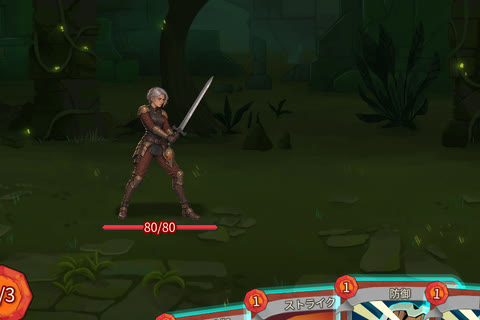](docs/validation/media/motion-v02-runtime/combat-ironclad-candidate01.png) · [死亡・復帰の描画試験MP4](docs/validation/media/motion-v02-runtime/combat-ironclad-candidate01.mp4) | [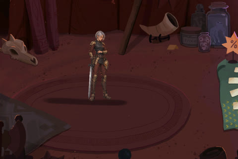](docs/validation/media/motion-v02-runtime/merchant-ironclad-candidate01.png) · [所作MP4](docs/validation/media/motion-v02-runtime/merchant-ironclad-candidate01.mp4) | [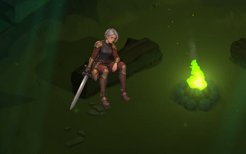](docs/validation/media/motion-v02-runtime/rest-ironclad-candidate01.png) · [所作MP4](docs/validation/media/motion-v02-runtime/rest-ironclad-candidate01.mp4) |
| Silent | [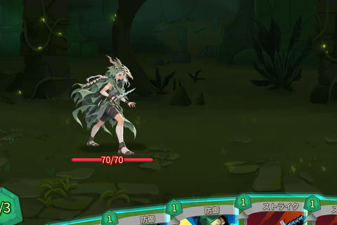](docs/validation/media/motion-v02-runtime/combat-silent-candidate01.png) | [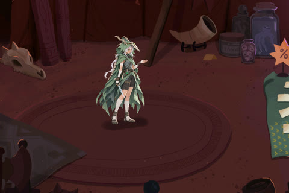](docs/validation/media/motion-v02-runtime/merchant-silent-candidate01.png) · [所作MP4](docs/validation/media/motion-v02-runtime/merchant-silent-candidate01.mp4) | [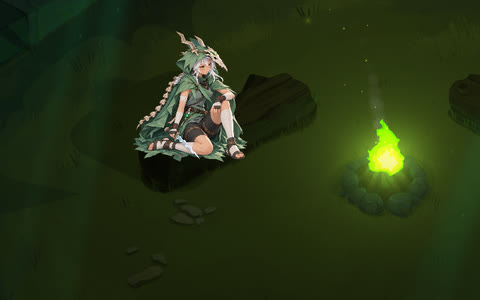](docs/validation/media/motion-v02-runtime/rest-silent-candidate01.png) · [所作MP4](docs/validation/media/motion-v02-runtime/rest-silent-candidate01.mp4) |
| Regent | [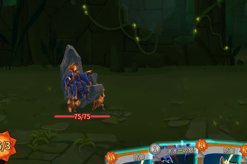](docs/validation/media/motion-v02-runtime/combat-regent-candidate01.png) | [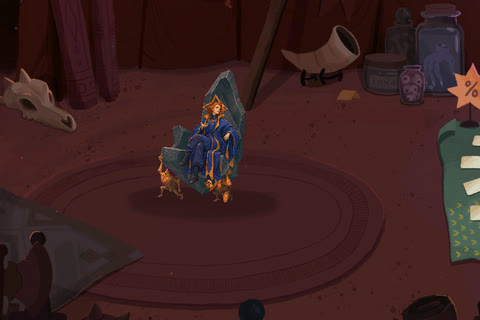](docs/validation/media/motion-v02-runtime/merchant-regent-candidate01.png) · [所作MP4](docs/validation/media/motion-v02-runtime/merchant-regent-candidate01.mp4) | [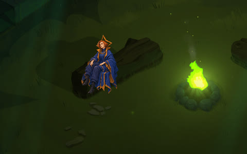](docs/validation/media/motion-v02-runtime/rest-regent-candidate02.png) · [所作MP4](docs/validation/media/motion-v02-runtime/rest-regent-candidate02.mp4) |
| Necrobinder | [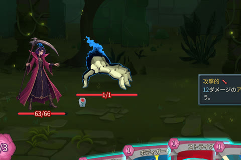](docs/validation/media/motion-v02-runtime/combat-necrobinder-candidate01.png) · [待機MP4](docs/validation/media/motion-v02-runtime/combat-necrobinder-candidate01.mp4) | [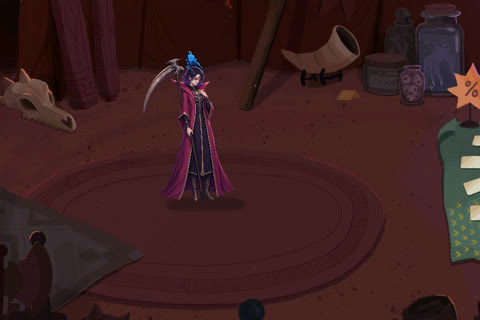](docs/validation/media/motion-v02-runtime/merchant-necrobinder-candidate01.png) · [所作MP4](docs/validation/media/motion-v02-runtime/merchant-necrobinder-candidate01.mp4) | [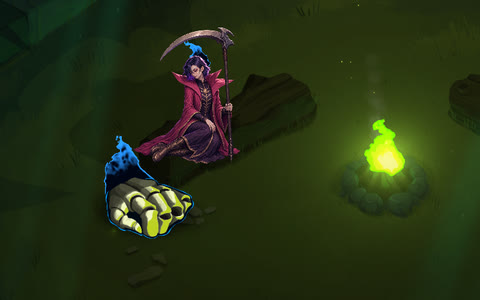](docs/validation/media/motion-v02-runtime/rest-necrobinder-candidate01.png) · [所作MP4](docs/validation/media/motion-v02-runtime/rest-necrobinder-candidate01.mp4) |
| Defect | [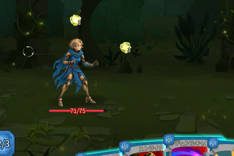](docs/validation/media/motion-v02-runtime/combat-defect-candidate01.png) | [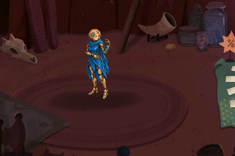](docs/validation/media/motion-v02-runtime/merchant-defect-candidate01.png) · [所作MP4](docs/validation/media/motion-v02-runtime/merchant-defect-candidate01.mp4) | [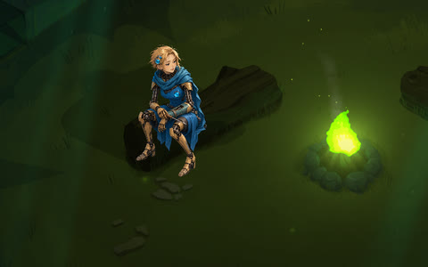](docs/validation/media/motion-v02-runtime/rest-defect-candidate01.png) · [所作MP4](docs/validation/media/motion-v02-runtime/rest-defect-candidate01.mp4) |

QA用に部屋・代表カード・エネルギーを準備した画面です。商人・休憩は全５人の所作MP4、戦闘の動画はIroncladの死亡・復帰の描画試験（HPを変えない試験）と、Necrobinderの待機姿勢です。代表カードの確認範囲は下の表を参照してください。休憩はAct 1で確認し、全Actの通しプレイ・座席構成は未確認です。[撮影版・時刻・確認範囲](docs/validation/media/motion-v02-runtime/README.md)。

制作の補足は [５人の姿勢比較（制作画像）](docs/validation/media/contextual-v02/README.md) と [15場面の所作（通常Godotの実演）](tests/assets/contextual-evidence/README.md)。選択動画の元素材は [H3生成プレビュー](docs/validation/media/motion-v02-runtime/generated/README.md)。これらは実ゲームの録画と区別しています。

Silent v05は**基準デザインのユーザー承認済み**。他４人のv02、新15姿勢とH3動画は**委任に基づく制作採用**です。今回の画像や動作へ個別のユーザー承認を拡張しません。[デザイン画と承認範囲](docs/design/characters/review-gallery.md)。

## どこまで確認したか

Windows v0.107.1 / 59260271の**隔離コピー・Compatibility renderer**で、QA用の部屋と手札を使って確認しました。５人共通で選択動画の再生・loop・切替・退出・再入場、reduced motion／disabled／動画欠損からの復帰を確認。Regentの７星座も実入力で反応しました。

| キャラ | 戦闘の代表確認 | 商人・休憩 |
| --- | --- | --- |
| Ironclad | Strike / Demon Form、攻撃・詠唱、長剣の形 | 所作・支持点・座位を確認 |
| Silent | Strike / Deadly Poison / Shiv、攻撃・詠唱、短剣の形 | 商品を見る手、膝を立てた座位を確認 |
| Regent | Strike / Venerate / Sovereign Blade、独立した剣の攻撃 | 玉座と別姿勢、candidate02で休憩の旧影を除去 |
| Necrobinder | Strike / Bodyguard / Unleash、独立OstyのHP・攻撃、頭の炎・鎌VFX | 新姿勢・座位・炎とOstyを確認 |
| Defect | Strike / Zap / Dualcast、Orbの増減・解放、通常の敵攻撃による被弾 | 品物を見る手、工具を扱う座位を確認 |

他４人の被弾はQA用のconsole damage、Ironclad/Necrobinderの死亡・復活は描画だけの試験です。v0.2の通常死亡から結果画面、実際の協力復活を確認したとは扱いません。

**0.2.0はゲーム終了後に所有installerで導入し、receiptと実ファイルhashの一致を確認済み。導入先の元ディレクトリからの起動は未確認です。** 元プロフィール400ファイルを今回あらためて採取し、導入後も追加・削除・サイズ/hash変更なし、原ゲームの４pinも一致しています。[実機QAと納品記録](https://github.com/Motoki0705/slay_the_spire_2_mods/blob/19ed278fb58ff1807b7e01e3f6c496133f17a0c9/docs/validation/motion-v02.md) / [媒体索引](docs/validation/media/motion-v02-runtime/README.md)。

全カード・全速度・Act通し・別renderer/他MOD・厳密な性能は [#46](https://github.com/Motoki0705/slay_the_spire_2_mods/issues/46)、協力プレイ・再接続・実死亡後の復帰は [#45](https://github.com/Motoki0705/slay_the_spire_2_mods/issues/45) に残ります。Compatibilityのparticle非対応警告と終了時の資源解放ログも未切り分けです。

## 導入・設定・制作の入口

**設定 → 一般 → MOD設定 → Pop Spire Womenを有効化 → 再起動。** [画像付きの専用導入ガイド](docs/usage/installation.md)に、このPCでの有効化、別PCでの生成・配置、更新・設定変更・削除をまとめています。上は対象版の分離した検証環境で撮影した操作画面です。

画像と動画は同梱済みで、遊ぶためのAPIキーや動画生成契約は不要です。別PCでは公開sourceから所有ゲームに合わせて生成します。最新版・別ビルドへの対応は未確認です。

対象版ではMODを有効にするとバニラとは別の進行領域を使い、元の進行・解放・統計は自動では引き継がれません。ゲーム内のMOD管理で**全MODを無効化して再起動**するとバニラ側へ戻ります。外観の設定をオフにするだけでは保存先は戻りません。混在した協力プレイの実動作は未確認です。

| 確認したいこと | 入口 |
| --- | --- |
| 撮影版・日時・確認範囲・変換・媒体hash | [v0.2媒体索引](docs/validation/media/motion-v02-runtime/README.md) |
| 生成動画・制作姿勢・単独rigの補足 | [H3生成プレビュー](docs/validation/media/motion-v02-runtime/generated/README.md) / [姿勢比較](docs/validation/media/contextual-v02/README.md) / [Godot実演](tests/assets/contextual-evidence/README.md) |
| ５人の基準デザインと旧案 | [レビューギャラリー](docs/design/characters/review-gallery.md) |
| 開発・依存関係・残課題 | [開発案内](docs/development/README.md) / [Issue地図](docs/development/issue-map.md) |
| 資料全体と制作工程 | [文書案内](docs/README.md) / [自律完成工程](docs/development/autonomous-delivery.md) |
| 設定と視覚資料の根拠 | [キャラ・世界観の調査](docs/research/characters/README.md) / [参照資料](art/references/README.md) |

開発のPCK-only方針やSpine Editorを使わない制作方法は [PCKの生成・導入・削除](docs/development/pck-only.md) と [AGENTS.md](AGENTS.md) を参照。文書や資料を拡張する際は [docsの拡張方針](docs/README.md#拡張を判断する考え方) と [参照資料の拡張方針](art/references/README.md#拡張を判断する考え方) を使います。

## v0.1の履歴

[旧実機画像・Silentの約６秒GIF/MP4・修正前後](docs/validation/media/progress-2026-10-09/README.md) / [v0.1の実機QA・最終候補05](docs/validation/runtime-v01.md)。2026-10-09の旧候補02〜05の記録です。H3や新15姿勢を使うv0.2の挙動の証拠には流用していません。
