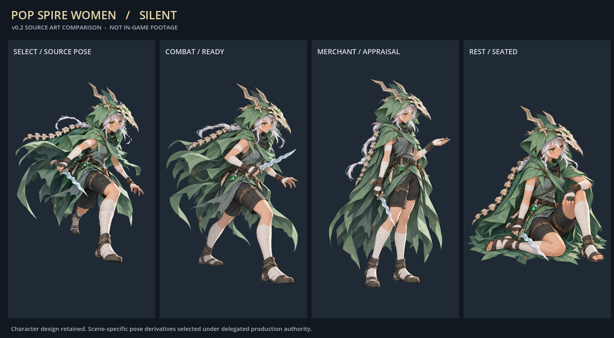
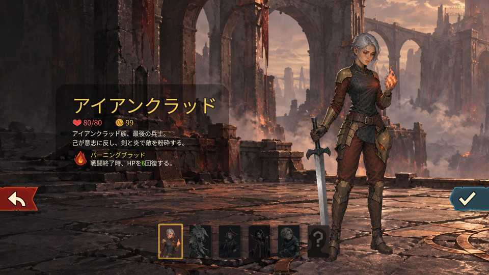
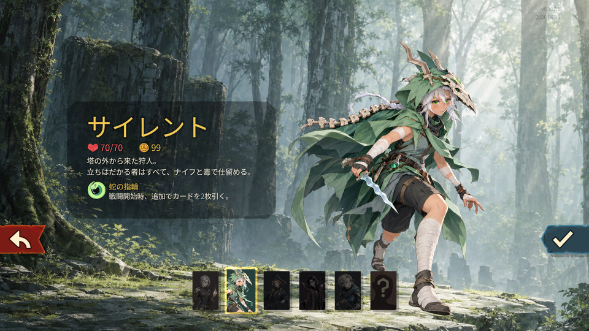
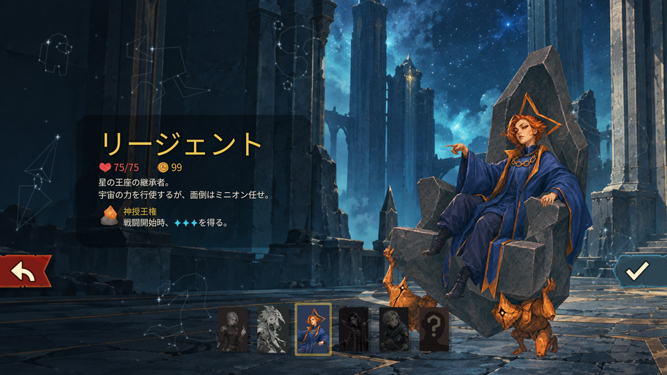
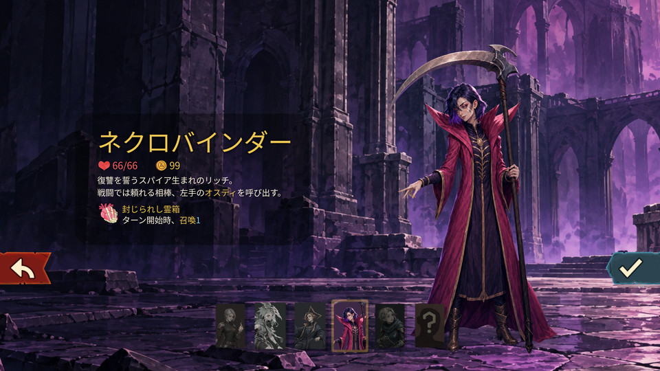
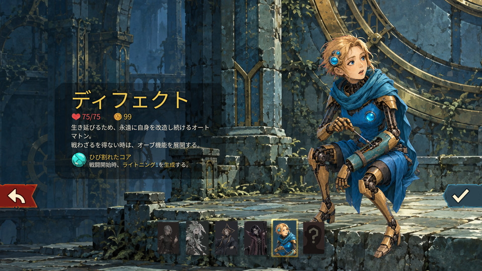
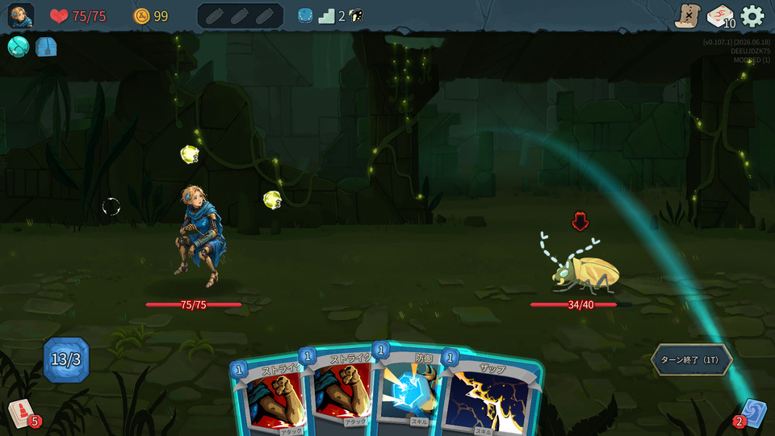
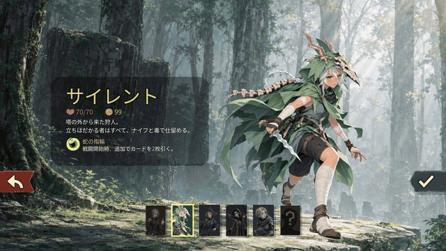
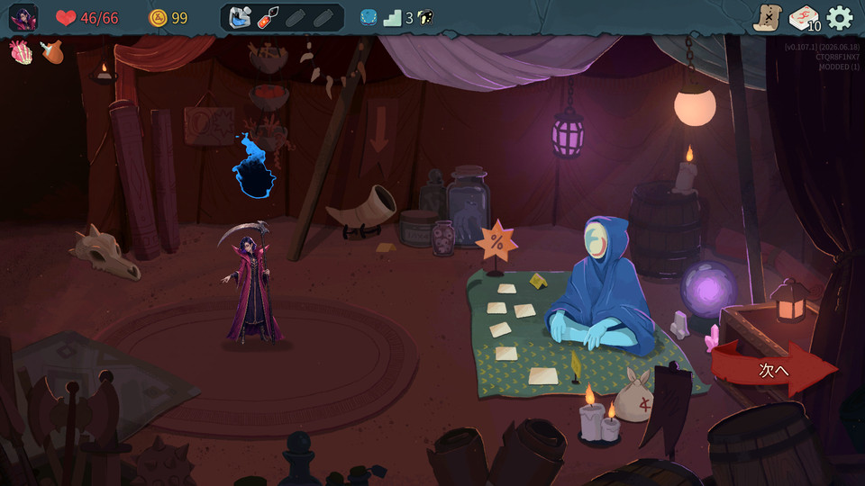
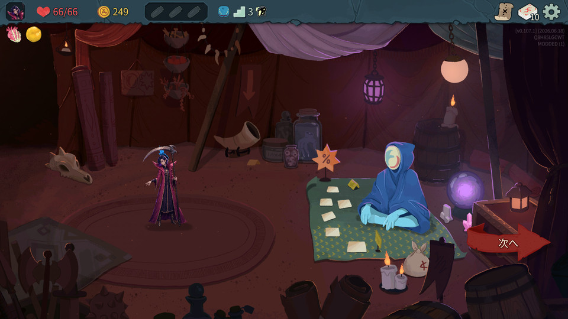

# Slay the Spire 2 — 全キャラ女性化 MOD

プレイアブル５人を、人の顔・髪・表情を持つ女性キャラクターへ翻案するMODです。

**v0.1の実装・ローカル導入を完了（2026-10-09、対象版限定）。** ５人の選択画面と、代表カードの操作・商人・休憩の表示を確認しています。最終版は候補05。操作の確認範囲と残る未確認項目を以下にまとめます。

**次版の制作中:** [場面別モーションとMiniMax H3 / 768Pの選択動画（#48）](https://github.com/Motoki0705/slay_the_spire_2_mods/issues/48)。選択・戦闘・商人・休憩で姿勢と演技を分けます。従来の実機画像・録画はv0.1の記録として下に保持しています。

新しい戦闘・商人・休憩用の姿勢15点を制作しました。[５人の場面別比較](docs/validation/media/contextual-v02/README.md)。これは制作素材の比較で、動作とゲーム内表示の確認は進行中です。H3の選択動画も制作中です。

## ５人の現在の外観 — 実ゲーム

所有Windows版 **v0.107.1 / 59260271**、2026-10-09撮影。選択画面５枚は **production-candidate-04**、右下のDefectの戦闘は **candidate03** です。クリックで原寸PNGを開きます。

| Ironclad / アイアンクラッド | Silent / サイレント |
| --- | --- |
| [][ironclad-full] | [][silent-full] |
| **Regent / リージェント** | **Necrobinder / ネクロバインダー** |
| [][regent-full] | [][necrobinder-full] |
| **Defect / ディフェクト** | **Defectの戦闘（検証用）** |
| [][defect-full] | [][defect-combat-full] |

戦闘画像はカード確認用にエナジーを補充した場面です。[撮影版・媒体索引](docs/validation/media/progress-2026-10-09/README.md) / [デザイン画・過去版の比較](docs/design/characters/review-gallery.md)。

Silent v0.5は**基準デザインのユーザー承認済み**。他４人のv02と実装用の派生素材は、委任に基づく制作採用です。選択画面や動作まで個別にユーザー承認された、という意味ではありません。

## 動きを見る — 実機録画

**Silentの選択画面・candidate04、2026-10-09撮影、約６秒・無音。** [MP4を開く（1280×720）](docs/validation/media/progress-2026-10-09/silent-selection-candidate04.mp4) / [収録間隔と変換の記録](docs/validation/media/progress-2026-10-09/README.md#silentの選択画面の実録)。GIFは640×360・0.81MBの軽量プレビューです。この映像で確認できるのは選択画面の待機動作です。

## どこまで確認したか

選択画面と上の録画は候補04。操作確認は候補02/03の記録を基にし、候補04でIroncladの刀身・休憩サイズ、候補05でNecrobinderの炎の高さを再確認しています。候補05の変更は炎の高さのみで、選択画面の５人の外観は同じです。

「確認」は記載した場面・操作を実機で確かめた範囲です。全カード・全イベント・全ゲーム速度の検証完了を意味しません。「未確認」は実プレイの確認が残っている項目です。

| キャラ | 選択画面 | 戦闘で確かめたこと | 商人・休憩 |
| --- | --- | --- | --- |
| Ironclad | 表示確認 | Strike、Demon Form、被ダメージ、死亡回避。候補04で刀身の形を再確認 | 表示確認。候補04で休憩サイズを再確認 |
| Silent | 表示確認 | Strike、毒、Shiv、被ダメージ、通常戦闘での死亡～結果画面 | 商人確認。休憩の表示・位置・大きさを修正して確認 |
| Regent | 表示・[７星座の操作確認](docs/validation/media/progress-2026-10-09/README.md#regentの７星座の入力確認) | Strike、Venerate、Sovereign Blade、被ダメージ | 表示確認 |
| Necrobinder | 表示確認 | 攻撃、Bodyguard、Unleash、被ダメージ、Ostyの攻撃・HP | 候補05で炎の位置・高さを再確認 |
| Defect | 表示確認 | Strike、Zap、Dualcast、オーブ数 | 表示確認 |

保存再開はIroncladの戦闘・SilentのNeowで確認。他の保存場面や協力プレイでの再開は未確認です。Defectの通常被弾、協力プレイ、実際の協力プレイ中の復活、最終的な負荷測定も未確認です。単独の死亡・復活の動作試験を、協力プレイの確認済みとは扱いません。[休憩姿・刀身の実機画像](docs/validation/media/progress-2026-10-09/README.md#戦闘戦闘外の表示)。

[実機QAの記録](docs/validation/runtime-v01.md) に検証結果と納品物の範囲をまとめています。残る確認は [協力プレイ #45](https://github.com/Motoki0705/slay_the_spire_2_mods/issues/45) と [通しプレイ・描画・性能等 #46](https://github.com/Motoki0705/slay_the_spire_2_mods/issues/46) で追跡します。

## 修正箇所を比較する

| Necrobinderの商人 — 修正前（候補03） | Necrobinderの商人 — 高さの修正後（候補05） |
| --- | --- |
| [][necro-merchant-full] | [][necro-merchant-after-full] |
| 青い炎が頭から離れて高い位置に残っていました。 | 候補05で戦闘・商人・休憩の炎を髪のすぐ上へ調整し、実機で目視確認しました。[Issue #42](https://github.com/Motoki0705/slay_the_spire_2_mods/issues/42)。 |

Silentの休憩姿の大きさ・位置も修正し、実機確認した修正を最終版へ収録しました。[休憩の実機画像](docs/validation/media/progress-2026-10-09/silent-rest-candidate03.png) / [Issue #40](https://github.com/Motoki0705/slay_the_spire_2_mods/issues/40)。

## 導入・制作の入口

導入方法は [MODの利用手順](mod/README.md) と [PCKの生成・導入・削除](docs/development/pck-only.md) を参照してください。公開用の自作素材から、所有ゲームに合わせてローカルで生成します。対応を確認している版は **v0.107.1 / 59260271** です。

この版ではMODを有効にするとバニラとは別の進行領域を使い、元の進行・解放・統計は自動では引き継がれません。ゲーム内のMOD管理で**全MODを無効化して再起動**するとバニラ側へ戻ります。外観の設定をオフにするだけでは保存先は戻りません。混在マルチプレイの実動作は未確認です。

| 確認したいこと | 入口 |
| --- | --- |
| 現在の実機画像・撮影版・変換・hash | [媒体索引](docs/validation/media/progress-2026-10-09/README.md) |
| ５人のデザイン画、承認範囲、旧案 | [レビューギャラリー](docs/design/characters/review-gallery.md) / [キャラクター方針](docs/design/characters/review-v03.md) |
| 素材の来歴と動きの作り方 | [制作素材](docs/design/characters/production-assets.md) / [完成までの工程](docs/development/autonomous-delivery.md) |
| 開発・依存関係・未完了の作業 | [開発案内](docs/development/README.md) / [Issue地図](docs/development/issue-map.md) |
| 設定と視覚資料の根拠 | [キャラ・世界観の調査](docs/research/characters/README.md) / [参照資料](art/references/README.md) |
| 文書全体と過去の実装・制作方針 | [ドキュメント案内](docs/README.md) |

Spine Professional・動画生成AI・追加DLLを使わず、Godot側で動きを表現しています。制作・開発ルールは [AGENTS.md](AGENTS.md)。基準コミット以後の変更はIssue・worktree・PRで管理します。

文書や資料を拡張する際は、[docsの拡張方針](docs/README.md#拡張を判断する考え方) と [参照資料の拡張方針](art/references/README.md#拡張を判断する考え方) を参照してください。

[ironclad-full]: docs/validation/media/progress-2026-10-09/select-ironclad-candidate04.png
[silent-full]: docs/validation/media/progress-2026-10-09/select-silent-candidate04.png
[regent-full]: docs/validation/media/progress-2026-10-09/select-regent-candidate04.png
[necrobinder-full]: docs/validation/media/progress-2026-10-09/select-necrobinder-candidate04.png
[defect-full]: docs/validation/media/progress-2026-10-09/select-defect-candidate04.png
[defect-combat-full]: docs/validation/media/progress-2026-10-09/defect-combat-two-orbs-candidate03.png
[necro-merchant-full]: docs/validation/media/progress-2026-10-09/necrobinder-merchant-before-fix-candidate03.png
[necro-merchant-after-full]: docs/validation/media/progress-2026-10-09/necrobinder-merchant-final-candidate05.png
