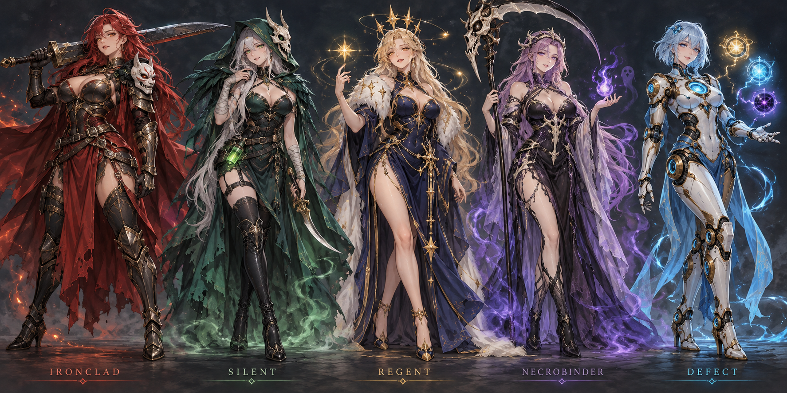

# 全キャラ女性化 MOD — キャラクター方針 v0.1

状態: **不採用・旧案。** ユーザーから「性的な表現が過剰」「元キャラの特徴に忠実に」と修正指示を受けた。現行案は [v0.2](rejected-v02.md)。この画像やプロンプトを次の生成の参照に使わない。

左からアイアンクラッド、サイレント、リージェント、ネクロバインダー、ディフェクト。
組み込み `image_gen` で生成。[使用プロンプト](../../../../art/prompts/lineup-v01.txt)。

## 確定した要件

- Slay the Spire 2 のプレイアブル全５キャラを先に制作する。
- 全キャラを女性化して統一する。
- 参照 MOD のように魅力的な表現を重視する。
- キャラ選択画面のアニメーションは、見入ってしまうようなものにする。
- キャラの方針が決まった時点でユーザーがレビューする。承認・修正を受けてから正式な素材とアニメーションを制作する。

参照: [KaguyaSilentRavenSkin](https://steamcommunity.com/sharedfiles/filedetails/?id=3786286239)

## 共通の提案

全員を明確に成人の女性として描く。繊細なアニメ調の線と、暗いファンタジーの陰影を合わせる。美しい顔立ち、表情、身体のラインを活かす衣装、肌・金属・布の質感の違いを魅力の軸にする。露出感は参照を目安にしつつ、５人を同じ体型や同じ衣装にはしない。

元キャラの配色、装備、象徴を一目で分かる形で残す。顔は隠しすぎず、目元を主役にする。戦闘画面の小さい表示でも識別できる輪郭を優先する。

今回の画像は外見の方向性を比べるコンセプトボード。ゲーム投入用の立ち絵・パーツ分け・実装済みアニメーションではない。

## ５人の提案

| キャラ | 顔立ち・雰囲気 | 外見・衣装・象徴 | 選択時の見せ場 |
| --- | --- | --- | --- |
| アイアンクラッド | 精悍な美人。余裕のある挑戦的な笑み。引き締まった体格 | 長い深紅の髪、琥珀の瞳。黒鉄と赤銅の身体に沿う鎧、深紅のマント、大剣。悪魔の面を肩の装飾に残す | 大剣を肩に収めてこちらに視線を向ける。口元がわずかに笑い、剣の亀裂から火の粉が立つ |
| サイレント | 妖艶で静かな暗殺者。鋭い目元と小さな微笑み | 白銀の長髪、翡翠の瞳。深緑のフード、骨の仮面を側頭部に掛ける。肩を見せる黒と緑のコルセット、非対称の裾、短剣と毒瓶 | 横目でこちらを見て、短剣を指先で返す。髪とマントが遅れて揺れ、薄い毒霧がほどける |
| リージェント | 気品と遊び心のある女王。華やかな笑み | 淡い金髪、金色の瞳。浮遊する王冠、夜空色と金のドレス、白いファー、星を模した装飾。足元に星屑 | 指先の小さな星を回し、ウインク。王冠と星の軌道がずれながら巡り、衣装の星模様が順に輝く |
| ネクロバインダー | 神秘的で艶のある死霊術師。落ち着いた柔らかい視線 | 薄紫の長髪、淡い肌、紫の瞳。骨のティアラ、黒紫と象牙色のドレス、長い薄布、鎌。骨と霊気で元の個性を残す | 指を上げると魂の灯が集まり、微笑んで解き放つ。薄布が浮き、背後に骨の手の影が一瞬現れる |
| ディフェクト | 透明感のある人型オートマトン。端正な顔と、ふと見せる親しみのある笑み | 青白いボブ、シアンの瞳。青・白・真鍮の曲線的な装甲、胸元の発光コア、関節の金属意匠。雷・氷・闇のオーブ | 目に光が灯り、こちらに顔を向けて小さく微笑む。３種のオーブが異なる速度で巡り、指先に小さな放電 |

## アニメーションの提案

- **選択直後（約1.5〜2.5秒）**: それぞれの見せ場を１回だけ再生し、自然に待機へつなぐ。
- **待機中**: 呼吸、瞬き、わずかな視線移動。髪・布・装飾は別々の周期で動かす。足元は落ち着かせ、顔と手に視線が集まるようにする。
- **長く眺めたとき**: 約10〜18秒おきに、表情や手元の小さな仕草を変える。毎回同じ間隔で反復しない。
- **画面の奥行き**: 背景・キャラ・前景エフェクトを分け、控えめな視差を付ける。ゲーム内の文字や操作領域の読みやすさを保つ。

この段階では動作設計のみ。静止画からアニメーションの品質やゲーム内互換性を保証しない。承認後にパーツ分けと短い動作サンプルで確認する。

## レビューしてほしい点

1. 各キャラの顔立ち、髪型、性格の方向性。
2. 衣装の華やかさ・露出感と、元キャラらしさのバランス。
3. 特に変更したいキャラと、選択時に見たい仕草。

返答例: 「全体OK。サイレントはもう少し参照寄り、ディフェクトは長髪に」

## 次の制作段階

レビュー反映 → 正式な立ち絵 → アニメ用パーツ制作 → 選択画面の動作サンプル → ゲーム内の見た目差し替え → 実機検証。

戦闘・休憩・商人の見た目にも同じキャラデザインを適用する方針。敵・ボス・NPCの女性化は今回の対象に含めない。
