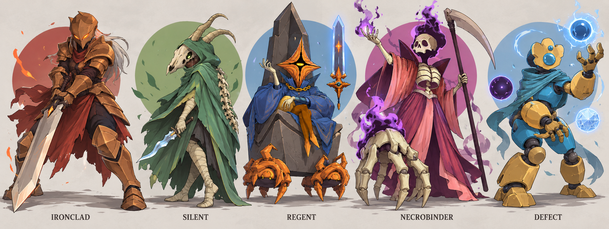

# 全キャラ女性化 MOD — キャラクター方針 v0.2

状態: **不採用・旧案。** 原型からの変化が少なく、女性化・擬人化が足りないとユーザーから指摘された。現行方針は [v0.3](../review-v03.md)。

組み込み `image_gen` で制作した比較用のコンセプトボード。[生成指示](../../../../art/prompts/lineup-v02.txt) / [入力資料と生成物の記録](../../../../art/concepts/lineup-v02.provenance.json)。

元の身体構造と輪郭を強く残した案。女性化・擬人化の程度とポップさはユーザーレビュー待ち。細部を確定した正式立ち絵・ゲーム素材ではない。

## 今回のレビュー指示

ユーザー原文:

> キャラ選択のアニメーションは動画生成AIで作成する。
>
> 立ち絵のレビュー：性的な表現が過剰すぎます。これは男に迎合しすぎていて、冷めてしまいます。キャラの特徴を忠実に守ってください。キャラの設定は公式のドキュメント等を参考にしてください。また、画像生成へは元のキャラをポップに女かするようにしてください。
>
> minimax h3, seedance 2.5のどちらかを考えている
>
> 画像生成AIに擬人化＋女化をさせると見た目の方向性が似通ってしまう点には注意してください。
>
> あらゆる参照画像や設定のリサーチはサブエージェントを用いて深く行いましょう。サブエージェントはgpt 6.1 sol xhighを用いて並列的に行ってください。世界観をよく理解できるようにしてください。
>
> また参照画像は各キャラごとにディレクトリを階層化して、管理しやすくしてください。

これまでに確定した対象はプレイアブル全５キャラ。キャラ方針のユーザーレビューを経てから正式素材・動画制作へ進む。

公式設定・参照画像・世界観は GPT-6.1 sol / xhigh 指定の調査専用サブエージェント３件で分担調査した。下記は [調査結果](../../../research/README.md) を反映したレビュー用提案。動作箇所の棚卸しは GPT-6.1 sol / xhigh、実装方式は GPT-6 astra / max が別途調査中。

## 描き直しの軸

**元のキャラをポップに女性化する。元の姿・設定・個性を最優先にする。**

公式原画を画像生成の参照に渡す。v0.1 の画像は参照に含めない。女性化と擬人化の程度はキャラごとに変え、仮面、骨、機械、異星人の身体を識別できる形で残す。元々女性として描かれるサイレントとネクロバインダーは、その設定を継承する。

ポップさは、整理した形、はっきりした色面、個性ある構えと仕草から作る。公式美術方針にある奇妙さ・不穏さ・遊び心を併せ持つ絵柄にする。実用的な衣装と元の身体構造を使い、胸・腰・脚の強調、胸を分割する鎧、深い胸元、高いスリット、誘惑するポーズは入れない。顔を覆うことがこの世界の視覚的な特徴でもあるため、表情は仮面や頭の角度、構え、手の動きからも伝える。

## 描き分けの設計

以下は公式事実そのものではなく、公式の特徴を踏まえた今回のデザイン提案。

| キャラ | 残す公式の核 | 今回の女性化・ポップ化 | 他の４人と分ける輪郭 |
| --- | --- | --- | --- |
| アイアンクラッド | 最後の兵士。本人の意志に反する剣と炎の戦い、閉じた仮面、戦士の重さ | 金銅色の尖った仮面、橙の眼光、銀灰色の髪、厚い実用鎧、幅のある長剣、暗い胴と赤褐色の下衣を持つ力強い女性の兵士 | 肩と腕に力のある輪郭、低い重心。握りと構えで意志と緊張を示す |
| サイレント | 既に女性の狩人。狩りと儀礼に結び付いた頭蓋骨、緑の外套、ナイフと毒 | 長い鼻先と角のある頭蓋骨を顔に着ける。大きなフード、身体を包む外套、灰色の髪束、巻き布、波形短剣、背面の長い骨を維持する | 外套が開き、再び姿を隠す三角形。手と短剣の軽さで動きを伝える |
| リージェント | 星の玉座の継承者。橙色の単眼の異星人、尊大さ、従者と玉座、浮遊する固有の剣 | 星形の頭そのものと単眼を維持。青い大きな王衣、金の鎖を着た女性の継承者として解釈。得意げに従者へ指示する | 星形の頭と座る本人、高い玉座、小さい運び手、身体を離れる青い宇宙剣。人間の顔や長い金髪は足さない |
| ネクロバインダー | 既に女性のリッチ。復讐の意志、骨格、霊的な炎、鎌、独立した相棒オスティ | 頭蓋骨・肋骨・細い骨の手足、赤紫の長衣と尖った襟、寒色の炎を維持。生意気さと復讐の真剣さを、骨の手の合図に込める | 高く細い本体と長い鎌。横に巨大な左の骨の手を置き、二者の大小・前後と独立性を見せる |
| ディフェクト | 機械の身体、特徴的な顔の部品、青い胴体、属性オーブ | 真鍮色の非対称な頭と青い光学レンズ、青い胴体、布の襟、大きな前腕・膝・足、露出した関節を維持する | 大きな末端部と露出関節の組み合わせ。顔を肌色の人間にせず、髪や身体に沿う胸甲を付けない |

**５人を見分ける確認項目:** 名前を隠しても識別できるか。輪郭だけでも区別できるか。全員が同じ顔・長髪・細腰・ドレス・立ち方になっていないか。元の非人間的な特徴が装飾だけになっていないか。

ディフェクトのローカル v0.107.1 のオーブ定義には雷・氷・闇・プラズマ・ガラスの５種がある。絵で一部を代表として描く場合は制作上の選定であり、公式の種類を減らした説明にはしない。

## 選択画面の動画案

MiniMax H3 / Seedance 2.5 を候補とし、レビューを反映した正式立ち絵から動画生成AIで制作する。サービスは未決定、動画は未生成。前案のパーツ変形を前提にした選択画面アニメーション方針を更新する。

| キャラ | 短い動画で見せたい動作 |
| --- | --- |
| アイアンクラッド | 剣の握りを確かめて踏ん張る。肩に力が入り、仮面の眼光と炎が揺れる |
| サイレント | 足音なく体重を移し、短剣を構える。マントが遅れて落ち着く |
| リージェント | 得意げに従者へ指示し、浮かぶ剣をくるりと返す。玉座の上でふんぞり返る |
| ネクロバインダー | 指先でオスティへ合図し、相棒が反応する。二者の独立した仕草が噛み合う |
| ディフェクト | 近づいたオーブに首をかしげ、指先で軌道を整える。レンズが明滅する |

カメラは固定、キャラの外見と装備を維持し、全身と操作領域の余白を確保する。ループの継ぎ目や手・仮面・オーブの変形は生成後に確認する。候補の比較と素材の流れは [動画制作方針](../../animation/video-production-v01.md) を参照。

## 参照の区別

公式の文章・画像から確認したことと、今回足した髪型・女性らしい仕草・ポーズ等の創作上の判断を混同しない。根拠は [公式設定と資料](../../../research/characters/README.md) にまとめた。

承認前に確認するのは、元キャラらしさ、５人の描き分け、ポップさ、女性化・擬人化の程度。
