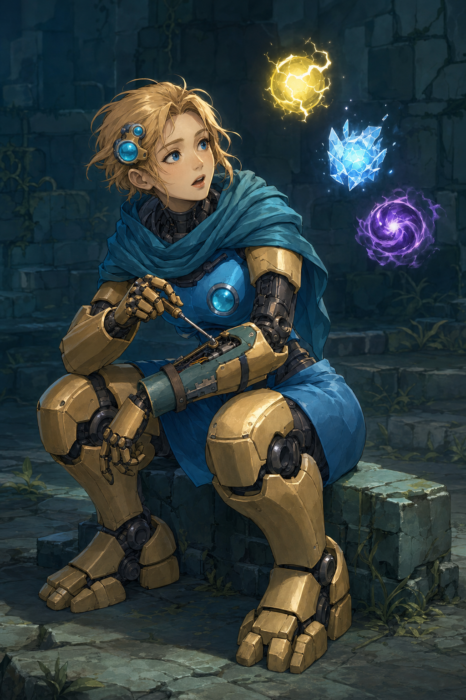

# Defect v01 — 自己修繕の途中でオーブへ気を取られる女性型オートマトン

状態: **2026-10-09 API生成・制作担当の目視確認済み。デザインは未承認、ユーザーレビュー待ち。** [Issue #6](https://github.com/Motoki0705/slay_the_spire_2_mods/issues/6) のレビュー用コンセプト。担当: `art-defect`。基準commit: `33a8c3e72cf1818ace1671723ed538dcac7834ac`。

[生成指示](../../../../art/prompts/defect-v01.txt) / [API条件・入力と出力のSHA-256・来歴](../../../../output/imagegen/defect/defect-v01.provenance.json)

## 今回の翻案

低い石に腰を下ろして自分の前腕を調整している途中、雷オーブが反応し、工具を回す手を止めて観察する瞬間を設計した。本人の生存のための手入れと、機械でありながら世界を知ろうとする好奇心を同じ場面に置く。目線、眉、口、修繕する指、重い足の接地を、その行動へ向ける。

女性の人間的な顔と髪は本MODの明示的な翻案であり、公式の性別や種族の変更を示す事実ではない。資料に残る「人間の顔を付けない」という旧提案は採用しない。[現行v0.3](../review-v03.md) とIssueの要件を優先した。全員が同じ身体・衣装・鑑賞者向けの笑顔になるv0.1、円盤顔を保つv0.2は見本に使っていない。

| 原作から読む要素 | 今回の設計判断 |
| --- | --- |
| 青い外殻と金色の四肢、首布 | 青い一体の胴殻、金色の分節した腕と脚、作業を妨げない青い布へ翻案 |
| 不均等な金色の顔板、大小の青い光学部品 | 顔板は人の顔へ変更。大小レンズの意匠は顔を遮らない側頭部のセンサーへ移す |
| 大きい前腕・脚・足、暗い接続部 | 重量を持つ機械の身体、露出した関節、幅のある足を設計。胸甲や細腰の均整で女性化しない |
| 他の構造物の部材で自分を修復して生きる | 異なる仕上げの交換板、留め具、開いた前腕の整備箇所と工具で用途を見せる |
| 感情と好奇心、独立して浮くオーブ | 人の眉・瞳・口で好奇心を読む。工具の停止と雷オーブへの視線を結ぶ |

場面、髪、合成人肌の顔、センサーの移設、工具、修繕箇所の具体形は制作判断。公式の自己修繕と好奇心の根拠は [Defect調査](../../../research/characters/defect-world.md) にあるが、この静止画と同じ場面が公式に描かれたとは主張しない。

## 参照と版

生成前に、以下の現行顔・全身・オーブを `view_image` で目視し、ファイルのSHA-256が [参照manifest](../../../../art/references/defect/sources.json) と一致することを確認した。APIにはこの3枚をこの順番で渡し、すべてを造形参照と指定した。既存コンセプトを部分編集する入力ではない。

| API入力 | 観察した内容 | 扱い |
| --- | --- | --- |
| [現行顔の切り出し](../../../../art/references/defect/official/key-art/sts2-lineup-defect-crop.png) | 金色の不均等な顔板、大きい青いレンズと上側の小さいレンズ | 配色と部品の大小を翻訳。円盤顔と端の他キャラは描かない |
| [現行全身](../../../../art/references/defect/official/gameplay/sts2-combat-overgrowth.jpg) | 丸い青い胴、首布、金色の大きい分節四肢、暗い関節、広い足 | 身体と素材の対比を参照。UI・敵は入力の対象から外す |
| [公式トレーラー99.5秒](../../../../art/references/defect/official/gameplay/sts2-trailer-defect-orbs-099500.png) | 身体から離れて弧を描くオーブ。雷の黄、氷の白青、闇の紫 | 3種を代表として選ぶ。身体や髪に付着させない |

公開参照は2026-10-08取得、撮影ビルド不明。ゲーム内文章の根拠はローカル **v0.107.1 / 59260271 / 2026-06-18** に固定されている。この版での公式オーブ定義は **Lightning / Frost / Dark / Plasma / Glass の5種**。絵の雷・氷・闇はその一部であり、公式が3種だけとは書かない。Plasma / Glass の現行外観は今回確認・描画していない。

Silent v0.3はアニメ調の顔と素材の塗りの読み方だけを目視した。APIへは送信せず、同じ顔・服・体型を指定していない。Silent固有の露出・可愛さ・透明感の変更指示はDefectへ転用していない。

## API生成記録

付属 `scripts/image_gen.py` を改変せず直接呼び出す。参照画像を渡すためCLIの `edit` / `/v1/images/edits` を使い、新規コンセプトを制作する。`gpt-image-2` / `high` / `1024x1536` / `n=1` / PNG / opaque / `--no-augment`。`input_fidelity` はこのモデルで指定しない。

認証は指定のdotenvから `OPENAI_API_KEY` だけを読み、今回のCLIプロセスへ渡した。キーと環境ファイルの内容は保存しない。CLIの診断は表示前にキーを伏せる。組み込み画像生成、別モデルへの切替、動画APIは使っていない。

初回1枚の呼び出しが成功。CLI報告時間は **101.8秒**。実測は **1024×1536、PNG、RGB、2,442,090 bytes**。修正生成は0回、ローカルでの画像編集・背景除去は行っていない。モデルや画質のfallbackはない。

| 対象 | SHA-256 |
| --- | --- |
| `art/prompts/defect-v01.txt` | `b56bde3bd9e338fb8b7fbead9a99e6e3a0af539d7ff2f20349bb4c140d98d729` |
| `output/imagegen/defect/defect-v01.png` | `cde58c39e9e93377cfae6b0fbff68626e698ea2959a5524f1daabcc8cf34fa93` |

入力ごとの役割・hash、資料取得日と派生、CLIのhash、引数と成否は生成記録に保存した。API成功はデザイン承認を意味しない。

## 目視確認

出力を `view_image` の原寸表示で確認した。以下は制作担当の観察であり、ユーザー承認や独立validator評価ではない。

| 確認点 | 実際の画像で読めること |
| --- | --- |
| 人型女性の顔・髪・表情 | 金色の髪、額、左右の青い瞳、眉、鼻、頬、開いた口が明瞭。レンズは側頭部へ移り、顔の中心を覆わない。眉と口にオーブへの驚き・好奇心が読める |
| 機械の身体との両立 | 暗い機構の首・肘・膝・足首、大きい金色の前腕と脚、分節指と広い足が見える。青い胴殻と布を持ち、肌着や強調した胸甲で女性化していない |
| 自己修繕の意味 | 前腕の開いた整備箇所、露出する内部配線、先端が調整部へ届く工具、青緑の交換板と留め帯が見える。右手の工具が左前腕へ向かう関係は成立している |
| 本人の行動・重心 | 低い石に座り、前腕を膝の上で支え、足を前後にずらして接地。顔は修繕箇所から右上のオーブへ向く。鑑賞者への正面の微笑み・立ちポーズにはなっていない |
| オーブの色と独立性 | 雷は黄、氷は白青の結晶、闇は紫の渦。3つとも身体の右上に離れて浮く。頭の側面と胴の青いレンズは固定部品で、浮遊オーブとは区別できる |
| 画面の不要物 | 顔、手、両足は画面内。参照のUI、カード、数字、敵、他キャラ、読める文字や透かしは見られない |

オーブは指示の広い弧より縦方向にまとまった配置になったが、色と身体からの分離は明瞭。表情は「小さな納得」より驚きが強い。これらはレビューで判断する点として残し、明らかな失敗とは扱っていない。細かな留め具の構造、工具の機械的寸法、静止画の前後での手の動きは検証していない。

## 通常検証と未確認

- CLI dry-runでモデル・画質・解像度・3入力の順番・出力先を確認した。
- 3入力の参照manifestとのSHA-256一致を確認した。
- PNGのデコード、実測1024×1536、RGB、出力とプロンプトのSHA-256を確認した。提出前の通常検証は、相対リンク・来歴JSONと実ファイルの整合・Git所有範囲・キー形文字列や秘密ファイルの混入を対象とする。結果は生成記録に残す。
- validatorは指定どおり0回。
- 顔と造形のユーザー承認、動画、部位分割、正式rig、ゲーム内表示と実プレイは未確認。本画像を完成素材や実装済みスキンとは扱わない。
