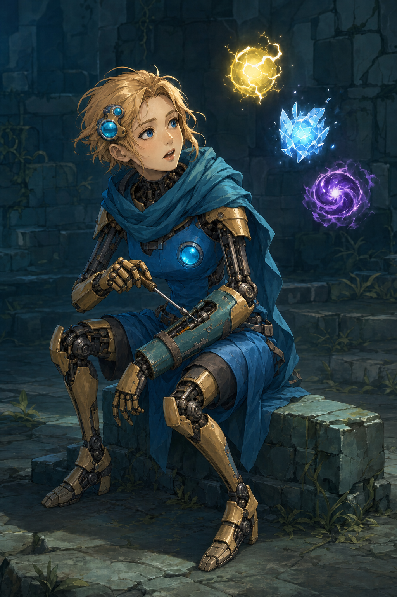
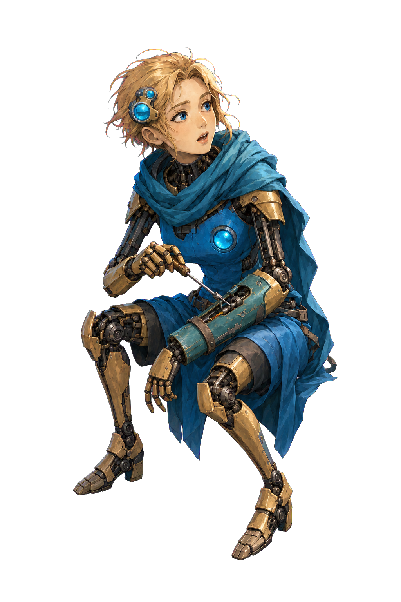

# Defect v0.2 — 細い機構と補修前腕の対比

[Issue #6](https://github.com/Motoki0705/slay_the_spire_2_mods/issues/6) / [PR #16](https://github.com/Motoki0705/slay_the_spire_2_mods/pull/16)。制作日: 2026-10-09（JST）。担当: `art-defect-production`。

状態: **委任に基づく制作採用候補、制作担当の目視確認済み。親の最終採否・統合待ち。** `design_adoption=delegated-production-selection`、`user_approved=false`。ユーザーが個別承認した画像とは記録しない。実ゲームでの表示・動作を確認する前のため `ProductionReady=false`。

ユーザー最新原文: 「Spine Professionalのライセンスはもってないです。これから、モッドの完成まで自律的に進めてください。動画生成AIの仕様は今回見送ります。」他４人についての「スタイルが良すぎます」「華奢な感じが魅力的」を、[改訂案](../slender-revision-brief.md)と[プロンプト調査](../../../research/art-direction/non-generic-characters.md)に沿って適用した。Silentのデザイン承認をDefectへ広げない。

## v01との比較

| v01 — 要修正の旧案 | v0.2 — 今回の制作候補 |
| --- | --- |
|  |  |

[v0.2原寸](../../../../output/imagegen/defect/defect-v02.png) / [編集指示](../../../../art/prompts/defect/defect-v02-edit.txt) / [モデル・入力・出力・hash・目視記録](../../../../output/imagegen/defect/defect-v02.provenance.json)。[v01の記録](review-v01.md)と元画像は保持した。不採用の５人lineupは入力していない。

| 確認点 | v0.2の目視観察と制作判断 |
| --- | --- |
| 人の顔・髪・表情 | v01の本人が読める額・眉・青い瞳・鼻・口と短い金髪を保持。大小の青いセンサーは側頭部に置かれ、顔を覆わない |
| 華奢さと機械の身体 | 上腕と手首が細い機構へ変わり、膝の全面装甲が小さい殻と暗い関節へ変わった。すねは細い金色の帯状装甲、足は小さい分節足。全身に重い殻を繰り返さない |
| 局所的な補修部品 | 開いた前腕の青緑の交換板、留め帯、露出した整備機構を残し、その前腕だけに相対的な量感を置いた。細い反対腕との違いに用途がある |
| 胴と布 | 単一の浅い青い胴殻と普通の成人の胴比率。胸形の独立装甲・極端なくびれに頼らず、青い首布と腰布の広い面を保つ |
| 本人の行動 | 低く非対称に座り、修理の工具を止めて雷オーブを見る関係を保持。鑑賞者へ向く立ち姿や微笑みには変えていない |
| 光と画風 | 青と金の配色、顔・金属の暖色光、布の寒色光を保持。Silentの白髪、緑衣装、顔、狩りのポーズは転写していない |

顔の年齢感・華奢さは目視判断で、身体寸法を測定した主張ではない。口を開いた驚きは旧案から残り、微かな納得や頷きの前後は静止画では確認できない。細かな工具寸法・留め具の機械的成立も未確認。

## 入力とAPI

改訂は付属 `scripts/image_gen.py` の `edit`、`gpt-image-2 / high / 1024x1536 / n=1 / PNG / opaque / --no-augment`。`input_fidelity`と`background=transparent`は指定しない。

| 呼出し | 番号付き入力と役割 |
| --- | --- |
| 改訂 | 1: v01を編集対象とし、顔・髪・色・道具・場面を保持、身体と装甲の量感を変更。2: [承認済みSilent v0.5](../silent/review-v05.md)を画風・光のみの参照に使用 |
| body分離 | 1: v0.2を唯一の編集対象とし、本人と工具を保持、背景・石座・独立オーブを除去。平坦なマゼンタをkey色にする |

原作の自己修繕・好奇心・青と金の根拠は[既存のDefect調査](../../../research/characters/defect-world.md)と[参照索引](../../../../art/references/defect/README.md)を使用した。原作の円盤顔を維持する旧制作提案は採用しない。この成人女性の顔、髪、機構の細さ、具体的な修理場面はMODの翻案であり、新しい公式設定とは称さない。既存資料のローカル調査版はv0.107.1 / 59260271、公開画像の撮影ビルドは不明。設定調査のやり直しやゲーム資源の再抽出は行っていない。

認証は指定dotenvを補間なしで読み、`OPENAI_API_KEY`だけをCLI subprocessへ渡した。キーや生のAPI例外を保存しない。付属CLIを改変せず、独自SDK生成器、組み込み画像生成、別モデルへのfallback、Spine Professional、動画生成AIを使っていない。制作セッションのログで `gpt-6.1-sol / max`と指定worktreeを確認し、起動引数は`service_tier=default`。応答の実効tierはログに公開されておらず、サーバー側で直接確認したとは記録しない。

API編集は**改訂１回・背景分離１回、合計２回成功、追加修正０回**。所要時間は改訂85.88秒、分離69.15秒。指定の最大３回のうち修正枠は使用していない。API成功と制作採否を区別する。

## 実装用RGBA body

[key原本](../../../../output/imagegen/defect/defect-body-v01-key.png) / [RGBA原本](../../../../output/imagegen/defect/defect-body-v01.png) / [API分離指示](../../../../art/prompts/defect/defect-body-v01-key-edit.txt) / [分離・alpha変換・hash・座標・観察記録](../../../../output/imagegen/defect/defect-body-v01.provenance.json) / [配布用body](../../../../mod/assets/PopSpireWomen/art/defect/body.png) / [rig.json](../../../../mod/assets/PopSpireWomen/art/defect/rig.json)。配布PNGはRGBA原本のbyte単位のコピーで、再エンコードしていない。

背景・石座・床・影・草・浮遊オーブ・独立した火花をAPIで除き、本人と小さい修理工具を残した。側頭部と胴の青いレンズは固定機構として残す。ゲームで生成・増減・evokeされる独立Orbをbodyへ焼き込まない。オーブのlifecycle確認はこの静止素材の検証とは別である。

付属 `remove_chroma_key.py` を無改変で使い、`#FF00FF / soft-matte / transparent-threshold=50 / opaque-threshold=120 / spill-cleanup`でalphaへ変換した。元key背景には角で最大40程度のRGB差があり、透明側閾値50で空き領域を除去する。edge contraction・blurは０。人物をPythonで描き変えず、色の切抜きと配布先へのコピーだけを行った。白・暗色背景の合成、部分拡大、座標の注記はリポジトリ外の一時検証画像として作成し、配布PNGに含めない。

実測は**PNG / RGBA / 1024×1536**。alpha描画範囲は左上`[186,120]`、右下exclusive`[862,1430]`。透明余白は左186・上120・右162・下106px。alpha=0は1,122,945px、半透明は10,043px、alpha=255は439,876px。枠全周はalpha=0で、人物・道具・髪・両足の切れはない。

原寸key画像、白・暗色背景のRGBA、髪と工具の部分拡大を目視した。背景の石やオーブ、連続した強いマゼンタ縁は見られず、髪の細い縁、工具の細軸、青と金の機構は残った。一部の髪先に暖色の細い縁は残る。ゲームのtexture filtering後に同じ見え方になるかは未検証。APIの背景分離で全身の位置が中央寄りになり、細かな髪・顔・布線に差があるため、原画の完全なpixel一致とは称さない。

| ファイル | SHA-256 |
| --- | --- |
| `defect-v02.png` | `b7918407efb26353e046a4f798de0ef5f9a662446a5eac1fa4e5e407bb4c2de5` |
| `defect-body-v01-key.png` | `b1f60f96178133e6bdf8981ae9caefd4093da129b354815d95bab8901d04ba84` |
| RGBA原本と配布用`body.png` | `4e19e93f1b4f52bef2974f27bb69b8cd0fdbc99062f0e08097106347419998f5` |
| `rig.json` | `1da6691b7205e277eb35128322f2afc13432c769971a2dd1dddf3cadad1128c1` |

入力とプロンプトのhash、寸法、mode、CLIと変換ツールのhash、引数、API成否は各provenanceへ保存した。

## rendererへ渡す座標と制限

2026-10-09の`/tmp/sts2-autonomous/runtime-contract.md`とsteeringの追加指示に沿うschema 1。座標は1024×1536画像の左上原点、+Y下。**l/rは画面上の左/右で、解剖学的左右ではない。** `display_height=300`は暫定で、親が実ゲームで調整する。

| marker | ピクセル座標 | 対象 |
| --- | --- | --- |
| `hip` | `[662,818]` | 腰の支持点。修理前腕による遮蔽の近く |
| `chest` | `[570,611]` | 胴殻と固定コア |
| `head` | `[484,310]` | 顔の中心付近 |
| `hand_l` | `[399,666]` | 工具を握る高い手 |
| `hand_r` | `[414,986]` | 修理前腕から下へ垂れる手 |
| `foot_l` | `[270,1218]` | 画面左の後ろ足 |
| `foot_r` | `[655,1372]` | 画面右の前足 |
| `hair` | `[307,222]` | 画面左の髪束 |
| `cloth` | `[743,1062]` | 画面右の布の裾 |

両手はこの姿勢ではx座標が近い。工具を持つ手が画面の左寄りなので`weapon_hand="hand_l"`とした。工具先端のanchorは`[583,782]`、胴の固定コアは`[568,608]`。肩・肘・膝の追加観察座標もprovenanceに記録した。ゲームnodeのbindingsを推測していない。originは足の最下部に合わせた`[460,1430]`。全９markerのalpha=255と注記した一時画像上の位置を確認した。

**今回のbodyは元の座り／屈み姿勢を保持し、石の支持物を除いた一枚絵。立ち姿勢の戦闘素材を生成したとは扱わない。** `layers=[]`で、前腕・布・後ろ髪・閉眼・横目は未分離。大きい腕回転、脚の立ち上がり、前後の遮蔽、瞬きは追加制作・調整が必要になり得る。軽いmesh変形のための座標入力を用意した段階で、攻撃・被弾・死亡・復活に適合したと称さない。選択背景・休憩専用body/rigも今回の出力に含めない。

## 通常検証と未確認

PNG４ファイルのデコード・寸法・mode、RGBAと半透明edge・枠全周透明・オーブの空き領域・配布PNGのbyte一致・全９markerの位置とalpha・rig schema・各入力不変・hash・相対リンク18件・所有10ファイル・秘密情報なし・`git diff --cached --check`を確認済み。最終結果はprovenanceに保存した。validatorは指定どおり０回。

未確認は、親の最終採否、Godotのimport/mesh変形、実ゲームでの表示サイズ・全状態遷移・攻撃時刻・VFX/Orb lifecycle、商人・休憩・選択各面への適合。renderer・catalog登録・ゲーム導入は他担当の範囲であり、この素材提出を実装完了やMOD完成とは記録しない。
