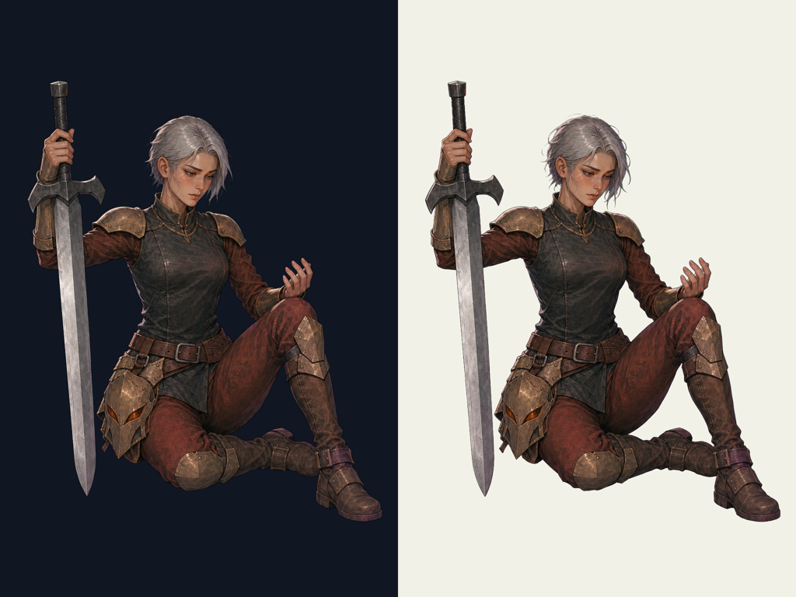

# IroncladのGodot用追加surface

## 現行v0.1への案内（2026-10-09）

[制作素材 v0.1](../production-assets.md) / [現行５人のギャラリー](../review-gallery.md) / [DLL不要のPCK生成・導入](../../../development/pck-only.md)。[PR #35](https://github.com/Motoki0705/slay_the_spire_2_mods/pull/35) がmainへ統合済み（基準 `6b190bb82a38052c42de869211586a032140ab84`）。

[v02デザイン](review-v02.md)は委任に基づく制作採用で、個別のユーザー承認ではない。剣と火の手を分けた本体と専用の休憩姿を使う。 API課金エラーで止まった選択背景・閉じ目は、ユーザー指定のCodex内蔵生成で制作・採用済み。以前のAPI来歴と今回の内蔵生成を混同しない。

現在の入力は [body](../../../../mod/assets/PopSpireWomen/art/ironclad/body.png)、[選択背景](../../../../mod/assets/PopSpireWomen/art/ironclad/select_background.png)、[閉じ目層](../../../../mod/assets/PopSpireWomen/art/ironclad/layers/eyes_closed.png)、[休憩body](../../../../mod/assets/PopSpireWomen/art/ironclad/rest_body.png)。ゲームへ渡すrigは元の `art/ironclad/rig.json` に調整を重ねた用途別の [combat](../../../../mod/assets/PopSpireWomen/rigs/ironclad/combat.json) / [merchant](../../../../mod/assets/PopSpireWomen/rigs/ironclad/merchant.json) / [select](../../../../mod/assets/PopSpireWomen/rigs/ironclad/select.json) / [rest](../../../../mod/assets/PopSpireWomen/rigs/ironclad/rest.json)。[production選択scene](../../../../mod/assets/PopSpireWomen/select/production/ironclad.tscn) と [UI icon scene](../../../../mod/assets/PopSpireWomen/ui/ironclad/icon.tscn) も統合済み。

動きは無料Godot描画を使い、Spine Professional・動画生成AIを使わない。原作のtrack/event/待ちを観測して同期する設計と、実プレイの成功は区別する。全５人のsurface・状態遷移等の実機QAは親の [Issue #11](https://github.com/Motoki0705/slay_the_spire_2_mods/issues/11) で継続中。共有済みの確認範囲は [開発の案内](../../../development/README.md#検証の境界) を参照。

## 以前の制作記録

> 以下は#28/#10の制作時点の記録を保持したもの。「未制作」「API復旧後」「本担当では未確認」、暫定表示高・hash・生成回数は当時の範囲を示す。現在の生成経路・有効素材・用途別rig・QA状況は上記の入口を参照し、古いAPI再開手順を現在の指示として使わない。

## #10 休憩surface制作（2026-10-09）

[Issue #10](https://github.com/Motoki0705/slay_the_spire_2_mods/issues/10)。担当 `production-surfaces` / GPT-6.1 sol / max / service_tier=default。今回の派生は **delegated-production-selection / user_approved=false**。Silent v0.5本人のユーザー承認を、新しい休憩姿や他４人の承認へ広げない。５人の休憩surfaceとRegent分離は制作済み。**Silent以外４人の選択背景・閉眼はbilling系APIエラーのため未制作**。本担当の素材をMOD完成やProductionReadyと称さない。

### 休憩姿の制作採用

既存v0.2の銀灰色の短髪、人の顔、薄い金銅の装甲、暗い胴と赤褐色の下衣を保持し、剣を支えて座り、素手を静かに見る休憩へ編集した。手の炎は休憩時には消している。剣を握るのは画像左の`hand_l`。柄・剣先・二本の腕・両足まで枠内。画像左側の足markerは右にある折り畳んだ後ろ足、画像右側は前へ出たブーツで、解剖学的左右ではない。成人の繊細な身体と装備の荷重を両立させ、笑顔の鑑賞ポーズにはしない。

| 配布物 | 内容 | SHA-256 |
| --- | --- | --- |
| [rest_body.png](../../../../mod/assets/PopSpireWomen/art/ironclad/rest_body.png) | 1024×1536 RGBA。本人と携行装備、背景なし | `1f86463ca13d4fb8fba2a425af96381629799ea352c8874bc72aa0262d2b7f6f` |
| [rest_rig.json](../../../../mod/assets/PopSpireWomen/art/ironclad/rest_rig.json) | schema 1、９marker、地面基準origin、静かな休憩キー | `9690a2c8b22139ba210817d052b7e3fc2e2c9664490fdded83a9ffa1c848fba1` |

マゼンタkey原本を、付属`remove_chroma_key.py`のcorners採色・soft matte 52/120・spill cleanupでRGBAへ変換した。加筆・縮小・crop・人物移動は行っていない。明暗背景で髪・肌・剣・金属を目視した。

alpha bboxは`[70, 207, 984, 1343]`、alpha=0は1,114,726、部分alphaは12,031、alpha=255は446,107画素。全外周はalpha0。原点は足・衣の地面接触を実画像から定める。

### 座標とGodot入力

左上原点・+Y下・px。l/rは**画像上の左右**。`display_height=300`はcanvas全体の暫定表示高で、人物実高ではない。親が実ゲームの表示サイズを調整する。origin=`[561, 1343]`。腰・胸は服／機構に覆われた位置の制作上の推定。

| marker | 実画像のpixel座標 |
| --- | --- |
| `hip` | `[416, 979]` |
| `chest` | `[475, 708]` |
| `head` | `[499, 454]` |
| `hand_l` | `[150, 383]` |
| `hand_r` | `[766, 720]` |
| `foot_l` | `[716, 1162]` |
| `foot_r` | `[914, 1284]` |
| `hair` | `[447, 345]` |
| `cloth` | `[564, 929]` |

`idle_loop / relaxed_loop / overgrowth_loop / hive_loop / glory_loop`へ弱い呼吸の明示キーを入れた。手・足を振る大きな所作へしない。原作のtrack・event・待機・保存/RNG・独立した相棒/Orb/武器は入力素材では変更しない。一枚のbody meshは大きい関節回転や隠れた人体を復元できない。商人・戦闘・死亡・復活との適合は親の実機確認事項。

`weapon_hand=hand_l`。本人の手と武器／工具の実画像に合わせた。

### 未制作の背景・閉眼

[背景プロンプト](../../../../art/prompts/ironclad/ironclad-surface-background-v01.txt)は2048×1152、本人なし・UIなし、左に静かな面、右に人物を置く空間。本人の採用画の画風・色に合わせたMODの舞台提案で、新しい公式設定とは書かない。1920×1080はgpt-image-2の16px条件を満たさないため使わない。

[閉眼プロンプト](../../../../art/prompts/ironclad/ironclad-surface-blink-v01.txt)・[元canvasのeye mask](../../../../art/prompts/ironclad/ironclad-surface-blink-v01-mask.png)は準備済み。成功PNGと`rig.layers`のblink登録はまだない。復旧後はAPIで閉眼を制作し、mask反転・3px拡張・1.3pxぼかし・元body alphaとの交差で**目の周囲だけ**を残す。開いた目を皮膚で覆う差分が必要。全身の別絵を瞬きlayerへ重ねない。既存Silentの方式を参照する。

### 来歴・検証・残る範囲

[今回の原入力・出力hash・採用・未制作・検証記録](../../../../output/imagegen/ironclad/ironclad-surface-production-v01.provenance.json) / [休憩PNGの制作・変換記録](../../../../output/imagegen/ironclad/ironclad-surface-rest-v01.provenance.json)。画像APIは指定スキルの無改変CLI `gpt-image-2 / high / 1024x1536 / PNG / n=1 / --no-augment`。キーは指定dotenvを補間なしで読み、OPENAI_API_KEYだけCLI子プロセスへ渡す。生例外・キー・課金usageは記録しない。背景サイズは2048×1152。別model、組み込みimagegen、独自SDK生成器、Spine購入・動画AIは使用しない。

#10全員分のライブCLI実行は上限20回中８回（成功６・billing系失敗２）。原画・過去素材のAPI回数とは分ける。成功でも位置／alpha不備のある版は不採用として保持。SDK内部の通信再試行回数と実請求額は公開されておらず不明。課金失敗を生成成功や設計却下と扱わない。

通常検証は、実PNGデコード・1024×1536・alphaと外周・入力不変・９markerの実画像位置とalpha・texture path・SHA-256・明暗背景の縁・Godot 4.5.1の`rig_schema.gd`と実texture読込み・休憩キー/玉座固定・実描画、文書リンク、diff。結果は上記provenanceへ。validatorは指定０回。実ゲーム起動・導入・元DLL変更・catalog/ProductionReady設定は本担当で実施していない。親の実機確認、未制作８素材のAPI制作、ゲーム面への接続が残る。

通常検証の確定結果: **Godot 4.5.1で195件・失敗０、実rig10個、相対リンク83件、休憩marker45点はalpha255**。[再現用検証script・結果](../../../../output/imagegen/ironclad/ironclad-surface-validation-v01.json) / [実休憩rigのGodot描画](../../../../output/imagegen/ironclad/ironclad-surface-rest_rig-godot-preview-v01.png)。V-Sync変更が不可という検証用Mesa driverのwarningはあるが、script/runtimeエラー・leak警告はない。
