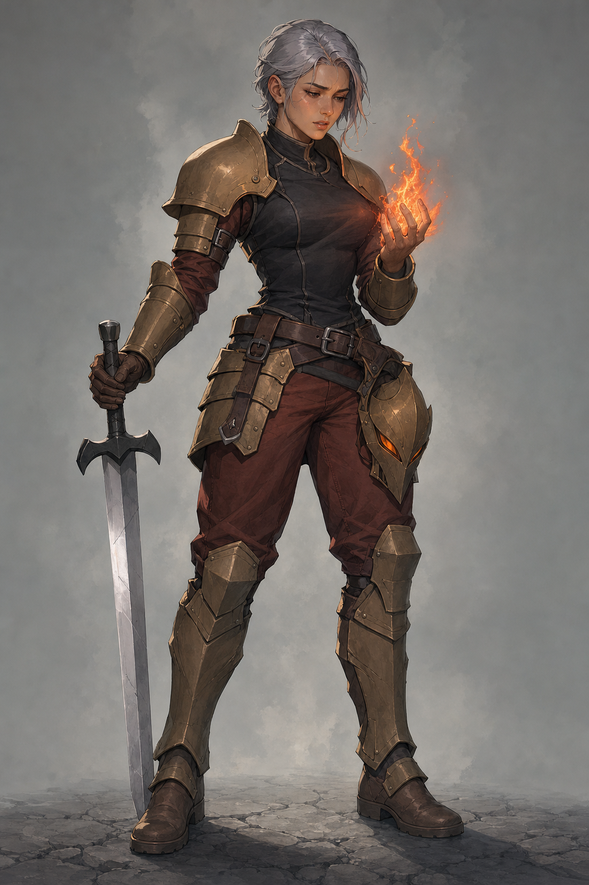
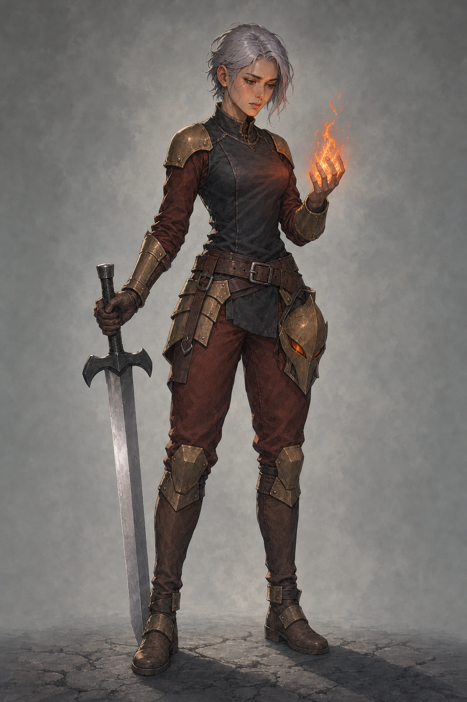
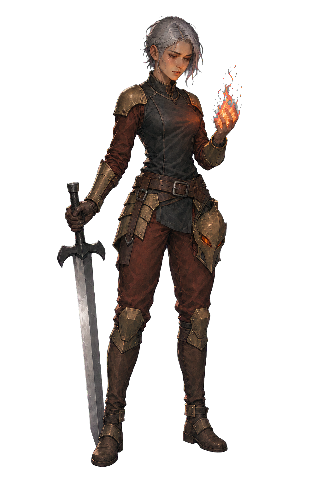

# Ironclad v0.2 — 華奢な身体と薄い装甲への改訂

担当: `art-ironclad-production` / [Issue #3](https://github.com/Motoki0705/slay_the_spire_2_mods/issues/3) / [PR #12](https://github.com/Motoki0705/slay_the_spire_2_mods/pull/12)。2026-10-09（JST）制作。`design_adoption=delegated-production-selection`、`user_approved=false`。担当が実装素材へ進める候補として選び、親の最終採否・統合判断へ提出する。ユーザーがこの画像を個別に承認したという記録ではない。

最新原文は「Spine Professionalのライセンスはもってないです。これから、モッドの完成まで自律的に進めてください。動画生成AIの仕様は今回見送ります。」。他４人への「スタイルが良すぎます」「華奢な感じが魅力的」を、[改訂案](../slender-revision-brief.md)と[プロンプト調査](../../../research/art-direction/non-generic-characters.md)に沿って適用した。Spine Professional・動画生成AIは使用していない。

## 旧案と改訂

| v0.1 — 要修正の旧案 | v0.2 — 制作採用候補 |
| --- | --- |
|  |  |

旧案の固定commitは `87ce8c21536fac2c2d1ce360e513fddb7e4e296d`。[旧レビュー](review-v01.md)とその画像・プロンプト・生成記録は上書きせず残す。不採用の５人lineupは見本にしていない。

| 観点 | v0.2で確認したこと |
| --- | --- |
| 肩・装甲の量感 | 肩当てを上腕に沿う短い薄板へ変更。大きく張り出した肩、上腕の重なる板、長いすね装甲が減り、細い身体と装備を分けて読める。 |
| 胴・衣服・手足 | 胴と腕の外形が細くなり、赤褐色の袖と下衣に可動する折れが残る。腰のくびれと胸のフィットは一部残り、脚の縦の比率の変化は控えめ。数値測定による体型評価ではない。 |
| 顔・本人の意志 | 成人の人顔、短い銀灰色の髪、寄せた眉と少し開く口を保持。自分の掌を見る視線と内側へ曲げる指が、炎を抑えようとする意志を示す。鑑賞者への微笑みへ変えていない。 |
| 剣・重心・手 | 画面左の手で柄を握り、剣先と両足が接地する。画面右の素手に局所的な炎が立つ。二本の腕、握り、肘、膝、足に目立つつながりの破綻は見られない。 |
| 原作の識別性 | 金銅の肩・前腕・膝の装甲、暗い胴、赤褐色の下衣、幅のある銀の剣と角張った鍔、腰に携行する尖った仮面、橙赤の炎を残す。顔は仮面で隠さない。 |
| 編集に伴う差分 | 装甲の層数とすねの覆いを整理し、腰には暗い折り返し布が加わった。身体・衣服の量感を改訂する許容範囲として記録し、装備が全て同じ画素・形で保持されたとは称さない。 |

装甲の外形が整理され、華奢さと兵士としての荷重が同時に読めるため、v0.2を背景分離へ進める候補にした。強さを身体の厚みや露出で増やさず、剣と掌を使う所作に残す。静止画は呼吸や炎制御の成功を証明しない。

## 原典と参照の範囲

「最後の兵士」「本人の意志に反する剣と炎」は公式ゲーム本文 **v0.107.1 / 59260271** の[英語抜粋](../../../../art/references/ironclad/official/game-assets/ironclad-localization-eng-v0.107.1.json)と[日本語抜粋](../../../../art/references/ironclad/official/game-assets/ironclad-localization-jpn-v0.107.1.json)を継承する。装備の元資料は[公式参照索引](../../../../art/references/ironclad/README.md)と[旧案の根拠](review-v01.md#原典観察翻案の区別)にある。今回、公式資料の再取得や設定の再調査はしていない。

女性の素顔、体型、呼吸の場面、仮面の腰携行はMODの翻案であり、公式設定の追加事実ではない。旧調査の原形維持を優先する提案は、[現行方針](../review-v03.md)に従って読み替える。

改訂APIの入力1は **Ironclad v0.1だけ**。顔・装備・色・場面の編集元とし、身体比率・服の収まり・装甲の厚みは保持対象から外した。[承認済みSilent v0.5](../silent/review-v05.md)は画風と澄んだ光の目視参照に限り、APIへ送らず、顔・白髪・緑の服・体型・狩りの姿勢を転写していない。

## API制作記録

改訂は付属`image_gen.py edit`を直接使用。`gpt-image-2 / high / 1024x1536 / PNG / opaque / n=1`、`--no-augment`。`input_fidelity`・maskは送信していない。[改訂プロンプト](../../../../art/prompts/ironclad/ironclad-v02-edit.txt)、[dry-run送信条件](../../../../output/imagegen/ironclad/ironclad-v02.request.json)、[入力役割・ハッシュ・時刻・目視記録](../../../../output/imagegen/ironclad/ironclad-v02.provenance.json)を保存した。API生成は成功し、RGB PNGを原寸で目視した。

| 対象 | SHA-256 |
| --- | --- |
| 編集元 `ironclad-v01.png` | `9774a4d1a692646faf5a341a28ea654ecec07e5f415bb15544c1d55bb2ee5531` |
| 改訂 `ironclad-v02.png` | `71035f4d02a5ce00a77f16e8acaa0419cf9f3790f46f349cc1cdb25b2abf4f6a` |

最初のdry-run比較はCLIが末尾改行を除く仕様との差で中断し、API送信前に比較条件を修正した。画像生成の再呼出しやモデル変更ではない。dotenvは補間なしで解析し、`OPENAI_API_KEY`だけをCLI子プロセスへ渡す。キー、生のAPI例外、環境ファイルは表示・保存していない。独自SDK生成器、組み込み画像生成、既存画像へのPython加筆は使用しない。

担当の指定は `gpt-6.1-sol / max / service_tier=default`。設定は変更していない。今回の制作工程では実効設定を独立取得しておらず、依頼値をサーバーの実効tier確認結果とは称さない。validatorは指定どおり0回。

## 実装用RGBA



配布用の[body.png](../../../../mod/assets/PopSpireWomen/art/ironclad/body.png)は、[最終切抜きPNG](../../../../output/imagegen/ironclad/ironclad-body-v02-clean.png)の**バイト単位で同一のコピー**。[配布素材の来歴](../../../../mod/assets/PopSpireWomen/art/ironclad/body.provenance.json)と[背景分離・変換の全記録](../../../../output/imagegen/ironclad/ironclad-body-v02-key.provenance.json)で原画から配布物まで追跡できる。

背景分離もAPI編集で実施し、入力1はv0.2のみ。初回の[緑キー版](../../../../output/imagegen/ironclad/ironclad-body-v01-key.png)と[そのRGBA](../../../../output/imagegen/ironclad/ironclad-body-v01.png)は髪・炎の緑黄のにじみで不採用。許可された修正1回で、汚染した版を入力にせず、元のv0.2から[マゼンタキー版](../../../../output/imagegen/ironclad/ironclad-body-v02-key.png)を制作した。[初回指示](../../../../art/prompts/ironclad/ironclad-body-v01-key-edit.txt)、[修正指示](../../../../art/prompts/ironclad/ironclad-body-v02-key-correction.txt)、各リクエスト・来歴を残し、不採用版を成功素材として扱わない。

モデル・画質・寸法は改訂と同じ。全体でライブCLI実行3回、成功3回、うちキー汚染の修正1回で担当の上限に達した。CLIはSDK内部の通信再試行回数を公開しないため、その回数は断定しない。`background=transparent`・別モデル・動画生成は使用しない。

マゼンタ背景は空白領域で指定RGBから最大48の色差があり、最初の変換では[外周alphaが最大14残った版](../../../../output/imagegen/ironclad/ironclad-body-v02.png)ができた。この版も非採用として保持。APIを追加せず、付属`remove_chroma_key.py`の透明判定を52へ調整し、soft matte・despillで色だけを分離した。加筆、輪郭の手描き修正、縮小、crop、edge contract、featherは行っていない。

最終変換の引数:

```text
remove_chroma_key.py
  --input output/imagegen/ironclad/ironclad-body-v02-key.png
  --out output/imagegen/ironclad/ironclad-body-v02-clean.png
  --key-color #ff00ff --soft-matte
  --transparent-threshold 52 --opaque-threshold 120 --despill
```

| 対象 | SHA-256 |
| --- | --- |
| API原本 `ironclad-body-v02-key.png` | `47c048064c94139932503d5fd0327665f584a65731dfbe081bdc15012f289ac9` |
| 最終 `ironclad-body-v02-clean.png`／配布 `body.png` | `0c8cae656fbaa59f4d5505a00ff48068dabca61faf54f7cbd512e612a032c42b` |
| 配布 `rig.json` | `7300405fb2a92c316cd23a50f1499dc2f7a83a822ead9d6eeb0a6128bcf21062` |

最終PNGは **RGBA / 1024×1536**。alpha=0が1,195,583画素、部分alphaが13,586画素、alpha=255が363,695画素。外周は全てalpha=0、可視領域は左上`(180,50)`〜右下exclusive`(767,1479)`。透明余白は左180／上50／右257／下57pxで、髪・指・両足・仮面・剣先にフレーム切れはない。APIへ要求した上下64pxの目標とは差があるが、完全な全身と余白を確認して採用候補にした。

白背景と暗背景の診断表示を原寸で目視し、緑・マゼンタの線、背景の残り、顔・衣服・金属の目立つ色抜けがないことを確認した。髪の細い縁と炎には部分alphaが残る。炎の中心は橙赤だが、外側の薄い縁には中立灰色の部分があり、広い柔らかい光は減った。診断用合成とcropは一時ファイルで、配布画像への加筆ではない。石床・煙背景・UI・独立相棒は含まない。

## rigの引き渡し

2026-10-09のsteering追記は「body.pngに加え、自分のart/<character>/rig.jsonへ実画像の座標markersを用意」「旧依頼のrig設定を編集しない文よりこの追加を優先」と明示したため、所有範囲の[rig.json](../../../../mod/assets/PopSpireWomen/art/ironclad/rig.json)を新規作成した。schema 1、canvas 1024×1536、原点は左上・+Yは下。左右は**画像の左右**で、解剖学的左右ではない。2026-10-09のruntime契約のSHA-256は `6a5a23c77dd63c5aa4af26a3a4aaf4db994fe439ae86ae978d8a6ae07c073798`。

| marker | 画像上の座標 | 対象 |
| --- | --- | --- |
| `head` | `(554,195)` | 成人の顔 |
| `chest` | `(538,408)` | 上体 |
| `hip` | `(521,699)` | 骨盤付近 |
| `hand_l` | `(253,685)` | 画面左の剣を握る手 |
| `hand_r` | `(712,385)` | 画面右の炎を包む素手 |
| `foot_l`／`foot_r` | `(333,1438)`／`(653,1403)` | 左右のブーツ |
| `hair`／`cloth` | `(495,120)`／`(546,717)` | 後頭部寄りの髪／腰の布 |

各marker中心は最終bodyのalpha=255。`weapon_hand="hand_l"`を契約に沿って指定し、基本攻撃の主腕を画面左へ合わせた。`origin=(493,1475)`は両足の間の足元基準、`display_height=300`は契約どおりの**暫定値**。原作VFXのbindingsは推測で設定せず、頭・炎の手・剣の握り・先端の観察座標を来歴へ記録し、親が実nodeへ対応させる。

`layers=[]`。髪・布・前腕の独立層、閉じ目・横目、専用選択背景・休憩絵は作っていない。本人の剣・携行仮面・掌の局所的な炎はbodyに含む。Osty・Orb・Sovereign Bladeはこの素材に含まない。掌の炎の独立点滅や、大きな関節回転時の遮蔽復元には追加の層が必要。

## 通常検証と未確認

通常検証は通過。新規PNG7件のデコード・mode・寸法、alpha、配布PNGと元PNGの一致、9 markerの範囲と不透明画素、resource pathの解決、入力・旧版の不変、リクエストとプロンプトの一致、39件のハッシュ照合、所有20ファイル、27ローカルリンク・見出しanchor、秘密情報不在、`git diff --check`を確認した。最終bodyでalpha=255の画素はキー原本と同じRGB、alpha=0の画素はRGB=0である。[検証記録](../../../../output/imagegen/ironclad/ironclad-v02.validation.json)を保存した。

**runtimeは未確認**。Godotでのmesh変形、装甲・剣の歪み、髪や腕の遮蔽、ゲーム背景での見え方と表示高さ、攻撃・ダメージ・死亡・復活・割込み・速度・VFX付着点は親の実装／実機検証へ引き渡す。専用休憩素材と独立した表情層も未制作。`production_ready=false`を維持し、正式catalog登録・ビルド・ゲーム導入・PR mergeはこの担当では行わない。画像の制作採用候補、ユーザー個別承認、実機での完成を区別する。
