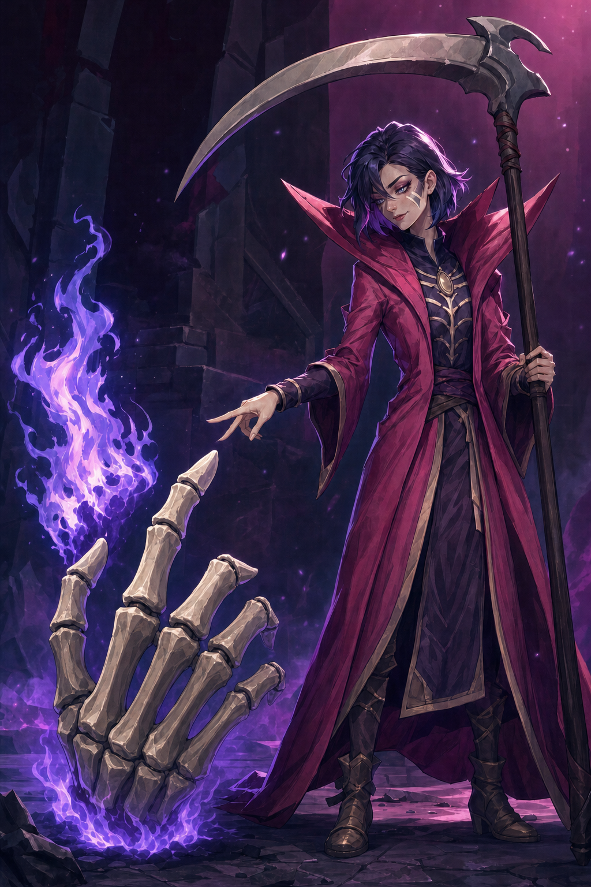
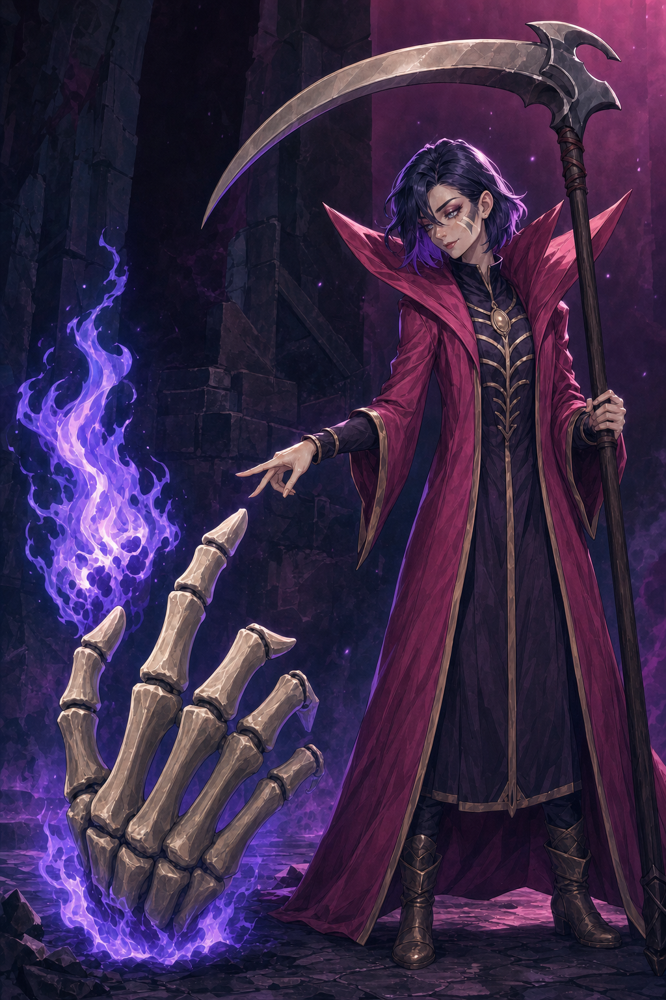
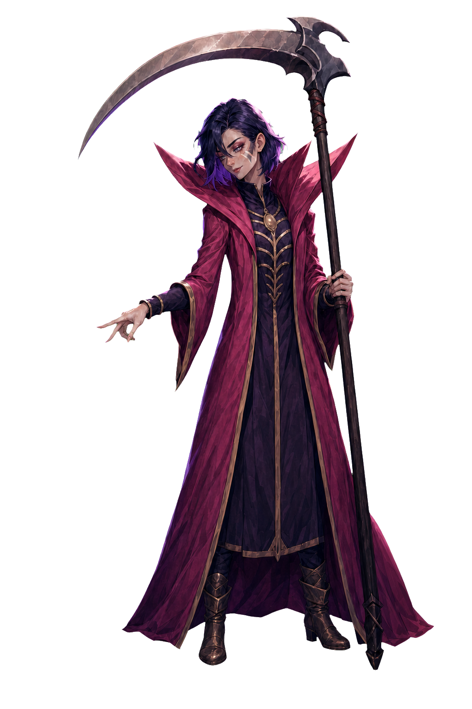

# Necrobinder v0.2 — 腰の絞りを緩めた改訂と実装用body

Issue: [#5](https://github.com/Motoki0705/slay_the_spire_2_mods/issues/5) / PR: [#17](https://github.com/Motoki0705/slay_the_spire_2_mods/pull/17) / 担当: `art-necrobinder-production` / 2026-10-09

状態: **v0.2・本人と鎌だけのRGBA body・実画像座標のrig.jsonを制作し、目視確認済み。委任に基づく制作採用の候補。** `design_adoption=delegated-production-selection`、`user_approved=false`、`production_ready=false`。親が最終採用・統合・実ゲーム確認を行う。ユーザーが新しい画像を個別に承認したという記録ではない。

## 最新レビューをどう反映したか

ユーザー原文は「その他のキャラはスタイルが良すぎます」「華奢な感じが魅力的」。最新の制作権限は「Spine Professionalのライセンスはもってないです。これから、モッドの完成まで自律的に進めてください。動画生成AIの仕様は今回見送ります。」。[４人の改訂案](../slender-revision-brief.md)と[プロンプト調査](../../../research/art-direction/non-generic-characters.md)を制作入力にした。Spine購入・動画生成AI・新しいサブエージェントは利用しない。

Necrobinderは旧案でも細い。さらに細くするのではなく、強く絞った腰と斜めの腰布を緩め、内衣と赤紫の長衣を広い面で落とす。人の顔・短い暗紫の髪・小さな笑みと眉の緊張・Ostyへの二指の合図・大きな襟・鎌・象牙色の縫い目・ロケットを保持した。原作の骨の顔へ戻さず、成人女性としての表情と相棒への信頼を継ぐ。

| 比較対象 | 画像 | 観察 |
| --- | --- | --- |
| 旧案 v0.1 corrected | [原PNG](../../../../output/imagegen/necrobinder/necrobinder-v01.corrected.png) / [制作記録](review-v01.md) | 細身だが、腰の絞りと斜めの巻き布、長い裾と鎌の縦方向が強い。旧版を上書きしない |
| 改訂 v0.2 | [原PNG](../../../../output/imagegen/necrobinder/necrobinder-v02.png) | 腰の締め付けと斜めの巻き布が弱まり、内衣・長衣の落ち方が直線的になった。見えているすねは短くなり、肩・手首の繊細さは保持。身体寸法の厳密な測定ではない |

| 旧案 v0.1 corrected・最新レビューで要修正 | v0.2・委任採用候補 |
| --- | --- |
|  |  |

顔・目線・二指の合図・Ostyの応答という意味のある場面は残る。Silent v0.5は澄んだ光と塗りだけの参照として渡し、顔・白髪・緑・狩人の姿勢を引き継がない役割を明記した。出力でもNecrobinderの短い暗紫髪と成人の鋭い顔は保たれている。

Ostyは独立した巨大な骨の手で、切れた手首の炎と五つの指の輪郭が読める。ただし掌面と手背の骨の描き分けは引き続き曖昧で、**概念画上の解剖学的な左手の確定は未完了**。bodyへはOstyを含めず、元ゲームの独立制御を親のruntime実装で維持する。v0.2の右下の衣の端はフレームに接しており、bodyの分離指示では全輪郭と余白を確保する。

## API条件と参照の役割

指定スキルの付属 `scripts/image_gen.py` を直接起動し、`edit` / `gpt-image-2` / `high` / `1024x1536` / PNG / opaque / １枚 / `--no-augment` を使った。改訂とbody分離の**２回ともAPI成功**。明らかな破綻・key汚染用の追加１回は未使用。`input_fidelity`は指定しない。`background=transparent`や別モデルを使わず、bodyは緑keyから付属 `remove_chroma_key.py` でalphaへ変換した。

改訂の入力画像は順番に、①[corrected版](../../../../output/imagegen/necrobinder/necrobinder-v01.corrected.png)：編集対象・人物と装備・場面、②[承認済みSilent v0.5](../../../../output/imagegen/silent/silent-v05.png)：光と塗りのみ、③[公式GIF frame 0](../../../../art/references/necrobinder/official/gameplay/necrobinder-osty-frame-000.png)：Ostyの構造と独立性のみ。body分離の入力は採用候補v0.2の１枚だけ。

既存の[設定調査](../../../research/characters/regent-necrobinder.md)・[参照索引](../../../../art/references/necrobinder/README.md)と[sources.json](../../../../art/references/necrobinder/sources.json)を再利用し、公式設定調査をやり直していない。人の肌・顔・髪はMOD上の翻案であり、正史で肉体を回復したという新事実を追加しない。

- [v0.2プロンプト](../../../../art/prompts/necrobinder/necrobinder-v02-edit.txt) / [リクエスト条件](../../../../output/imagegen/necrobinder/necrobinder-v02.request.json)
- [body分離プロンプト](../../../../art/prompts/necrobinder/necrobinder-body-v01-key-edit.txt) / [リクエスト条件](../../../../output/imagegen/necrobinder/necrobinder-body-v01-key.request.json)
- [来歴・入力/出力hash・API成否・変換・通常検証](../../../../output/imagegen/necrobinder/necrobinder-v02.provenance.json)

制作セッションは独立したCodex exec。turn contextで `gpt-6.1-sol / max` を照合し、起動設定は `service_tier=default`。サーバー応答の実効tierはログに公開されておらず未確認。設定変更・fastへの切替なし。認証は指定dotenvを補間なしで読み、`OPENAI_API_KEY`だけを付属CLIのsubprocessへ渡した。キーと生エラーは記録しない。

## 実装素材と通常検証

| 素材 | 役割 |
| --- | --- |
| [body-v01-key.png](../../../../output/imagegen/necrobinder/necrobinder-body-v01-key.png) | v0.2を入力にしたAPI編集原本。本人と鎌のみ、RGB・1024×1536・緑key。原本を保持 |
| [body-v01.png](../../../../output/imagegen/necrobinder/necrobinder-body-v01.png) | 最初のsoft matte。RGBA・1024×1536。髪の細い外縁に青緑寄りのにじみが残ったため比較記録として保持 |
| [body-v01-clean.png](../../../../output/imagegen/necrobinder/necrobinder-body-v01-clean.png) | 同じkey原本へ付属ツールの1px境界縮小を加えた採用alpha。人物の描き直しや追加API編集はない |
| [配布body.png](../../../../mod/assets/PopSpireWomen/art/necrobinder/body.png) | 採用alphaのbyte単位で同一のコピー。元PNGと配布PNGのhash対応は来歴JSONへ |
| [rig.json](../../../../mod/assets/PopSpireWomen/art/necrobinder/rig.json) | runtime契約schema 1。実画像の顔・手・足・髪・布へmarkerを配置。`display_height=300`は親が実機で調整する暫定値 |

原本の緑は指定した`#00ff00`に完全一致せず、境界サンプルはRGB最小`[6,232,9]`〜最大`[30,246,28]`。付属ツールの`--auto-key border`が採取した`#0af10e`を使い、`--soft-matte --transparent-threshold 36 --opaque-threshold 128 --spill-cleanup`で切り抜いた。最初のalphaでは細い髪の外縁ににじみを認めたため、同じ原本へ`--edge-contract 1`を追加した結果を採用した。ぼかしは０。境界を1px縮めるため、単独の極細な髪の線が一部短くなる代償はある。顔・服・体型・武器をPythonで描き変えていない。

採用alphaの可視bboxは`[169,34,942,1452]`、透明余白は左169 / 上34 / 右82 / 下84 px。プロンプト内の48px余白目安には上だけ達しないが、髪・両手・両足・衣・鎌の刃と柄はフレーム内に収まり、外周の非透明pixelは０。alphaは完全透明1,101,042 / 半透明7,835 / 完全不透明463,987 pixel。緑が赤青より16以上強い可視pixelは０。この数値だけで全ての色にじみが消えたと証明するものではなく、明色・暗色に合成した検査用previewでも目視した。

本人の顔・短髪・衣・腰の落ち方・二指の合図・鎌を保持し、Osty・炎・背景・UI・床・影はbodyに含まれない。生成編集なのでv0.2とのpixel単位の一致は主張しない。検査previewは`/tmp/sts2-autonomous/art5/body-inspection/`に分離し、配布画像には合成していない。

`hand_l/r`と`foot_l/r`は**画面の左右**であり、解剖学的左右ではない。鎌を持つのは画面右の`hand_r=[739,616]`、`weapon_hand=hand_r`。合図は画面左の`hand_l=[281,695]`。`origin=[590,1442]`は足元基準。頭・胸・腰・髪・衣・両手・両足の９markerは実画像上の不透明領域へ配置した。腰・胸の中心は衣服の上からの制作上の推定であり、身体寸法の実測ではない。`head_fire`・鎌の刃先・柄先・握り位置のanchorも記録し、ゲームnodeのpathやbindingsは推測で追加しない。`layers=[]`で開始し、髪・布・腕・表情の別層は未制作と明記する。

通常検証はPNGデコード・RGB/RGBA寸法・alphaと外周・元PNGと配布PNGの一致・rig/リクエスト/来歴JSON・promptと入力/output/hash・原入力とスキルscriptの不変・文書リンク・所有範囲・秘密情報の非混入・`git diff --check`。実行結果と件数は来歴JSONの`normal_validation`に保存する。静止素材の検証をゲームの起動・実プレイ確認と混同しない。

## 未確認

v0.2のOstyの左手確定、最終制作採否、実ゲームでの表示寸法・mesh変形・攻撃/被弾/死亡/復活/VFX同期・相棒の独立動作は未確認。専用の閉眼・横目・腕・衣・髪の別層、休憩用の座り姿、選択用背景は今回の２回の基本生成枠へ含めていない。原作rigやrendererコードの編集・ゲーム導入をこの担当は行わない。validatorは指定どおり０回。
