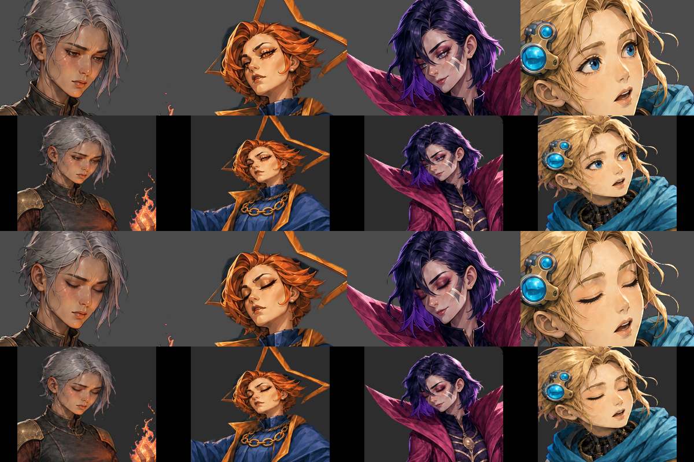

# 制作素材 v0.1

対象はプレイアブル５人。Silent v0.5のデザインはユーザー承認済み。他４人のv02と今回の実装用派生は、自律制作の委任に基づいて親が採用した。個別のユーザー承認や実プレイ検証済みを意味しない。

## 現行の入力と生成方法

| キャラ | デザイン基準 | 画像の来歴 | 動作上の区別 |
| --- | --- | --- | --- |
| Ironclad | 華奢な体格、ためらいのある火と剣の使い手 | v02と本体/休憩はAPI、背景/閉じ目はCodex内蔵 | 剣を持つ画像左の手と、火を持つ右の手を分ける |
| Silent | ユーザー承認v05の可愛さ・透明感 | 本体/背景/閉じ目/休憩は既存API記録 | 羽織・白髪・短剣、素早い低い姿勢 |
| Regent | 小柄な女王、星の冠、指示する態度 | v02/玉座/休憩はAPI、本体は元生成画のalpha分離、背景/閉じ目は内蔵 | 玉座と担ぎ手は独立した静止層。７星座hoverは別の入力層 |
| Necrobinder | 細い身体、ロケット、鎌、Ostyとの関係 | v02/本体/休憩はAPI、背景/閉じ目は内蔵 | 鎌の手、独立したOstyと元ゲームの状態制御を保持 |
| Defect | 継ぎ合わせた機構と少女的な好奇心を持つ成人 | v02/本体はAPI、背景/閉じ目は内蔵、休憩は座った本体の再利用 | 機械の飾りと、ゲームが個別に制御するOrbを区別 |

以前のAPI課金エラー後、ユーザーが「codexに入っている画像生成機能を使用してください」と指定したため、足りなかった４背景・４閉じ目は内蔵 `image_gen` で制作した。使用モデル、画質設定、課金量はツールから取得できないので推測値を記録しない。背景の実出力は1672×940または941、閉じ目の生成出力は1536×1024。要求解像度と実出力を区別し、実値は各provenanceへ残した。

プロンプトと参照cropは `art/prompts/<character>/*-builtin-v01*`、元の生成結果とSHA-256は `output/imagegen/<character>/*-builtin-v01*`。Codexの保存元を削除せずプロジェクトへコピーした。生成履歴のPNGは上書きしない。

## 実装用の素材

`mod/assets/PopSpireWomen/art/<id>/` に本体、背景、休憩本体、元rigと層を置く。PNGは1024×1536の本体座標を保持し、閉じ目の層も同じcanvas。４人の閉じ目は顔のcropを入力に生成し、目の領域だけをalphaで取り出した。元の身体・顔の輪郭・鼻・口・眉は書き換えていない。



生成済みcropから層を再組立する場合:

```bash
uv run --no-project --with pillow python tools/assets/assemble_blinks.py
```

この処理は画像生成を行わない。出典hashを確認し、生成cropを元の300×200へ縮小して目maskを2px拡張・1pxぼかし、元のalphaと交差させる。変更範囲は目の周囲に限定される。別の顔・身体へ転用する場合は、この登録位置とmaskを作り直す。

`tools/assets/compile_rigs.py` は元rigを保持し、`rig-overrides.json` の手・所作・表示位置の調整を重ねて `rigs/<id>/{combat,merchant,select,rest}.json` を生成する。休憩は専用の `rest_rig.json` を使う。受け入れる動作名・状態同期は [free-animation](../../development/free-animation.md) の契約に従う。

```bash
python3 tools/assets/compile_rigs.py
godot --headless --path mod/assets \
  --script /absolute/repo/tools/assets/build_ui_icons.gd -- \
  /absolute/repo/tools/assets/ui-recipes.json
```

UIは生成本体の顔をcropし、top/outline=85×85、portrait/locked=132×195、map=49×64へ整える。outlineはalphaを広げた白、lockedは暗いシルエットで、原ゲームが描く鍵を重ね描きしない。透明境界はpremultiplied alphaで縮小する。UI/rigそれぞれの `build-receipt.json` に入力・設定・出力のhashを残す。

５つの `select/production/<id>.tscn` は元の自作選択sceneを継承し、背景と最終rigを指定する。Regentのhoverも継承する。ゲームへ接続するPCKは [PCKのローカル生成](../../development/pck-only.md) を使う。

## 検証と限界

本体・分割した玉座・閉じ目の合成を目視し、rig schema・texture寸法・UI型はPCK生成時のGodot preflightで検査する。これらの成功は、原ゲームの実プレイ確認とは別の結果として扱う。

休憩素材は本体の別姿勢を必要とするため、生成時に細部が変わる場合がある。Silentの休憩画では足元がつま先の出る巻き布になり、立ち姿の閉じた靴と完全一致しない。委任範囲で採用した衣装差分として記録し、原画像の完全維持とは称さない。単一meshの変形は関節ごとの完全な手描きアニメーションではなく、元のイベント時刻に合わせた姿勢・層の動きである。実機で隠れ・大きさ・武器位置を確認して調整する。

新しいキャラや動作を足すときは、先に必要な状態・独立して動く要素・原ゲームとの接点を決める。元の全身画を無条件に引き延ばして済ませず、違和感が出る場合は層や姿勢から変更する。API/内蔵の区別、元画と派生の関係、ユーザー承認と制作採用の区別は保つ。
