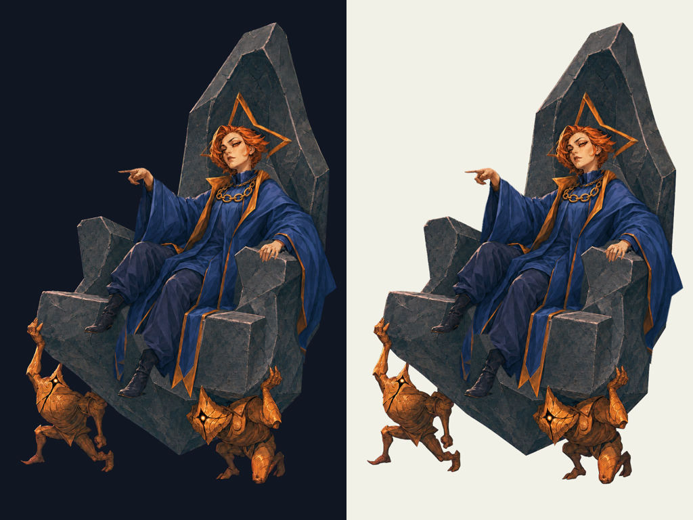
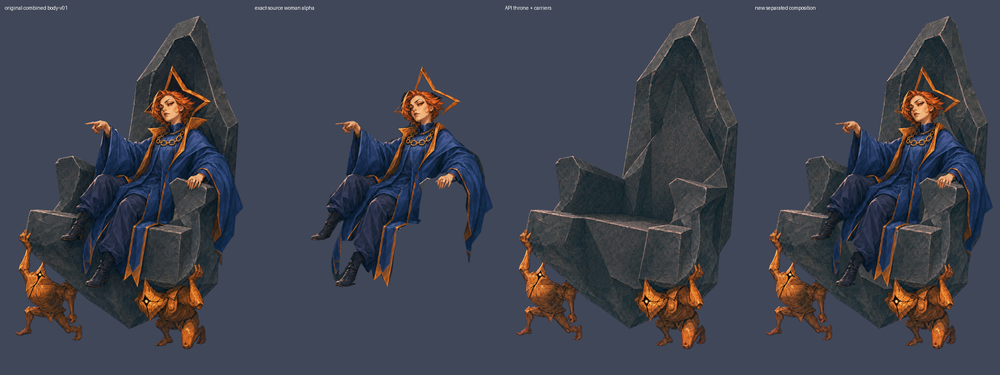

# RegentのGodot用追加surface

## #10 休憩surface制作（2026-10-09）

[Issue #10](https://github.com/Motoki0705/slay_the_spire_2_mods/issues/10)。担当 `production-surfaces` / GPT-6.1 sol / max / service_tier=default。今回の派生は **delegated-production-selection / user_approved=false**。Silent v0.5本人のユーザー承認を、新しい休憩姿や他４人の承認へ広げない。５人の休憩surfaceとRegent分離は制作済み。**Silent以外４人の選択背景・閉眼はbilling系APIエラーのため未制作**。本担当の素材をMOD完成やProductionReadyと称さない。

### 休憩姿の制作採用

既存body-v01の本人を同じ画素・同じcanvas・同じ位置からalpha maskで分離した。銅橙の髪、星飾り、人の顔、指図する手、青と金の王衣、両ブーツのRGBは原本と一致する。API人物分離v01は本人が拡大・移動しており不採用。元画像をmaskで保護する修正はbilling系エラーで出力なし。そこで既存のAPI制作画素をalphaだけで抽出し、移動・再描画・新規人体の加筆を行わず原位置を保持した。玉座と２体の運び手は別のAPI編集で本人を除去し、元の隠れた座面・背・肘掛けを石として補完した。人物の大きい回転で新しい衣服の遮蔽部分まで復元できると主張しない。

| 配布物 | 内容 | SHA-256 |
| --- | --- | --- |
| [rest_body.png](../../../../mod/assets/PopSpireWomen/art/regent/rest_body.png) | 1024×1536 RGBA。本人と携行装備、背景なし | `608428127a16624ab8232f2c44b7635c8f65fa9be834e9fdbe075f447f583e5d` |
| [rest_rig.json](../../../../mod/assets/PopSpireWomen/art/regent/rest_rig.json) | schema 1、９marker、地面基準origin、静かな休憩キー | `3fc81bd4583bc8487972817e4f11881720221cb6e30bde108f8130837ec8c15d` |

玉座はマゼンタkey原本を付属ツールのcorners採色・soft matte 52/120・spill cleanupでRGBAへ変換した。人物は元body-v01のRGBを保ち、輪郭mask・限られた星飾り／肌領域の元画素選択・alpha交差だけで分離。肩・肘掛け・ブーツ周辺の石をmaskから除き、原画・API成功版・不採用版を残した。大きい変形では元の遮蔽境界が露出し得る。

alpha bboxは`[247, 267, 996, 1178]`、alpha=0は1,292,474、部分alphaは24,306、alpha=255は256,084画素。全外周はalpha0。玉座を含む全体の接地は別層の最下端1430pxを使う。

### 座標とGodot入力

左上原点・+Y下・px。l/rは**画像上の左右**。`display_height=300`はcanvas全体の暫定表示高で、人物実高ではない。親が実ゲームの表示サイズを調整する。origin=`[528, 1431]`。腰・胸は服／機構に覆われた位置の制作上の推定。

| marker | 実画像のpixel座標 |
| --- | --- |
| `hip` | `[588, 742]` |
| `chest` | `[705, 608]` |
| `head` | `[697, 445]` |
| `hand_l` | `[403, 522]` |
| `hand_r` | `[794, 729]` |
| `foot_l` | `[299, 956]` |
| `foot_r` | `[395, 1144]` |
| `hair` | `[746, 418]` |
| `cloth` | `[604, 938]` |

`idle_loop / relaxed_loop / overgrowth_loop / hive_loop / glory_loop`へ弱い呼吸の明示キーを入れた。手・足を振る大きな所作へしない。原作のtrack・event・待機・保存/RNG・独立した相棒/Orb/武器は入力素材では変更しない。一枚のbody meshは大きい関節回転や隠れた人体を復元できない。商人・戦闘・死亡・復活との適合は親の実機確認事項。

### Regentの分離と旧玉座の抑止

現行[body.png](../../../../mod/assets/PopSpireWomen/art/regent/body.png)は人物のみ。[layers/throne.png](../../../../mod/assets/PopSpireWomen/art/regent/layers/throne.png)は玉座＋２体の運び手のみ。`rig.json`と`rest_rig.json`で`bone=root,z=-1`。人物は元の９markerに基づくmeshへ分け、玉座をその人体変形へ巻き込まない。`preserve_slots=["shadow"]`を両rigへ明示し、旧`throne*`/`*guy*`を残す省略時設定による二重表示を防ぐ。独立Sovereign Bladeには触れない。

携行武器なしのため`weapon_hand`は省略。許可されない`none`を入れず、選択・attack・attack_sovereign・castには画像左の指図を明示clipで指定した。休憩は呼吸だけの専用clip。right-hand markerは元位置から皮膚の不透明な点`[794,729]`へ小さく移した。本人画像のRGB・位置は変えていない。

元一体版[regent-body-v01.png](../../../../output/imagegen/regent/regent-body-v01.png)とその来歴は保持。旧reviewのhash `7347...1b7a`はこの**旧一体原本**のhashで、現在の配布bodyのhashではない。現在の対応は[人物alpha分離記録](../../../../output/imagegen/regent/regent-surface-body-source-v04.provenance.json)・[body側来歴](../../../../mod/assets/PopSpireWomen/art/regent/body.provenance.json)へ。

### 未制作の背景・閉眼

[背景プロンプト](../../../../art/prompts/regent/regent-surface-background-v01.txt)は2048×1152、本人なし・UIなし、左に静かな面、右に人物を置く空間。本人の採用画の画風・色に合わせたMODの舞台提案で、新しい公式設定とは書かない。1920×1080はgpt-image-2の16px条件を満たさないため使わない。

[閉眼プロンプト](../../../../art/prompts/regent/regent-surface-blink-v01.txt)・[元canvasのeye mask](../../../../art/prompts/regent/regent-surface-blink-v01-mask.png)は準備済み。成功PNGと`rig.layers`のblink登録はまだない。復旧後はAPIで閉眼を制作し、mask反転・3px拡張・1.3pxぼかし・元body alphaとの交差で**目の周囲だけ**を残す。開いた目を皮膚で覆う差分が必要。全身の別絵を瞬きlayerへ重ねない。既存Silentの方式を参照する。

### 来歴・検証・残る範囲

[今回の原入力・出力hash・採用・未制作・検証記録](../../../../output/imagegen/regent/regent-surface-production-v01.provenance.json) / [休憩PNGの制作・変換記録](../../../../output/imagegen/regent/regent-surface-rest-v01.provenance.json)。画像APIは指定スキルの無改変CLI `gpt-image-2 / high / 1024x1536 / PNG / n=1 / --no-augment`。キーは指定dotenvを補間なしで読み、OPENAI_API_KEYだけCLI子プロセスへ渡す。生例外・キー・課金usageは記録しない。背景サイズは2048×1152。別model、組み込みimagegen、独自SDK生成器、Spine購入・動画AIは使用しない。

#10全員分のライブCLI実行は上限20回中８回（成功６・billing系失敗２）。原画・過去素材のAPI回数とは分ける。成功でも位置／alpha不備のある版は不採用として保持。SDK内部の通信再試行回数と実請求額は公開されておらず不明。課金失敗を生成成功や設計却下と扱わない。

通常検証は、実PNGデコード・1024×1536・alphaと外周・入力不変・９markerの実画像位置とalpha・texture path・SHA-256・明暗背景の縁・Godot 4.5.1の`rig_schema.gd`と実texture読込み・休憩キー/玉座固定・実描画、文書リンク、diff。結果は上記provenanceへ。validatorは指定０回。実ゲーム起動・導入・元DLL変更・catalog/ProductionReady設定は本担当で実施していない。親の実機確認、未制作８素材のAPI制作、ゲーム面への接続が残る。

通常検証の確定結果: **Godot 4.5.1で195件・失敗０、実rig10個、相対リンク83件、休憩marker45点はalpha255**。[再現用検証script・結果](../../../../output/imagegen/regent/regent-surface-validation-v01.json) / [実休憩rigのGodot描画](../../../../output/imagegen/regent/regent-surface-rest_rig-godot-preview-v01.png)。V-Sync変更が不可という検証用Mesa driverのwarningはあるが、script/runtimeエラー・leak警告はない。
