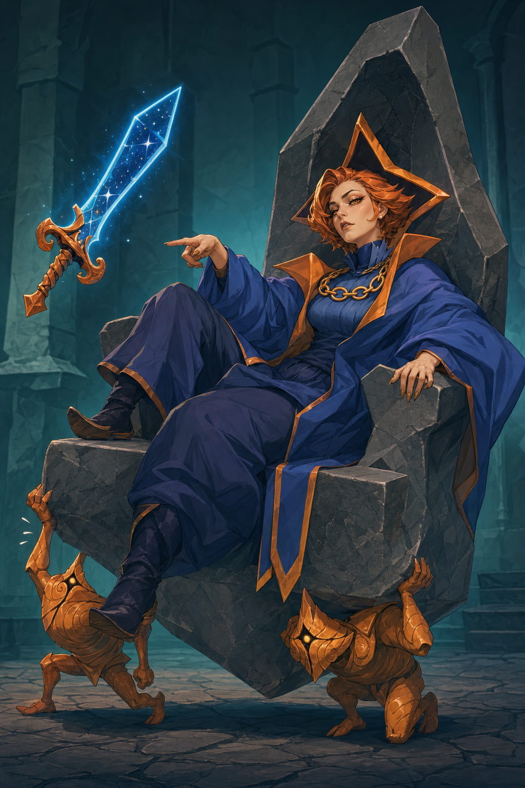
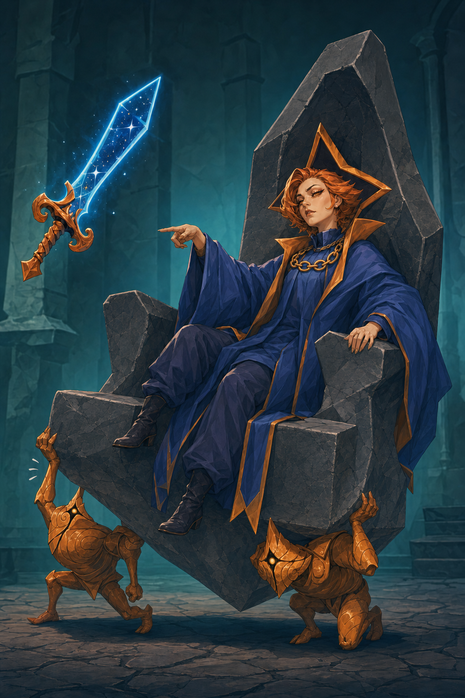
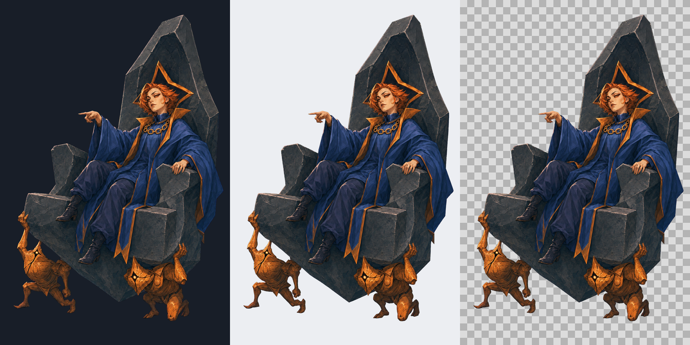

# Regent v0.2 — 小さな成人の身体と大きな王衣

作成日: 2026-10-09（JST）。担当: `art-regent-production`。[Issue #4](https://github.com/Motoki0705/slay_the_spire_2_mods/issues/4) / [draft PR #15](https://github.com/Motoki0705/slay_the_spire_2_mods/pull/15)。共通指示の基準commit: `b2763f844b0a345793ac8567f7a1996db3480fb2`。初回制作commit: `4f97a7a700cfb42e9b1435b6f8049d9b48fb75af`。

状態: **担当が委任に基づく制作採用の候補として選び、実装用bodyの入力にしたv0.2。** `design_adoption=delegated-production-selection`、`user_approved=false`。親が最終採用とmergeを判断する。ユーザーが個別に承認した画像とは扱わず、ユーザーの再回答待ちだけで制作を止めていない。

## 旧案との比較と採用理由

| v0.1 — 要修正の旧案 | v0.2 — 今回の制作採用候補 |
| --- | --- |
|  |  |

[v0.2原寸](../../../../output/imagegen/regent/regent-v02.png) / [v0.1の記録](review-v01.md) / [今回の全文プロンプト](../../../../art/prompts/regent/regent-v02-edit.txt) / [入力・出力hashとAPI来歴](../../../../output/imagegen/regent/regent-v02.provenance.json)。旧案・旧プロンプト・来歴は上書きしていない。不採用の５人集合案は入力していない。

ユーザーの「その他のキャラはスタイルが良すぎます」「華奢な感じが魅力的」を、[改訂案](../slender-revision-brief.md)と[プロンプト・絵作りの調査](../../../research/art-direction/non-generic-characters.md)に沿って適用した。旧案の`compact, sturdy build`と`weighty seated silhouette`を、小さな成人の身体と余る王衣の関係へ置き換えた。顔・髪・色・装備・玉座の場面を保持し、胴と四肢、衣服の落ち方を変更対象にした。

目視では、胸をなぞる服の起伏が弱まり、細い胴と控えめな腰の形になった。袖口から出る手首・前腕も細く、大きい袖と身体の間に空間がある。衣服全体を細くする変更ではなく、大きな王衣と玉座の中に小さい本人がいる対比として採る。銅橙の短髪、細い琥珀の両目、成人の鼻・顎・眉、橙の星形飾り、青と金の王衣は残る。幼い巨大な目や頭、Silentの顔・白髪・緑へは寄せていない。

顎を上げた尊大な表情、指図する手、肘掛けにかけた手、玉座の下で踏ん張る２体の運び手が同じ場面にある。本人の顔を星形の異星の頭へ戻していない。即位済みの女王という正史も追加していない。原作の核と女性の人体への翻案を分ける根拠は、既存の[キャラ調査](../../../research/characters/regent-necrobinder.md)と[参照索引](../../../../art/references/regent/README.md)。今回は公式設定の再調査や再抽出を行っていない。

残る点は、運び手へ向ける視線と「揺れに一瞬慌てる」顔の芝居が静止画では控えめなこと。構図と運び手の苦労のほうが滑稽さをよく伝える。身体を小さくする編集で、膝・足の位置と画面内の収まりは少し変わったが、左右非対称の座位は保持された。衣服越しの人体寸法は測定しておらず、特定のプロンプト語の因果実験とは称さない。

## 参照とAPI条件

v0.2の入力は番号付きで次の２枚。どちらも生成前に実画像を目視した。

| 入力 | 役割と保持・変更の範囲 |
| --- | --- |
| 1: Regent v0.1 | 編集対象。本人の顔・銅橙の短髪・色・装備・場面を保つ。身体の大きさと服の収まりは保持条件から外し、改訂する |
| 2: [Silent v0.5](../../../../output/imagegen/silent/silent-v05.png) | ユーザー承認済み画像の光・塗り・静かな色面だけを参照。顔、目の大きさ、白髪、緑、衣装、体型、姿勢は転写しない |

指定のimagegenスキル付属`image_gen.py`の`edit`のみでAPIを呼び出した。`gpt-image-2 / high / 1024x1536 / PNG / n=1`、`--no-augment`。mask、`input_fidelity`、背景パラメータは省略。v0.2はRGBの不透明なレビュー場面で、実装用の背景透過とは区別する。[画像API運用](../image-api-workflow.md)に従い、指定dotenvを補間なしで解析してキー１つをCLI子プロセスへ渡した。キー・生のAPI例外を表示・記録していない。

## 実装用RGBA body

本人・玉座・２体の運び手を一組とした、1024x1536のRGBA素材を制作した。背景分離の入力は採用候補v0.2の１枚のみ。独立制御されるSovereign Blade、その光・星、室内・床・影・離れた汗の描写は含めない。

[RGBA原寸](../../../../output/imagegen/regent/regent-body-v01.png) / [APIのkey背景原本](../../../../output/imagegen/regent/regent-body-v01-key.png) / [背景分離プロンプト](../../../../art/prompts/regent/regent-body-v01-key-edit.txt) / [body来歴・変換条件](../../../../output/imagegen/regent/regent-body-v01.provenance.json) / [配布用body.png](../../../../mod/assets/PopSpireWomen/art/regent/body.png) / [rig.json](../../../../mod/assets/PopSpireWomen/art/regent/rig.json)。確認画像は同じRGBAを合成・縮小した表示用で、人物を描き変えた素材ではない。

APIでは`background=transparent`を指定せず、服・肌・髪・石に含まれないmagenta `#FF00FF`の均一背景へ編集した。モデル・画質・解像度はv0.2と同じ。生成された背景には小さい色差があり、付属`remove_chroma_key.py`がcornersから採った色は`#F705ED`。最初の変換では左下の背景にalpha最大15の微かな残りがあったため、その中間結果をローカルQA用に保ち、透明側の閾値だけ16から32へ調整して再変換した。API再生成や人物の再描画は行っていない。

最終変換は`--auto-key corners --key-color '#FF00FF' --tolerance 12 --soft-matte --transparent-threshold 32 --opaque-threshold 110 --spill-cleanup`。feather、contract、canvasの拡張・縮小はしていない。元API PNGとCLI・変換ツールのhashを来歴に保存した。alpha=0は848,149px、0<alpha<255は7,569px、alpha=255は717,146px。枠全周と元の剣の空き領域はalpha=0で、半透明の縁を持つ。

可視範囲は左上原点の`[60,65,996,1431)`、透明余白は左60／上65／右28／下105px。全身・星飾り・髪・両手・ブーツ・玉座・運び手の手足は枠内に収まる。指示した全方向64pxの余白は左右で未達だが、切れはない。残る動作余白は親の表示検証で確認する。背景を埋める後加工でこの差を隠していない。

暗・明・市松の背景で全体を確認し、顔と髪、指差しの手、右の布端、運び手の足を原寸cropで見た。背景の四角い残り、目立つmagentaの縁、布・肌の色抜けは見当たらない。目視の観察であり、全画素が無欠陥という保証ではない。人の顔、細い身体、服の落ち方はv0.2と同じ読みを保つ。

RGBA原本と配布PNGはbyte単位で同一、SHA-256は両方`7347c74978a6e3fef6aeb2c15122483d54fcd53fd419496f8e35ec43c4de1b7a`。v0.2のSHA-256は`4a411f96141df8fe596c19347bf0c30d576deac56827724bc05e5b4f614488cc`、key原本は`7674d0a4235d68131b38f4a2ec833036b0028024763eef2711afe3b1c3edc218`。全入力・prompt・PNG・rigの対応は各provenanceにまとめる。

`/tmp/sts2-autonomous/runtime-contract.md`をbody生成前に確認した。1024x1536の全身RGBAと透明余白、独立した剣を焼き込まない契約に合わせる。原画では本人が玉座を大きく覆い、２体の運び手も座面と重なるため、このbodyは玉座・運び手が一体の場面cutoutとして渡す。独立`layers/throne.png`や、髪・前腕・布・閉じた目の層は今回制作していない。大きい関節回転や、本人だけを揺らして玉座を固定する演技には追加の層が必要で、一枚絵から遮蔽部分を復元できるとは扱わない。

body確認中にsteeringへ「body.pngに加え、自分のart/<character>/rig.jsonへ実画像の座標markersを用意」「旧依頼のrig設定を編集しない文よりこの追加を優先」が追記された。この追加に従って、自分のRegent用`rig.json`だけを新規作成した。runtimeコードと共通rigは変更していない。正式catalogの登録・`ProductionReady`判定は親／renderer担当へ引き継ぐ。制作採用とゲーム内の表示検証は別の状態。

rigは契約schema 1、canvas `[1024,1536]`、body `res://PopSpireWomen/art/regent/body.png`、暫定`display_height=300`、`layers=[]`、`anchors={}`。左上原点、+Y下。手足のl/rは**画像の左／右**で、本人の解剖学的左右ではない。足markerは運び手の足ではなく本人のブーツに置いた。原点`[528,1431]`は運び手の最下部を基準にした接地高さで、玉座を含む全体を配置するための暫定値。

| marker | 実画像上の座標 | 対象 |
| --- | --- | --- |
| hip | `[588,742]` | 座った本人の腰。衣服に覆われた位置の目視推定 |
| chest | `[705,608]` | 金鎖の下の上胴 |
| head | `[697,445]` | 人の顔の中心付近 |
| hand_l / hand_r | `[403,522]` / `[796,747]` | 指差す左側の手／肘掛けにかけた右側の手 |
| foot_l / foot_r | `[299,956]` / `[395,1144]` | 画像左の高いブーツ／画像右の低いブーツ |
| hair | `[746,418]` | 銅橙の外側の髪束 |
| cloth | `[604,938]` | 本人の前へ垂れる青い王衣 |

全marker位置のalphaは255で、透明背景へ置いた値ではない。両手とも剣を握っていないため、weapon handは**なし**。独立したSovereign Bladeの制御・接点は元ゲームとrenderer側へ残す。大きい玉座や運び手を人体のmarkerで自然に変形できるとは未検証で、親の実ゲーム調整が必要。

## 通常検証と未確認

APIは改訂１回＋背景分離１回、計２回成功。明らかな破綻のための追加１回枠は使っていない。CLI報告の時間は改訂83.7秒、背景分離70.7秒。色の切り抜きは２回で、API呼出し数に含めない。

PNGデコード・RGB/RGBA・寸法、全入力と承認済みSilentの不変、各SHA-256、配布PNGとの一致、alphaの枠・余白・剣の空き領域、rig JSONのschema・resource path・canvas内のmarker・各markerのalpha、文書の相対リンク、所有範囲、秘密情報なし、`git diff --check`を通常検証で確認した。validatorは指定どおり0回。

実ゲームの表示、動作への適合、死亡／復帰や独立剣との同期、配布物へのPCK統合、実プレイは担当範囲外で未実施。ローカルの既存調査対象はv0.107.1 / 59260271 / Godot 4.5.1であり、最新版対応とは称さない。Spine Professional、動画生成AIは使用していない。
