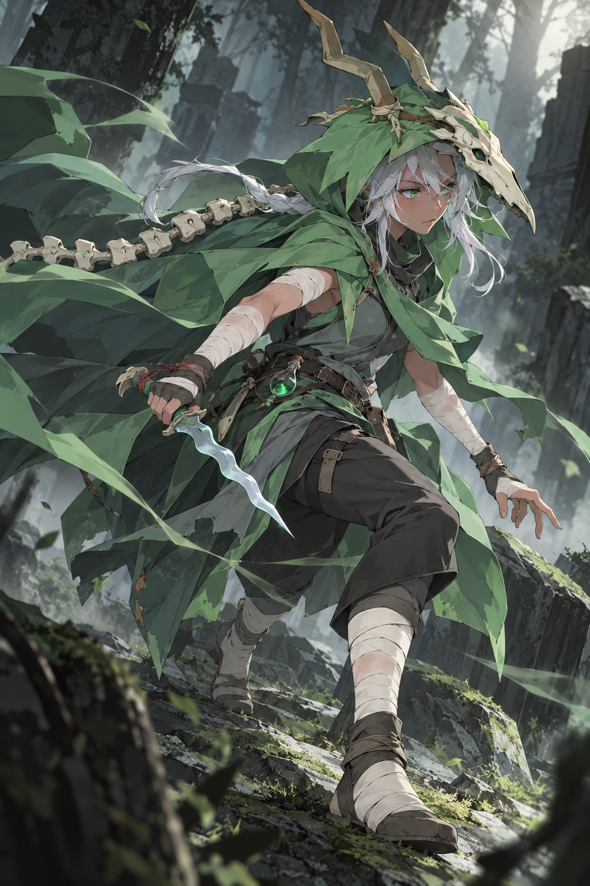

# キャラクター方針 v0.3 — 本人らしさが伝わる擬人化・女性化

状態: **サイレントv0.4をAPIで生成済み。透明感を増し、野性的な印象を抑える改訂待ち。** デザイン全体は未確定。残り４人も制作する指示を受けている。v0.1 は単調さと魅力の捉え違い、v0.2 は女性化・擬人化の不足で不採用。

## 今回の目標

元キャラを、**人の顔・髪・表情を持ち、はっきり女性として読めるキャラクターへ翻案する**。基準はユーザーが示した [KaguyaSilentRavenの選択画面](../../../art/references/silent/mod-reference/kaguya-silent-raven/user-provided-selection.png)。原作の色・装備・能力・人物像を、新しい人体、衣装、表情、仕草に引き継ぐ。

公式設定の調査は、その翻案の意味を支える。元の骨格や顔を文字どおり維持することを制作条件にはしない。設定の事実と、本MODの外観上の解釈は区別する。擬人化した絵を、原作で肉体を回復した・種族が変わったという新しい正史の証拠にはしない。

## この作品で目指す「魅力」

**本人の意志、癖、矛盾、他者との関係が見え、もっと知りたくなること。** 顔立ちや絵としての美しさも、その人物らしさと結び付けて作る。

v0.1 は髪色や装飾を変えても、同じ細身の身体、同じ豪華な衣装、同じ鑑賞者向けの笑みと立ち方に寄っていた。外見の要素を足すだけでは人格の違いにならない。v0.2 はその反省を原型の維持へ振り切り、依頼の擬人化・女性化を弱めてしまった。

次の絵は、各人の「その人らしい瞬間」から設計する。

- **意志が読める:** 本人は何を見て、何をしようとしているか。視線、手、重心がその行動へ向いているか。
- **理由のある外見:** 服や道具、修繕、身なりが、その人の仕事・背景・性格と結び付いているか。装飾の量で魅力を埋めない。
- **一面的でない:** 強さの中の疲れ、尊大さの中の滑稽さ、生意気さの中の信頼など、別の面を小さな仕草で見せられるか。
- **絵として気持ちよい:** 輪郭のリズム、色面、素材の対比、顔と手への視線の流れを整える。細部は焦点と意味があるところへ集める。
- **眺める理由がある:** 動画では視線や仕草に始まり・間・反応があり、何度か見て気づく小さな変化があるか。

露出の多少だけを品質の判定にしない。身体の強調や鑑賞者への媚びを５人共通の主役にせず、美しさ・可愛さ・格好よさが各人の行動から伝わるようにする。

## ５人の「らしい瞬間」

以下は公式設定を基にした **MOD用の演出・翻案の提案**。公式にその場面があるという記述ではない。

| キャラ | 人物として気になる核 | 見せたい瞬間 | 人型女性への翻案の軸 |
| --- | --- | --- | --- |
| アイアンクラッド | 大きな力を持ち、自分の意志に反する戦いも背負う兵士 | 剣を支えながら手の炎を抑え、呼吸を整えて再び顔を上げる。強さと意志の緊張 | 顔の見える力強い女性兵士。銀灰色の髪、金銅の実用鎧、使える装備としての仮面、剣、炎を引き継ぐ。笑みで好戦性を足さない |
| サイレント | 狩りの訓練と儀礼を背負う、集中した女性狩人 | 気配に気づいてぴたりと止まり、目線と短剣だけが先に動く。外套が遅れて収まる | はっきり人の顔を持つ女性。緑のフード、白灰の髪、巻き布、頭蓋骨と背面の骨、短剣を再構成。頭蓋骨は顔を全て隠さない着用へ翻案する |
| リージェント | 大仰な自負と英雄願望、従者に頼る生活の滑稽さ | 得意げに指図した直後、玉座の揺れに少し慌て、何事もなかったように威厳を取り戻す | 人の表情を持つ女性の継承者。橙色の星形は頭飾り・髪や襟の輪郭へ、単眼の印象は目元の意匠へ翻訳。大きな青い王衣、玉座、従者、浮遊剣を保つ |
| ネクロバインダー | 生意気さの奥に復讐の意志があり、相棒への信頼がある | オスティへ合図し、応答に一瞬だけ表情を緩める。次の瞬間には前を見据える | 人の顔を持つ女性の死霊術師として擬人化。青白い肌、骨を思わせる化粧・衣装、赤紫の長衣、霊的な炎、鎌を使う。オスティは独立した骨の手のまま |
| ディフェクト | 自分を直して生き延びる機械の、好奇心と感情 | 自分の腕を調整していたらオーブが反応し、手を止めて観察する。納得して小さく頷く | 人の表情を読める女性型オートマトン。青と金、大小の光学部品、機械の手足、接ぎ合わせた部材と布を人体へ再設計。自己修繕の跡に意味を持たせる |

５人に同じ髪型・体型・笑顔の型を割り当て、色だけを替えない。一方、違いを出すためだけに特徴を盛り合わせない。行動、重心、衣装の用途、表情の幅が自然に違うかを見る。

## 最初の描画確認

組み込み `image_gen` で制作。[生成指示](../../../art/prompts/silent-v03.txt) / [入力資料と出力の記録](../../../art/concepts/silent/silent-v03.provenance.json)。2026-10-09作成。未承認。

ユーザーレビュー: 「質感はいい感じになりました。ただし、サイレントは参照モッドのようにかわいい系かつ、露出を15%あげてください。」質感・構図を保った部分編集として、[API経由のv0.4](image-api-workflow.md)を準備する。この追加指示はサイレントについての指定であり、全５人に同じ露出量や可愛さの型を適用する指示にはしない。

v0.4は [API出力](../../../output/imagegen/silent/silent-v04.png)として保存済み。追加レビューの対象はv0.3ではなくv0.4とユーザーが訂正した。「透明感が足りなくて、野性的な感じがあまりよくない」。次の修正では、可愛い顔と露出調整を保ち、荒れた布・強い暗部・重い印象を抑え、肌・白髪・瞳に澄んだ光を与える。背景のalpha透過の指定とは扱わない。

他４人も作成する。各人の設定・意志・仕草を起点にした別の案にし、Silentの同じ顔や可愛さへ揃えない。

まずサイレントを、添付参照で明確な「人の顔を見せる翻案」の基準として描く。狩りの途中の集中と軽快さを、顔・手・外套の動きで見せる。他４人を同じ顔や服装へ展開する見本にはしない。

この段階は絵柄と擬人化の程度を合わせる確認用。正式な立ち絵、動画、ゲーム内素材の承認にはしない。

## 調査結果の採否

設定の一次事実・公式原画・役割・人物像は採用する。調査書にある「人間の顔を付けない」「骨や機械の顔をそのまま残す」という制作提案は、今回のユーザー意図に対して保守的すぎるため採用しない。衣装や所作へ何を翻訳するかの根拠として読み替える。調査の原文は記録として残す。

設定の入口: [キャラと世界観の調査](../../research/characters/README.md)。動く場所と実装契約は [動作一覧](../../research/motion/inventory.md) と [実装方式](../../research/implementation/options.md) で扱い、外観の翻案とゲーム動作の互換性を分けて判断する。
