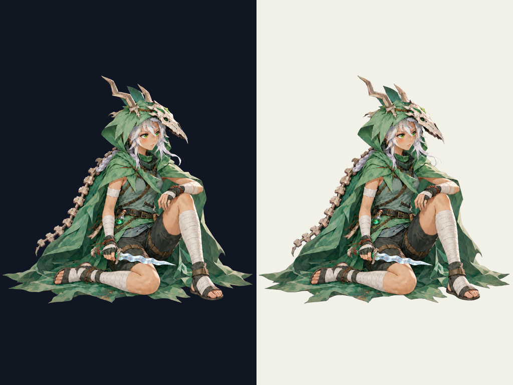

# SilentのGodot用素材

## 現行v0.1への案内（2026-10-09）

[制作素材 v0.1](../production-assets.md) / [現行５人のギャラリー](../review-gallery.md) / [DLL不要のPCK生成・導入](../../../development/pck-only.md)。[PR #35](https://github.com/Motoki0705/slay_the_spire_2_mods/pull/35) がmainへ統合済み（基準 `6b190bb82a38052c42de869211586a032140ab84`）。

[v05基準デザインのユーザー承認](review-v05.md#ユーザー承認2026-10-09)を保持する。本体分離・背景・まばたき・休憩姿・UI・rig等の派生は委任に基づく制作採用で、個別のユーザー承認ではない。 本体・背景・閉じ目・休憩姿の既存API記録を保持し、現在の20用途別rig・選択scene・UIへの統合は全体文書で案内する。

現在の入力は [body](../../../../mod/assets/PopSpireWomen/art/silent/body.png)、[選択背景](../../../../mod/assets/PopSpireWomen/art/silent/select_background.png)、[閉じ目層](../../../../mod/assets/PopSpireWomen/art/silent/layers/eyes_closed.png)、[休憩body](../../../../mod/assets/PopSpireWomen/art/silent/rest_body.png)。ゲームへ渡すrigは元の `art/silent/rig.json` に調整を重ねた用途別の [combat](../../../../mod/assets/PopSpireWomen/rigs/silent/combat.json) / [merchant](../../../../mod/assets/PopSpireWomen/rigs/silent/merchant.json) / [select](../../../../mod/assets/PopSpireWomen/rigs/silent/select.json) / [rest](../../../../mod/assets/PopSpireWomen/rigs/silent/rest.json)。[production選択scene](../../../../mod/assets/PopSpireWomen/select/production/silent.tscn) と [UI icon scene](../../../../mod/assets/PopSpireWomen/ui/silent/icon.tscn) も統合済み。

動きは無料Godot描画を使い、Spine Professional・動画生成AIを使わない。原作のtrack/event/待ちを観測して同期する設計と、実プレイの成功は区別する。全５人のsurface・状態遷移等の実機QAは親の [Issue #11](https://github.com/Motoki0705/slay_the_spire_2_mods/issues/11) で継続中。共有済みの確認範囲は [開発の案内](../../../development/README.md#検証の境界) を参照。

## 以前の制作記録

> 以下は#28/#10の制作時点の記録を保持したもの。「未制作」「API復旧後」「本担当では未確認」、暫定表示高・hash・生成回数は当時の範囲を示す。現在の生成経路・有効素材・用途別rig・QA状況は上記の入口を参照し、古いAPI再開手順を現在の指示として使わない。

> 最新の#10追加は末尾の「#10 休憩surface制作」を参照。既存#28の３回と、今回の全員分８回を区別する。

[Issue #28](https://github.com/Motoki0705/slay_the_spire_2_mods/issues/28) / [元デザインのユーザー承認](review-v05.md)。2026-10-09。Spine Editor・動画AIを使わない自律制作の委任に基づき、親が素材を採用した。**派生素材の個別ユーザー承認ではない。ゲーム内確認は未実施。**

## 素材

| 出力 | 内容 |
| --- | --- |
| `mod/assets/PopSpireWomen/art/silent/body.png` | 1024×1536 RGBA。承認絵から人物を分離し、角・外套・手足・短剣まで枠内へ収めた |
| `mod/assets/PopSpireWomen/art/silent/rig.json` | #26のschema 1。足元基準、顔・手・足・髪・外套のpixel座標。実ゲームで大きさと変形を調整する |
| `mod/assets/PopSpireWomen/art/silent/layers/eyes_closed.png` | 同canvasの瞬き用レイヤー。APIで閉眼にした領域だけをmaskに沿って残した |
| `mod/assets/PopSpireWomen/art/silent/select_background.png` | 2048×1152。人物・装備を含まない森と足場。選択画面で人物とは別に描く |

画像は全て `gpt-image-2 / high`、スキル付属CLIのImage API editで制作。ライブ呼出しは人物分離・瞬き・背景の３回。CLIの引数検査で `edit --max-attempts` が拒否された１回はAPIへ送信されていない。モデル変更や動画生成はしていない。キーは指定dotenvからそのプロセスへ渡し、表示・保存しない。CLIは課金usageを返していないため実請求額を推定で記録しない。

## 本人と描画の確認

可愛い人の顔、白髪と緑の瞳、緑の外套、頭蓋骨・角・背面の骨、短剣・毒瓶、短パンと巻き布を維持した。背景分離時に余白を確保し、元画像で画面外だった外套の端を補った。APIによる描き直しを含む派生なので、承認画像との画素一致は主張しない。元の承認済みPNGは変更していない。

単色マゼンタの指定に対し、実際の背景色にはわずかな変動があった。付属 `remove_chroma_key.py` のcorners自動採色（代表値 `#f703ee`）、soft matte閾値24/96、spill cleanupでalphaへ変換した。alpha bboxは `(32,25)-(968,1344)`、透明画素1,030,480、部分透明14,374。大きい背景残りや人物の欠落がないことを目視。細い髪の縁と最終背景上での見え方は描画検証で確認する。

瞬きは両目のmask内をAPIで編集し、closed-eye出力の該当領域だけを抽出した。maskを3px拡張・1.3pxぼかし、元bodyのalphaとの共通範囲に限定。手描きで目を加筆していない。背景や身体などmask外の再生成結果はレイヤーへ使っていない。

`hand_l`/`hand_r`と`foot_l`/`foot_r`は画像の左/右。短剣を持つ手は`hand_l`。`display_height=300`は暫定。元の骨格や武器の付着点との対応、攻撃・被弾・死亡等の変形、選択画面での構図は#26との統合後に検証する。全身の一枚meshでは大きな関節回転の隠れた部分を復元できないため、必要なら追加層へ分割する。

## 再現と来歴

- [人物分離の指示](../../../../art/prompts/silent/body-v01.txt) / [API記録](../../../../output/imagegen/silent/silent-body-v01-key.provenance.json) / [alpha変換・採用記録](../../../../output/imagegen/silent/silent-body-v01.provenance.json)
- [瞬きの指示](../../../../art/prompts/silent/blink-v01.txt) / [mask](../../../../art/prompts/silent/blink-v01-mask.png) / [API・レイヤー抽出記録](../../../../output/imagegen/silent/silent-blink-v01.provenance.json)
- [背景の指示](../../../../art/prompts/silent/select-background-v01.txt) / [API・採用記録](../../../../output/imagegen/silent/silent-select-background-v01.provenance.json)

各記録に入力・prompt・出力・変換のhash、寸法、API成否、採用範囲を残す。配布用body/backgroundは対応する出力PNGと同一bytes。PNGデコード・alpha・hash・入力不変・相対リンク・git diffを確認し、runtimeのProductionReadyとユーザー承認は別に扱う。

## #10 休憩surface制作（2026-10-09）

[Issue #10](https://github.com/Motoki0705/slay_the_spire_2_mods/issues/10)。担当 `production-surfaces` / GPT-6.1 sol / max / service_tier=default。今回の派生は **delegated-production-selection / user_approved=false**。Silent v0.5本人のユーザー承認を、新しい休憩姿や他４人の承認へ広げない。５人の休憩surfaceとRegent分離は制作済み。**Silent以外４人の選択背景・閉眼はbilling系APIエラーのため未制作**。本担当の素材をMOD完成やProductionReadyと称さない。

### 休憩姿の制作採用

承認済みSilent v0.5の本人を、採用済みbodyから自然な座位へ編集した。白髪・緑の瞳・人の顔、頭蓋骨と角、外套と背面の骨、同じ短パン・巻き布・露出、短剣と毒瓶を保持する。休憩中も横の気配を見ており、幼い顔や病弱な人物へ変えていない。短剣を持つのは画像左の`hand_l`。初回v01は外套が枠へ接触したので不採用。修正v02は全輪郭が枠内だが、左右余白は9px/12pxにとどまり、要求した80px目安は未達。描画時の余白は親の表示調整事項として残す。

| 配布物 | 内容 | SHA-256 |
| --- | --- | --- |
| [rest_body.png](../../../../mod/assets/PopSpireWomen/art/silent/rest_body.png) | 1024×1536 RGBA。本人と携行装備、背景なし | `91dfb59ff51fe0effbc40a63fb8918688e2b8ce17100d58870e1bd7c7dfea3ab` |
| [rest_rig.json](../../../../mod/assets/PopSpireWomen/art/silent/rest_rig.json) | schema 1、９marker、地面基準origin、静かな休憩キー | `d7a561cf189162ed0d40faca159320c92029383dbdf086e751444bd368129c25` |

v02キー背景はcorners採色で`#f803d9`となり、赤だけがspill channelと見なされて最初のalphaで肌が欠落したため、その変換は不採用。付属ツールへ対称の指定key `#ff00ff`、soft matte 52/120、spill cleanupを明示した`silent-surface-rest-v02-clean.png`を採用。明暗背景で肌・白髪・衣の不透明さを確認した。画像APIへの追加呼出しはない。

alpha bboxは`[9, 301, 1012, 1212]`、alpha=0は1,161,260、部分alphaは7,388、alpha=255は404,216画素。全外周はalpha0。原点は足・衣の地面接触を実画像から定める。

### 座標とGodot入力

左上原点・+Y下・px。l/rは**画像上の左右**。`display_height=300`はcanvas全体の暫定表示高で、人物実高ではない。親が実ゲームの表示サイズを調整する。origin=`[530, 1212]`。腰・胸は服／機構に覆われた位置の制作上の推定。

| marker | 実画像のpixel座標 |
| --- | --- |
| `hip` | `[554, 972]` |
| `chest` | `[578, 766]` |
| `head` | `[594, 555]` |
| `hand_l` | `[436, 1010]` |
| `hand_r` | `[655, 808]` |
| `foot_l` | `[245, 1098]` |
| `foot_r` | `[850, 1168]` |
| `hair` | `[648, 589]` |
| `cloth` | `[243, 978]` |

`idle_loop / relaxed_loop / overgrowth_loop / hive_loop / glory_loop`へ弱い呼吸の明示キーを入れた。手・足を振る大きな所作へしない。原作のtrack・event・待機・保存/RNG・独立した相棒/Orb/武器は入力素材では変更しない。一枚のbody meshは大きい関節回転や隠れた人体を復元できない。商人・戦闘・死亡・復活との適合は親の実機確認事項。

`weapon_hand=hand_l`。既存のSilent body/閉眼/選択背景の画像bytesとrigの９marker/layersは維持し、combat rigに短剣側`hand_l`だけを明示した。

### 来歴・検証・残る範囲

[今回の原入力・出力hash・採用・未制作・検証記録](../../../../output/imagegen/silent/silent-surface-production-v01.provenance.json) / [休憩PNGの制作・変換記録](../../../../output/imagegen/silent/silent-surface-rest-v02-clean.provenance.json)。画像APIは指定スキルの無改変CLI `gpt-image-2 / high / 1024x1536 / PNG / n=1 / --no-augment`。キーは指定dotenvを補間なしで読み、OPENAI_API_KEYだけCLI子プロセスへ渡す。生例外・キー・課金usageは記録しない。背景サイズは2048×1152。別model、組み込みimagegen、独自SDK生成器、Spine購入・動画AIは使用しない。

#10全員分のライブCLI実行は上限20回中８回（成功６・billing系失敗２）。原画・過去素材のAPI回数とは分ける。成功でも位置／alpha不備のある版は不採用として保持。SDK内部の通信再試行回数と実請求額は公開されておらず不明。課金失敗を生成成功や設計却下と扱わない。

通常検証は、実PNGデコード・1024×1536・alphaと外周・入力不変・９markerの実画像位置とalpha・texture path・SHA-256・明暗背景の縁・Godot 4.5.1の`rig_schema.gd`と実texture読込み・休憩キー/玉座固定・実描画、文書リンク、diff。結果は上記provenanceへ。validatorは指定０回。実ゲーム起動・導入・元DLL変更・catalog/ProductionReady設定は本担当で実施していない。親の実機確認、未制作８素材のAPI制作、ゲーム面への接続が残る。

通常検証の確定結果: **Godot 4.5.1で195件・失敗０、実rig10個、相対リンク83件、休憩marker45点はalpha255**。[再現用検証script・結果](../../../../output/imagegen/silent/silent-surface-validation-v01.json) / [実休憩rigのGodot描画](../../../../output/imagegen/silent/silent-surface-rest_rig-godot-preview-v01.png)。V-Sync変更が不可という検証用Mesa driverのwarningはあるが、script/runtimeエラー・leak警告はない。
