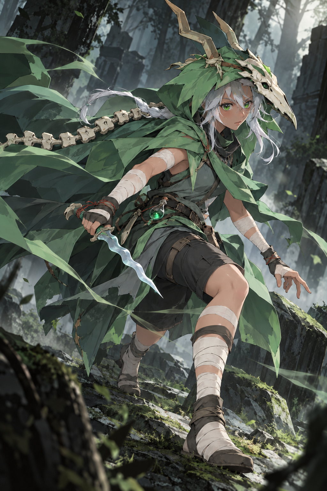
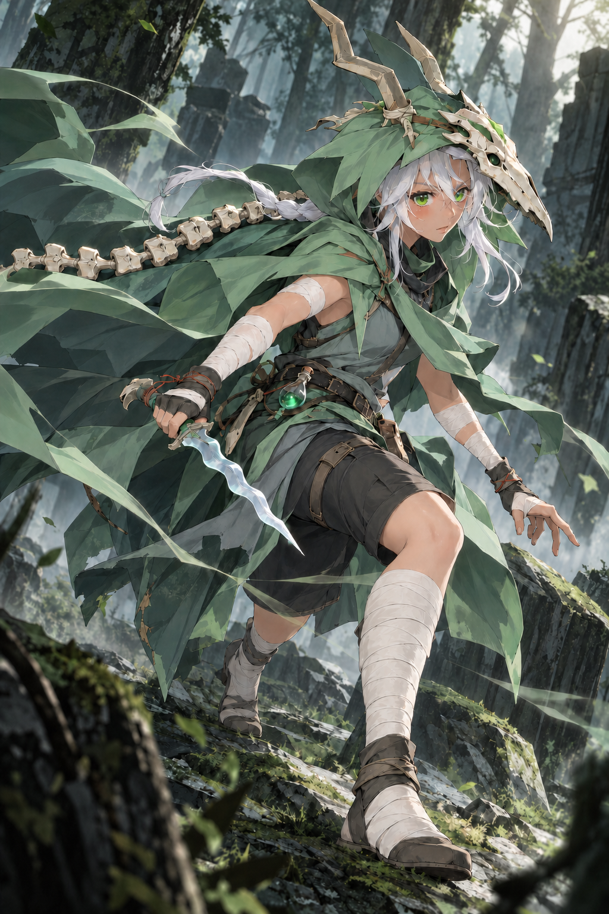

# Silent v0.5 — 透明感と繊細さの部分編集

状態: **API生成・目視確認済み。デザイン未承認。膝下の革バンドの保持に未完了の差分あり。** [Issue #2](https://github.com/Motoki0705/slay_the_spire_2_mods/issues/2) のレビュー画像。2026-10-09（JST）作成。担当は `art-silent`、基準commitは `33a8c3e72cf1818ace1671723ed538dcac7834ac`。

## 確定した指示と編集範囲

ユーザー要件: 「質感はいい感じ」「参照モッドのようにかわいい系かつ、露出を15%あげて」「v0.4に透明感が足りなくて、野性的な感じがあまりよくない」。

今回の編集元はv0.4。既に調整された可愛い人の顔と露出を保ち、露出をさらに15%増やす要求とは扱わない。構図、ポーズ、本人、緑の衣装、頭蓋骨、背面の骨、短剣、巻き布、ベルト、毒瓶を保持する。衣装の新調や参照MODのポーズへの置換は指示していない。

変更するのは、肌・白髪・緑の瞳・布の光と質感。濁った灰色の強い陰影、荒い色面、過度な擦れ・ほつれを抑え、澄んだ肌色、髪の透ける光、小さな瞳のハイライト、軽い布の流れへ整える。透明感は絵の光と色の指定であり、背景のalpha透過ではない。白飛びや画面全体の低コントラスト化を避ける。

最新の[キャラ方針](../review-v03.md)に従い、目線と短剣が狩りへ向く集中した人型女性として扱う。調査内に残る古い原形維持の提案は今回の制作条件にしない。

## 比較用画像

| 編集元 v0.4 | 今回の出力 v0.5 |
| --- | --- |
|  |  |

[v0.5を原寸で開く](../../../../output/imagegen/silent/silent-v05.png)。生成画像はレビュー用であり、正式な立ち絵・動画・ゲーム素材の承認を示さない。

## 入力とAPI設定

v0.4と参照MODを生成前に目視し、初回はその順序で `edit` に渡した。初回出力も原寸で確認し、修正では以下の３入力を使った。v0.4は、どちらの呼出しでも本人と露出の基準。

| 呼出しと順序 | 入力 | 役割 |
| --- | --- | --- |
| 修正1 | [初回のv0.5出力](../../../../output/imagegen/silent/silent-v05.attempt1.png) | 局所修正の編集対象。改善された光・質感は残し、前脚のすねの巻き布だけを修正する。 |
| 初回1／修正2 | [silent-v04.png](../../../../output/imagegen/silent/silent-v04.png) | 初回の編集対象、修正時の衣装・露出参照。本人・顔・露出・衣装・装備・構図・動作・森の配置を決める基準。 |
| 初回2／修正3 | [ユーザー指定MODの選択画面](../../../../art/references/silent/mod-reference/kaguya-silent-raven/user-provided-selection.png) | 可愛いアニメ表現と髪・瞳・肌・布の澄んだ描写の参考。顔の別人化、衣装・ポーズ・UIの転写には使わない。公式原画とは区別する。 |

- 実行: imagegenスキル付属 `scripts/image_gen.py`、OpenAI Image API、`edit`。
- モデル: `gpt-image-2`。画質: `high`。指定サイズ: `1024x1536`。PNG、`n=1`。
- プロンプト: [初回の光・質感編集](../../../../output/imagegen/silent/silent-v05.attempt1.prompt.txt)と[巻き布の局所修正](../../../../art/prompts/silent-v05-edit.txt)。各回 `--no-augment` で本文をそのまま送信。
- マスク・背景パラメータ・input fidelityパラメータは未指定。既存の森を残す不透明画像を指示。`gpt-image-2` の入力は常にhigh fidelity。
- キーはユーザー指定のdotenvをシェル実行せず、補間なしで解析し、`OPENAI_API_KEY` だけをCLI子プロセスへ渡した。キーと生のAPI例外は記録していない。
- [最終出力の生成記録](../../../../output/imagegen/silent/silent-v05.provenance.json)と[初回の生成記録](../../../../output/imagegen/silent/silent-v05.attempt1.provenance.json)に、モデル、画質、サイズ、CLI・入力・プロンプト・出力のSHA-256、実行時刻、成否、修正理由を保存した。初回の画像・指示も保持し、過去画像を上書きしていない。

キーを呼出しプロセスへ渡した後の最終修正のCLI引数は以下。dotenvの扱いは[画像API運用](../image-api-workflow.md)に準拠する。

```bash
uv run --no-project --with openai --with pillow --with python-dotenv python \
  /mnt/c/Users/kamim/.codex/skills/.system/imagegen/scripts/image_gen.py edit \
  --model gpt-image-2 \
  --image output/imagegen/silent/silent-v05.attempt1.png \
  --image output/imagegen/silent/silent-v04.png \
  --image art/references/silent/mod-reference/kaguya-silent-raven/user-provided-selection.png \
  --prompt-file art/prompts/silent-v05-edit.txt \
  --no-augment --n 1 --size 1024x1536 --quality high --output-format png \
  --out output/imagegen/silent/silent-v05.png
```

## 結果・目視確認

初回はAPI成功（CLI報告89.8秒）。光・質感の改善と顔・主要装備・動作の保持を目視できたが、前脚のすねの巻き布にv0.4にはない細い肌色の隙間が発生した。現在の露出を保つ条件から外れるため、許可された「明らかな失敗の１回修正」をこの巻き布の復元に使った。

修正もAPI成功（CLI報告87.2秒）。初回＋修正１回、各１枚で生成を終了した。最終出力は1024×1536のRGB PNGでalphaなし。v0.4と各出力を原寸で見比べた結果は以下。

| 確認箇所 | 目視結果 |
| --- | --- |
| 顔・肌 | 同じ可愛い人の顔と集中した横向きの視線を保つ。顔・腕・太ももの中間色が明るく柔らかくなり、灰色の濁りが弱まった。鑑賞者への笑顔には変えていない。 |
| 白髪・緑の瞳 | 白い髪と三つ編みの配置を保ち、細い毛束の光が澄んだ。緑の瞳の小さなハイライトが明瞭。陰影の階調も残る。 |
| 緑の布 | 面の粗い斑と強い明暗の切替が少し柔らかくなった。大きな布の流れと尖った輪郭は保っており、繊細さの改善幅は控えめ。 |
| 本人・構図・動作・主要装備 | 同じ１人、角付き頭蓋骨、背面の骨、波形短剣、毒瓶、ベルト、短パン、ブーツ、手と前脚、森と岩の配置を保つ。別の衣装や人物への変更は見られない。 |
| 露出・巻き布 | 初回で発生したすねの肌の隙間は修正後に覆われた。上腕・太ももの露出はv0.4と同程度に見える。露出面積の厳密な測定はしていない。 |
| 未完了の装備差分 | 修正で前脚の膝直下の濃色の革バンドも省略された。元の装備を全て保持できたとは判定しない。API修正の上限を使用済みで、追加生成は行っていない。 |
| コントラスト・背景 | 肌・髪・巻き布の階調が残り、白飛びや全面的な白い霞にはしていない。森と深緑の暗部が奥行きを保つ。背景は不透明。文字・UI・追加人物は見られない。 |

技術確認はAPI成功、PNGデコード・サイズ・alpha確認、各記録のSHA-256照合、原入力の不変、文書リンク、所有範囲、秘密情報を含まないこと、`git diff --check`。これらと、デザインの承認・保持条件の完全達成は区別する。

## 未確認

膝下の革バンドの省略が未解決。元の尖った外套輪郭も残るため、透明感・繊細さと野性味の低減が十分かはユーザーの判断待ち。ユーザーのデザイン承認、実ゲームでの表示、動画・rig適合性は未確認。validatorは指定どおり0回。
