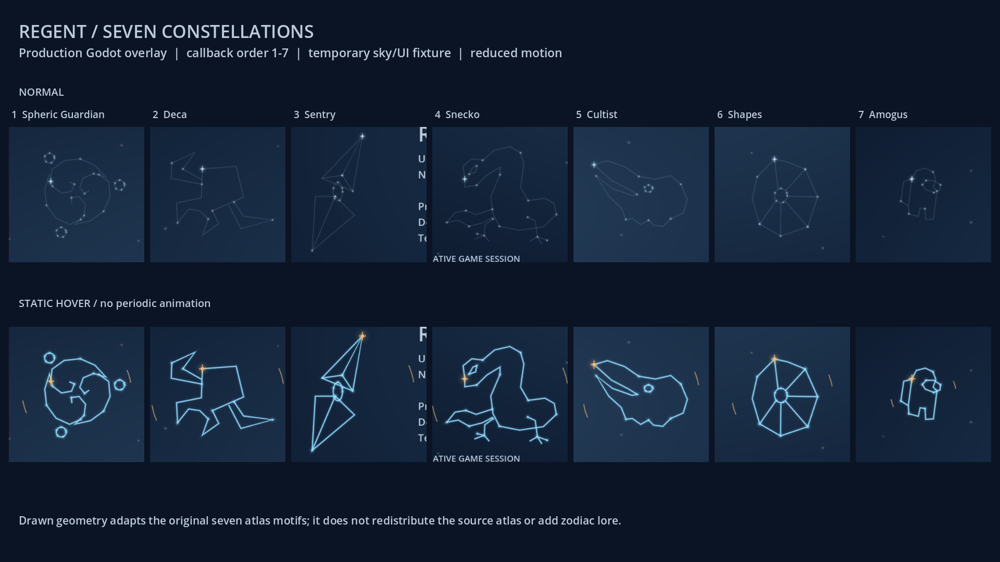
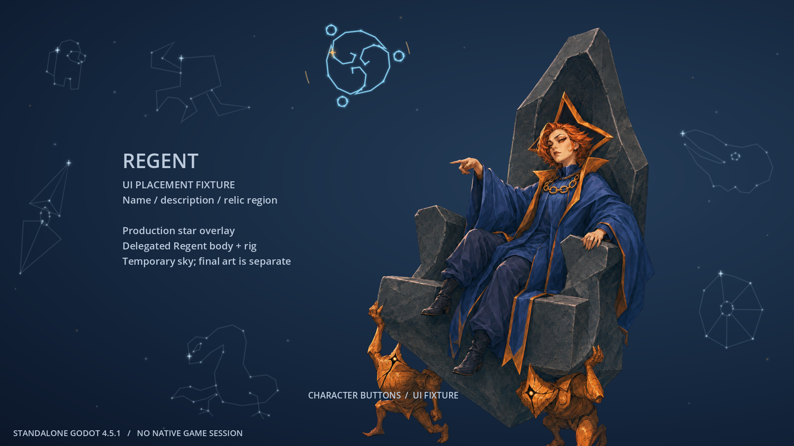

# Regentの７星座overlay (#21)

2026-10-09。**７種のGodot描画・hover・選択runtimeへの接続とstandalone検証を完了。実ゲームの確認は親のQAへ引き継ぐ。** 対象資料は v0.107.1 / 59260271、描画検証は Godot 4.5.1。最新版対応・実プレイ合格とは称しない。

[Issue #21](https://github.com/Motoki0705/slay_the_spire_2_mods/issues/21) / [無料描画runtimeと素材契約](free-animation.md) / [原作の動作調査](../research/motion/inventory.md#１-キャラクター選択画面)

担当 `regent-select-overlay`、基準commit `30bcf1ba4b9d8986a58bca5382d2e4205779b7b7`。起動記録は `gpt-6-astra / max / service_tier=default` を明示し、turn_contextのmodel/maxも照合。実際に適用されたtierはturn_contextに露出しないため、defaultの指定と実効値の独立確認は区別する。追加agent・validatorはともに0回。

## 制作判断

採用済みRegentの青い王衣、金と橙の装飾、指図する所作の周囲に、静かな星図を置く。通常は淡い線と小さな星、hover時は青い輪郭、金色の主星と短い円弧で区別する。中央にボタン群・説明ラベル・クリック操作を追加しない。通常時の星の明滅は小さく、星座自体の位置は動かさない。

このoverlayは**委任に基づく制作採用（delegated-production-selection）**。ユーザーが個別承認したとは記録しない。Silent v0.5のuser-approvedとは別。画像・動画生成、Spine Editor、外部描画依存は使わず、GodotのControl `_draw()`、線・円・星を使用した。



これは完成overlayの実描画。背景とUIは位置確認用fixture、人物は基準commitの採用Regent body/rig。スクリーンショットは最終選択背景やnativeゲームの画面ではない。比較sheetは画面cropなので、端にfixtureの文字が含まれる箇所がある。

## 元の順番・名称・図形との対応

原作の `_Ready` は次の順にControlの `MouseEntered / MouseExited` を登録する。これは**callback登録順**で、画面の左から右の順や世界設定上の序列ではない。enteredで該当skin、exitedで**すべて `normal`**。sceneの `preview_skin="default"` は第８のhoverではない。

| 順 | 原Control / entered callback | 正確なskin名 | atlasのoutline slot / path | 本overlayの図形・初期中心 (x,y) |
| --- | --- | --- | --- | --- |
| 1 | `SphereGuardianHover` / `b__8_0` | `spheric guardian constellation` | `guardian_outline` | ３つの巻く区画と３つの小衛星、(1255,265) |
| 2 | `DecaHover` / `b__8_2` | `deca outline` | `deca_outline` | 角張った胴と張り出す肢、(900,310) |
| 3 | `SentryHover` / `b__8_4` | `sentry constellation` | `sentry_outline` | 上下の尖った部位と中央の円、(575,610) |
| 4 | `SneckoHover` / `b__8_6` | `snecko constellation` | `snecko_outline` | 曲がった長い首・尾・眼・足、(960,945) |
| 5 | `CultistHover` / `b__8_8` | `cultist constellation` | `cultist_outline` | 長く開いた嘴と鳥形の頭、(2070,485) |
| 6 | `ShapesHover` / `b__8_10` | `shapes constellation` | `shapes_outline` | 丸い中心と扇状の多面輪郭、(2070,805) |
| 7 | `AmogusHover` / `b__8_12` | `amogus constellation` | `amogus_outline` | 背面の張り出し・visor・分かれた脚、(620,270) |

各 `b__8_{奇数}` が対応するexited。名前はゲーム内資源の識別子としてそのまま保持する。７つを惑星、黄道十二宮、神格、Regentの能力や特定の物語へ結び付ける根拠はなく、その意味を創作していない。上表の図形は下記atlasを目視した記述で、独自の設定ではない。

根拠（ローカル原資料はmainの `docs/research/motion/evidence/` にgitignoredで存在）:

- `core-animation.il.txt:2764-3064`。`_Ready` MethodDef `0x06002e4f` / RVA `0x150f08`、`SetSkin` `0x06002e50` / `0x1511bc`。callbackは `0x06002e5a`〜`0x06002e67`。`SetSkin` はskin反映後に `SetSlotsToSetupPose` を呼ぶ。カード・run選択・報酬等の処理はこの接点にない。
- `resources/scenes/screens/char_select/char_select_bg_regent.tscn:13-33,187-234`。７Controlとoffset、元のSpine位置を確認。
- [skin/attachmentの公開済み構造記録](../research/implementation/evidence/rig-reuse/spine-features.json):7676-7834。各hover skinは対応するoutline attachmentを持つ。生画像を再配布する資料ではない。
- `resources/.godot/imported/characterselect_regent.atlas-fc153b99fafde1c616f53ddeef134658.spatlas` のregion名・bounds・rotateで、元PCKのtexture１件だけを参照した。`.godot/imported/characterselect_regent.png-65cd54b849bfc5e8b98e4b2715b51ff0.s3tc.ctex` はMD5 `82458cb723d0e6904989fd0481923538` と照合。Godotの `get_image / decompress / get_region` で７outlineをローカル目視。元atlas/CTEX/cropは本変更にも配布PCKにも収録しない。

| 固定資料 | SHA-256 |
| --- | --- |
| `core-animation.il.txt` | `75a6de060cc7ac0a0877967e5bf27833fa278f0399e6e17a4c6f6897f447f619` |
| 元 `char_select_bg_regent.tscn` | `3c81e4995ab7dbf6b1f470d2779454c1089c804a34c052680ecc688de35ea3de` |
| 元 `character_select_screen.tscn` | `3d2305fdddae6f432e52ac4b8ea5035c5cecfd26fbc30c319f09b1cd4a05eb1e` |
| `spine-features.json` | `662600f55bde91db927f42008a1b4e41b5e50ad19709e56186c09e9c32b9f3b1` |
| 参照CTEX | `91a232c997456cc6ce478c2b647858bde50be00c4c234a099f71107997317980` |

### 保持と変更を区別する

**保持:** ７つのhover対応、１つのactive mode、離脱でnormal、見て発見する背景の反応、クリック不要、選択と出発を待たせないこと。

**制作上の変更:** 元Spineのskin交換を、独立Controlの線・星・色の交換へ置換。元の輪郭を観察した手描きの点列で、atlasのpixelや輪郭の完全再現ではない。originalの大きい長方形hoverを図形周辺の楕円へ変え、人物と説明文に合わせて７箇所を移した。通常時にも淡い図形を見せ、発見しやすくした。元の300個のCPUParticles2Dの流れは少数の固定した星の弱い明滅へ置換。元Spineの6.667秒loop・deform・同じparticle軌道を移植したとは称しない。

本体の顔・衣装・独立武器・従者をhoverで交換しない。原作のControlはマウスhoverの接続だけであり、確認できていないcontroller/touch専用機能を移植済みとしない。ゲームUIの既存controller操作へ新しいfocus先を追加しない。

## canvasと親の調整点

元 `character_select_screen.tscn:81-93` の `AnimatedBg` はfull rectにoffset `(-388,-80,252,40)`、scale `(1.1,1.1)`、pivot `(1280,600)`。1920×1080の画面では**2560×1200**。scale適用後の左上は `(-516,-140)` になる。背景資源が1920×1080でも、実際のoverlayの論理canvasは同寸とは限らない。

元 `RegentBg` は親中央anchor、offset `(-960,-521,1600,679)`、size2560×1200、子Spineは `(-185,-20)` / scale0.46。#26の `select_background.tscn` は `AnimatedBg` を満たすfull rectなので、この**旧RegentBg固有のoffsetを重ねない**。今回の座標は#26の新root上のもの。fixtureは元 `AnimatedBg` のoffset/scale/pivotをコードどおり再現した。別解像度のtestでも同じ変換からhit位置を算出する。

| 場所 / export値 | 調整対象 |
| --- | --- |
| overlay `reference_size=(2560,1200)` | 星図の設計canvas。実Controlへ縦横比を保ってfit |
| `layout_offset` / `layout_scale` | 星図全体の平行移動・倍率。offsetはreference座標 |
| `constellation_positions` | 上表の順で最大７中心を上書き。省略分は既定値 |
| `constellation_scales` | 上表の順で個別倍率。描画とhit領域の両方へ反映 |
| `idle_line_opacity` / `ambient_opacity` / ３色 | 完成背景の明るさに合わせて線・星・青金を調整 |
| `transition_seconds=0.18` | 通常hoverの短いfade。reduced motionでは使わない |
| #26 `figure_position` / `figure_height` | 人物の位置・canvas高。overlayとは独立して親が調整 |

`motifs.gd` の `RADII` は図形の基本半径。hover楕円はその1.25倍。重なる設定にした場合は正規化距離が小さい１つを選ぶ。custom配置の描画とhit判定は同じtransformを用い、別々のpixel定数でずれない。



この図は既存の `figure_position=(0.62,0.94)` / `figure_height=0.88` のまま。基準commitのbodyは玉座・従者を含み、下端の従者とUI fixtureが近く、一部が画面下へ出る。星図の完成とは別に、制作中の分離layerと最終背景へ差し替えた後、親が人物高・足元・UIとの重なりを調整する。art/rig/catalogと共通runtimeは本担当では変更していない。

## 接続・入力・解放

`select/regent.tscn` に以下の１行を追加した。`rig_path` / `background_path` / catalog登録は親の所有で、standaloneではtest harnessだけが既存Regent body/rigとfixture背景を指定する。

```gdscript
overlay_scene_path = "res://PopSpireWomen/select/overlays/regent/constellations.tscn"
```

overlayは `set_presentation_state(active, reduced_motion)` を実装する。`get_active_skin()` と `constellation_changed(skin_name)` は描画内の識別用で、ゲームModelのskinや能力を変更する接点ではない。

- 全Controlを `MOUSE_FILTER_IGNORE` / `FOCUS_NONE` とし、子buttonは作らない。`_input` でmotionの位置を観測するだけで、`accept_event` / `set_input_as_handled` は呼ばない。click・wheel・keyの消費、カーソル形状変更、ゲーム側へinput再送を行わない。
- 通常は７つのweightを現在hoverへ短く近付ける。Tween・Timer・await・Taskを作らず、連打しても待ち行列が伸びない。SceneTree pauseで入力と周期処理が止まり、復帰時は現在のマウス位置を取り直す。
- reduced motionは時計を0にし、周期 `_process` を止める。hoverの輪郭・主星・円弧はその場で切り替わる。明滅やfadeがなくてもnormalとの差が読める。
- region離脱、viewport離脱、window focus離脱でnormalへ戻る。active=false、hide、exitで入力・hover・weightを解除。exit時はviewport/windowのsignalもdisconnectする。同じnodeの再entryとruntimeによる再生成の両方を扱う。再表示時にポインタが図形上なら、新しくhit判定する。
- 星の位置と位相は固定値。RNGを作成・呼出・seed変更しない。ゲームのModel・Save・データ・カード・キャラIDにアクセスしない。

共通 `select_background.gd/tscn` の変更は**なし**。通常buildからゲームへ自動コピーする処理も追加していない。元のselectへ戻すには親の設定でMOD選択表示を無効化でき、星図だけ外すなら上記 `overlay_scene_path` を空にする。

## 通常検証と再現

```bash
python3 tests/regent_overlay/run_checks.py \
  --godot /tmp/sts2-tools/issue-8/Godot_v4.5.1-stable_linux.x86_64 \
  --output /tmp/regent-overlay-checks
```

Python標準library、Godot 4.5.1、`xvfb-run`を使用。`mod/assets` をtempへコピーしてimportし、**test専用PCK**をexport。空hostからPCKだけを読み、Mesa llvmpipe / GL Compatibilityで実描画・入力を実行する。ゲーム本体・DLL・save・Steamは起動も変更もしない。test PCKはfixtureを含むため配布物にしない。

**67確認、失敗0**（画像保存確認を含む）。[ログ](../../tests/regent_overlay/evidence/checks.log) / [入力と画像のSHA-256](../../tests/regent_overlay/evidence/validation.json)。import/export成功、GDScript error・終了時のObject/resource leak報告なし。Xvfb環境のVSync設定非対応warningはログに残している。

| 確認 | 結果 |
| --- | --- |
| ７つのentered名と順、離脱normal | 全対応を期待値と照合、通常/reducedの両方 |
| 56回の高速切替 | 最後の１つへ収束、残ったhoverなし |
| viewport離脱 / focus離脱 | 最終motionイベントなしでもnormal |
| 裏UIのclick | overlayより前のsiblingにあるButtonが星座領域内のクリックを受信。hover途中でも完了待ちなし |
| pause / unpause | 時計・weight・hover停止、pause中の物理マウス移動を復帰時に反映 |
| reduced motion | ７つの静的差分をpixelでも確認。10描画frame後も画面がpixel一致 |
| active / hidden / ancestor hidden | 即時停止と再表示。runtimeによる古いoverlayの解放も確認 |
| exit/reentry / 12回の背景交換 | 同じnode再entry、背景再生成、signalの重複なし、WeakRefで解放確認 |
| layout調整 / 1280×720へのresize | 現transformで描画とhit位置が一致 |
| RNG | standaloneのglobal RNGで比較し、構築・時計・hover後も系列を消費しない |

物理位置を再取得する検証では、Xvfbのcursorも移動する。`Input.parse_input_event` だけではOSカーソルを動かさないため、warp後のOSイベントと合成イベントの順を分けた。[Godot 4.5 Input仕様](https://docs.godotengine.org/en/4.5/classes/class_input.html#class-input-method-parse-input-event)

目視確認: 上の７モードsheet、[通常](../../tests/regent_overlay/evidence/standalone-normal.png)、[Spheric Guardian](../../tests/regent_overlay/evidence/standalone-spheric-guardian.png)、[Snecko](../../tests/regent_overlay/evidence/standalone-snecko.png)、[reduced](../../tests/regent_overlay/evidence/standalone-reduced.png)。７つの図形、通常/hoverの青金の差、説明欄・人物の顔や指先を避ける配置を確認した。これは自分の通常検証で、validator評価ではない。

### 親へ引き継ぐ未確認事項

nativeゲームの選択・出発・マルチプレイ待機・画面遷移、実際のUI文字量や画面shake、Windows renderer、高DPI/ultrawide、controller/touch環境は未確認。UI clickの結果はstandalone fixtureで、native UIの回帰確認を代替しない。最終背景と人物/玉座layerを統合後、親が７箇所の表示域・文字・従者・出発ボタンとの配置、設定切替、他MODとの共存を実機確認する。今回のコードだけを根拠にsave/co-op互換性やMOD全体完成を宣言しない。
