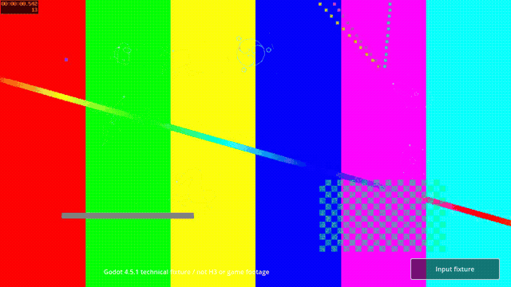

# 選択動画・場面別motion v0.2 (#50)

対象はWindows v0.107.1 / build 59260271用PCK-only経路。今回の指示で選択動画AIを再開するが、このruntime担当は有料API、画像生成、ゲーム起動・導入を行わない。親がMiniMax H3 / 768P映像、人物・姿勢・anchorsを制作する。Spine Professional、自作・第三者DLL、セキュリティ設定変更は不要。

## 親の素材とsceneの契約

各 `mod/assets/PopSpireWomen/select/production/<character>.tscn` に次を指定する。省略した既存sceneは従来のGodot人物を再生する。親所有のart・rig・production sceneは本PRでは変更しない。

```ini
video_path = "res://PopSpireWomen/art/silent/select_loop.ogv"
poster_path = "res://PopSpireWomen/art/silent/select_poster.png"
rig_path = "res://PopSpireWomen/rigs/silent/select.json"
```

- 動画は人物を含むRGB全画面、768P / 16:9、各約8秒。無音Theora `.ogv` に変換し、同じ構図のPNG posterを用意する。音声を含む多重stream、別codec、未完了・途切れたOgg、128 MiB超はruntimeで拒否する。生成物の出自・モデル・prompt・hashは親の制作記録に残す。合成fixtureをH3生成物と扱わない。
- **動画とposterは実viewportを基準に中央aspect-coverで描く。** 元の2560×1200背景parentの位置・拡大・非等方scaleを逆変換で相殺する。入力画像も最終16:9画面座標で合成し、親座標のfigure_positionを直接動画の座標に転記しない。16:9以外は中央cropが生じる。人物の全身・髪・武器を全frameでUI safe area内に収める制作確認は別途必要。
- Regentの星座7hoverは独立した既存Godot overlayを映像の上に置く。動画へその操作領域を焼き込まない。overlayの位置・入力契約は旧parent座標のまま保持する。人物、動画、overlay、UIの重なりは最終素材で親が確認する。
- 動画再生中は人物puppetを生成しない。動画なしなら従来のGodot rig。設定された動画がmissing/invalidならposter、posterがなければGodot静止。reduced motionも同じ静止経路。どちらもなければ元scene alias。disabledは元表示へ戻る。
- 非表示・退出・キャラ切替時はstop、stream参照解放、処理停止。再表示・re-enableは先頭から再生。tree pause/resumeはdecoderと連動。映像は音量0、全media Controlはmouse IGNORE。ゲーム音・UI入力を扱わない。

TheoraはGodotの標準対応形式で、VideoStreamPlayerのloop/expandと線形音量0を使用する。[Godot 4.5 VideoStreamPlayer](https://docs.godotengine.org/en/4.5/classes/class_videostreamplayer.html)、[VideoStreamTheora](https://docs.godotengine.org/en/4.5/classes/class_videostreamtheora.html)。

## 場面別の入力rig

`tools/assets/compile_rigs.py` は `art/<character>/{combat,merchant,select,rest}_rig.json` の**完全なschema 1 rig**を優先する。combat/merchant/selectの個別ファイルが存在しない場合だけ `rig.json` にfallbackする。restは `rest_rig.json` 必須。存在する個別ファイルが不正なら停止し、旧姿勢で成功としない。全入力の基本検査を終えてから出力するので、後半のキャラが不正な場合に前半だけ書き換えない。元sourceを書き換えず、receiptへ選択source、hash、profileを記録する。

追加の任意field:

```json
{
  "schema": 1,
  "surface": "merchant",
  "motion_profile": "contextual_v02"
}
```

これは差分rigの例ではなく、完全な既存rigへ追加するfieldである。compilerは出力にtargetのsurfaceを記録する。違うsurfaceのrigをsceneへ繋ぐと元表示へfallbackする。未指定または `legacy_v01` は従来の動作を保つ。新profileの意味は次の通り。

| surface | 独立した演技 |
| --- | --- |
| combat | 敵への重心、胸の呼吸、頭の小さな相殺、武器側の構え。足rootを固定 |
| merchant | 肩の脱力、品物へ遅れて向く視線、自由な手の値踏み、支持する手 |
| rest | 座位のhip/rootを固定し、息・遅れる頭・手・髪を局所的に動かす |
| select | 動画なしの既存選択gesture。動画再生時はrigを使わない |

Ironcladの重い呼吸、Silentの小さな動き、Regentの手の指図、Necrobinderの傾げ、Defectの手元の確認で係数を分ける。**立位の画像を座位や戦闘姿勢へ変形して済ませる機能ではない。** 場面のbody・meshes/layers・origin・markers・anchorsは親が作る。武器剛体meshと握りはその入力を保つ。libraryの移動量は1536px canvasを基準に高さへ比例させ、回転は度単位。明示した `clips` がlibraryより優先する。

merge順は従来通りsource → common → character.all → character.surface。親は新しいポーズで古いorigin/layer/anchor/clip overrideが上書きしないよう `rig-overrides.json` も合わせて改訂する。特に旧sourceにあるidle clipは新profileより優先するので、libraryを使いたい動作の明示clipを取り除くか新姿勢向けに作り直す。

anchorsはcanvas上のpixel座標 `{ "bone": "head", "position": [x,y] }`。bindingは元visual内の相対pathと任意scale_multiplierを維持する。顔、握り、鎌の両端等を新画像に合わせる。Osty/剣/Orbを本人の映像へ固定しない。driver_readerのphase/mix/secondsと元のイベント・速度・割込み・死亡終端を変えず、未知animationは元表示へ戻し、VFX position/scaleも復元する。

## PCK-only経路

`tools/pck_mod/build.py` のallowlistに `.ogv` / `.webp` を追加。Godot importは画像だけ、Theoraは元byteのままpackする。別assetsディレクトリを入力しても、選択scene基底・全animationコード・routerはbuildツールと同じ版へ揃える。

preflightはvideoの構造・decoderの進行、poster、rig、descriptorを別に記録する。動画が不正でも静止fallbackを使えるsurfaceは残す。動画しかなくreduced motion時に表示できないdescriptorは採用しない。pack後は全resourceのhashをreadbackし、loose assetのない別hostへPCKをmountして、有効movieがdecode・進行することを確認する。receiptの `packed_selection_media` と `video-readback.json` を確認する。通常buildとinstallの分離、`has_dll=false`、元ゲーム・保存・他MODの保全は従来通り。

## 通常検証

```bash
python3 -m unittest discover -s tests/animation -p 'test_*.py' -v
python3 -m unittest discover -s tests/pck_mod -v
python3 tests/animation/run_checks.py \
  --godot /tmp/sts2-tools/issue-8/Godot_v4.5.1-stable_linux.x86_64 \
  --output /tmp/sts2-motion-v02/animation
python3 tests/pck_mod/run_video_checks.py \
  --godot /tmp/sts2-tools/issue-8/Godot_v4.5.1-stable_linux.x86_64 \
  --output /tmp/sts2-motion-v02/pck
```

ffmpeg/libtheoraとxvfbを使用。各出力は使い捨て技術fixtureとログで、ゲームからの抽出物を含まない。Godot rendererによるpixel変化、loop、pause/resume、parent変換相殺、poster crop一致、missing/invalid、切替/再入場、Regent全7hoverとクリック透過、場面別の局所joint差、既存同期/死亡/復元、PCKのbyteとdecoderを検査する。

2026-10-09の通常検証はGodot **315項目（animation 195 / 従来selection 42 / movie 78）**、Python **23件（compile 4 / PCK 19）**が失敗0。合成PCKのpreflight・byte/hash readback・空hostでのdecode/進行、および公開用source bundleのPCK-only manifestと非同梱物を確認した。preflight/readbackは先頭0.25秒のdecoder確認であり、全clipの絵・継ぎ目検査を代替しない。

[検証記録・入力/実装/媒体hash](../../tests/select/evidence/v02/validation.json)と[短い実録GIF](../../tests/select/evidence/v02/synthetic-selection.gif)。映像は**通常Godotで合成testsrc2を再生した技術fixture**で、H3生成物・人物デザイン・実ゲーム映像ではない。2026-10-09収録、28描画frameをnominal 12fpsで縮小GIF化。viewport全面への表示とRegent overlayの共存を確認できる。性能測定用ではない。



親によるH3素材への接続、最終人物の全frame safe area、Windows実機のCPU負荷・ゲーム遷移・全イベント・Osty/剣/Orbは未確認。旧 `runtime-v01.md` の実機結果を、このv0.2の実機完了の証拠として流用しない。validatorは指定0回、起動0回。
