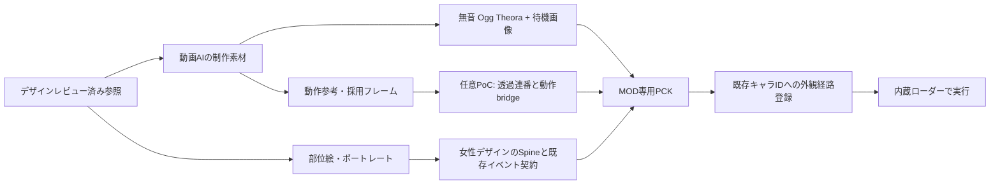

# ５キャラ外観MODの実装方式

調査日: 2026-10-08。対象はインストール済み **v0.107.1 / commit 59260271 / Godot 4.5.1 / Windows x64**。本書は方式選定と試作の設計であり、MODのビルド・導入・ゲーム起動・正式素材の制作は実施していない。公開ライブラリのソース確認と、合成テスト映像のFFmpeg変換だけを行った。

**2026-10-09追補:** ユーザーのモーション再利用案を [骨格再利用の追加調査](rig-reuse.md) で具体化した。24個の実資源ではSpine physics/path constraintは０で、骨のキー・weighted mesh・IK/transformが主体だった。戦闘は**元骨格へ再skin・再weightしてモーションを流用するPoCを先に行い**、適合しない部位だけ新rig/retargetへ進む。デザインは現時点で未承認。本書の「承認済み素材」は制作開始後の条件であり、現在の承認状態を表さない。

要件: Ironclad / Silent / Regent / Necrobinder / Defect の既存のキャラIDとゲーム内容を保ち、元の色・装備・モチーフ・人物像を、人の顔・髪・表情を持つアニメ女性へ大胆に翻案する外観MOD。原型をほぼそのまま残した案はユーザーが却下している。骨・機械・異星の姿をliteralに維持することは必須条件ではなく、衣装や造形へ翻訳する。過剰な性的強調と５人の似通った顔は避ける。キャラ選択の動きには動画生成AIを使う。他の動きへの利用箇所も検討する。デザインレビュー後に正式素材と実装へ進む。動画AIのモデル選定は [制作方針](../../design/animation/video-production-v01.md)、動作の実在箇所と全アニメ名は [動作一覧](../motion/inventory.md) を参照。

## 推奨する最初の構成

**ゲーム内蔵ローダー + 名前空間を分けたPCK + 小さなC# DLL**を使う。キャラ選択はAI生成動画を無音の `.ogv` に変換し、専用Godotシーンで再生する。戦闘・商人・休憩所は、今後承認された女性デザインを**元のSpine骨格へ再skin・再weightし、既存モーションとeventを流用する**方式から検証する。新rig・mesh・部位絵の作成は、新デザインに合わない部分へ絞る。女性化を弱めることで元rigへ合わせることはしない。AI動画による戦闘動作は、連番への変換とイベント接続を比較候補にする。

補助ライブラリの第一PoC候補は **RitsuLib の既存キャラIDに対する asset replacement API**。`STS2.RitsuLib.Compat.0.107.1` **0.6.7** の実在パッケージとソースを確認した。今回の「既存５キャラの外観だけを替える」用途を直接表現できる。**BaseLib 3.4.7 + 狭いHarmonyパッチ**を代替案とする。両ライブラリを最初から必須依存にする必要はない。どちらもこの環境で実行していないため、正式な依存確定は下記PoCの起動・復帰・同期確認後に行う。

この選択には次の理由がある。

- 既存キャラのカード、能力、アンロック、セーブ中のIDを新規キャラへ移さずに済む。
- 選択画面の短いループは動画再生に向く。戦闘は攻撃、被弾、死亡、復活、ゲーム速度、固有VFXが絡み、動画ファイルの差し替えだけでは成立しない。
- RitsuLibは既存IDに対する登録APIがある。BaseLibの `CustomCharacterModel` は新規キャラ用であり、それ自体をスキンAPIとして使わない。
- Spineの実行経路を使うと、体型を新しく設計しても既存state machineやイベントへ接続しやすい。元rigへ収めるために女性化・擬人化を弱めない。体型・衣装の変更に応じて部位分割、mesh、weight、必要なbone追従点を設計する。



## 確認できた土台と版固定

| 項目 | 確認した値・状態 | 判断への影響 |
| --- | --- | --- |
| ローカルゲーム | `v0.107.1`、`59260271`、release date `2026-06-18` | 「最新版対応」とせず、最初はこの版だけを検証対象にする |
| `GodotSharp.dll` | assembly `4.5.1.0` | Godot .NET SDK / importer / exporterを4.5.1系で揃える |
| 実行runtime | `net9.0`、同梱Microsoft.NETCore.App `9.0.7` | MODも `net9.0` を対象にする |
| `0Harmony.dll` | assembly `2.4.2.0` | ゲーム同梱DLLを参照し、別版をMODと一緒に配らない |
| ローカルの映像API | `Godot.VideoStreamPlayer` に `SpeedScale / Loop / Paused / StreamPosition / Finished`、`VideoStreamTheora` typeあり | 4.5.1標準の設計が静的には接続可能。再生成功の証拠ではない |
| 実行ファイルの文字列 | `VideoStreamTheora`, `VideoStreamPlayer` を検出 | native側の存在を補強するが、実際のcodec初期化は未検証 |
| 開発ツール | PATHで `dotnet / godot / ilspycmd` 未検出。`ffmpeg / ffprobe` あり | 最初の実装作業にSDKとeditor/export環境の準備を含める。環境全体で不在とは断定しない |

値、対象ファイルのSHA-256、静的API一覧は [environment.json](evidence/environment.json)。調査した公開repoのcommit・ファイルhash、NuGet実物のhashは [provenance.json](evidence/provenance.json) に固定した。`sts2.dll` のassembly versionは `0.1.0.0` なので、互換性判定にはrelease情報と対象method signatureも使う。

## ローダー・フレームワークの比較

| 候補 | 実在する機能と今回の使い方 | 制約 | 今回の判断 |
| --- | --- | --- | --- |
| **StS2内蔵ローダー** | JSON manifest、C# DLL、アセットPCK。Workshop/local modsを読む | ゲーム版でAPIが変わる | 必須の土台。外部ローダーを追加しない |
| **RitsuLib** | `RegisterCharacterAssetReplacement(characterEntry, CharacterAssetProfile)`、builderの `CharacterAssetReplacement`。既存ID単位でscene/UI等を登録。型付きnode factoryとresource fallbackもある | framework自体の互換検証が必要。後の登録の非null fieldが優先される。non-Spineの全動作が登録だけで完成するわけではない | **第一PoC候補**。0.107.1専用compat packageを固定して使う |
| **BaseLib** | `NodeFactory<NCreatureVisuals/NRestSiteCharacter/NMerchantCharacter>`、`CustomAnimation`、設定支援。ゲーム専用rootを標準Godot nodeから組み立てられる | 既存５キャラの経路を自分のHarmony patchで選ぶ必要がある。`CustomCharacterModel`の各overrideは既存キャラには適用されない | **有力な代替**。必要なfactoryだけ使い、小さな外観adapterを持つ |
| **Harmony単独** | 指定methodのprefix/postfixで既存キャラのgetter/visual生成を変更 | typed root変換、設定、compat処理を自作。広いtranspilerは更新に弱い | 依存を最小にしたい場合の第３案。補助ライブラリが不適合なら検討 |
| **同じres pathを持つPCK** | vanilla texture/atlas/sceneを同じpathで上書き。コードなしで成立する置換もある | 読み込み順、resource cache、他スキンとの競合。設定でキャラごとに戻しにくい。atlasとmeshの整合を要する | 小さい単独texture modには適する。本MODの全５キャラ＋動画の主経路にはしない |
| **Sts2SkinManager** | インストール済みskinの選択UI、PCK mountと非選択DLLの抑止 | アニメ制作APIではない。現在のREADMEでは切替に再起動を要する。５キャラ一体DLLを一部だけ有効にできるとは未確認 | 必須依存にしない。配布前の共存検証対象 |
| **ModSmith** | 旧来のコンテンツ支援ライブラリ | 作者READMEが「documentationのみ利用、BaseLibへ」と案内 | 新規依存に採用しない |
| 新規 `CustomCharacterModel` / `ModCharacterTemplate` | 新しいキャラ、カードプール、アンロック等を追加するための仕組み | 既存キャラのスキンという要求を変えてしまう | 採用しない |

ゲームの内蔵ローダーとWorkshop追加は [Mega Critのv0.107.1告知](https://steamcommunity.com/games/2868840/announcements/detail/710026912607505281)。ファイル構成・manifest・`affects_gameplay`は [ModTemplate Wiki](https://github.com/Alchyr/ModTemplate-StS2/wiki/Modding-Basics)。Harmonyのprefix/postfix/transpilerの役割は [公式説明](https://harmony.pardeike.net/v2/articles/patching.html)。PCKの同一path優先と、既にロードしたresourceのcacheが別問題であることは [Godot LoadResourcePack](https://docs.godotengine.org/en/4.5/classes/class_projectsettings.html#class-projectsettings-method-load-resource-pack) と [ResourceLoader](https://github.com/godotengine/godot/blob/f62fdbde15035c5576dad93e586201f4d41ef0cb/doc/classes/ResourceLoader.xml) による。

### RitsuLibで確かめた既存キャラ用の接続

[登録API](https://github.com/BAKAOLC/STS2-RitsuLib/blob/2332d9d054f431887aaeffef9aa634959f148889/src/Content/ModContentRegistry.CharacterAssetReplacements.cs#L70-L99) はcharacter IDをキーにしており、新規CharacterModelの継承を要求しない。[getter patch](https://github.com/BAKAOLC/STS2-RitsuLib/blob/2332d9d054f431887aaeffef9aa634959f148889/src/Scaffolding/Characters/Patches/CharacterAssetOverridePatches.cs#L53-L83) が登録profileを読む。 [runtime factory](https://github.com/BAKAOLC/STS2-RitsuLib/blob/2332d9d054f431887aaeffef9aa634959f148889/src/Scaffolding/Content/Patches/ModModelRuntimeGodotFactoryPatches.cs#L30-L86) はsceneまたはTexture2Dを `NCreatureVisuals` に変換する。

設計上の登録例。これはソースのsignatureに基づく説明であり、今回ビルド済みの実装ではない。

```csharp
var profile = new CharacterAssetProfile(
    Scenes: new CharacterSceneAssetSet(
        VisualsPath: "res://PopSpireWomen/ironclad/combat.tscn"),
    Ui: new CharacterUiAssetSet(
        CharacterSelectBgPath: "res://PopSpireWomen/ironclad/select.tscn"));

RitsuLibFramework.CreateContentPack(ModId)
    .CharacterAssetReplacement("IRONCLAD", profile)
    .Apply();
```

実際のIDは既存modelの `Id.Entry` から取得して照合する。変更するfieldだけを設定し、vanillaのprofile一式で他modのfieldまで埋めない。`RegisterCharacterAssetReplacement` は見た目の登録であり、カード・relic・キャラ追加の登録は不要。[builder](https://github.com/BAKAOLC/STS2-RitsuLib/blob/2332d9d054f431887aaeffef9aa634959f148889/src/Scaffolding/Content/ModContentPackBuilder.cs#L281-L291)、[profile型](https://github.com/BAKAOLC/STS2-RitsuLib/blob/2332d9d054f431887aaeffef9aa634959f148889/src/Scaffolding/Characters/CharacterAssetProfile.cs#L329-L340)。

0.6.7は調査日当日のrelease。API packageには `Compat.0.107.1` が実在し、[対応target定義](https://github.com/BAKAOLC/STS2-RitsuLib/blob/2332d9d054f431887aaeffef9aa634959f148889/build/RitsuLib.Compatibility.props#L1-L9) にも0.107.1がある。これを動作保証の代用にはしない。runtimeはroot loader、shared、compat、assets等を含む完全な配布物を使い、compile用DLLを１枚だけmodsへコピーしない。[配布構造](https://github.com/BAKAOLC/STS2-RitsuLib/blob/2332d9d054f431887aaeffef9aa634959f148889/README.md#package-choices)。

### BaseLibを選んだ場合の差分

同じ素材を使い、RitsuLibのprofile登録に相当する部分を、対象５キャラだけに絞った `CharacterModel` のgetter / `CreateVisuals` patchへ置換する。factoryは描画に必要なrootとmarkerを補うが、[自動アニメ構築は行わない](https://github.com/Alchyr/BaseLib-StS2/blob/c070755d11ec062f6c97c4dda1a205d975ed066a/docs/auto_conversion.md#limitations)。 [CreateFromScene](https://github.com/Alchyr/BaseLib-StS2/blob/c070755d11ec062f6c97c4dda1a205d975ed066a/Utils/NodeFactories/NodeFactory.cs#L359-L376) はmain threadを要求する。

3.4.7のmanifestは `min_game_version: 0.107.1`。しかしこれだけで全helperの互換性を確定しない。NuGet実物のrepository commitは `255b153…`、調査したmasterは `c070755…`。必要helperのsource/versionをfreezeし、runtime packageとの一致を検証する。[manifest](https://github.com/Alchyr/BaseLib-StS2/blob/c070755d11ec062f6c97c4dda1a205d975ed066a/BaseLib.json)、[CustomCharacterModelの対象判定](https://github.com/Alchyr/BaseLib-StS2/blob/c070755d11ec062f6c97c4dda1a205d975ed066a/Abstracts/CustomCharacterModel.cs#L397-L421)。

## 実装する接点と保つ契約

下表のローカルゲーム側の接点は [動作一覧](../motion/inventory.md) と、その担当が抽出した [core-animation IL](../motion/evidence/core-animation.il.txt)、[combat-triggers IL](../motion/evidence/combat-triggers.il.txt) による。RitsuLibを使う場合はprofileで該当getterへ接続し、BaseLib案ではそのgetterを限定patchする。

| 表示箇所 | 接点・資源 | 推奨する処理 / 保つもの |
| --- | --- | --- |
| 選択の大きい背景 | `CharacterModel.CharacterSelectBg` → `NCharacterSelectScreen.SelectCharacter` | 元の `AnimatedBg` containerとUIを保ち、追加される背景sceneだけ変更。選択切替時に旧sceneが解放される生命周期を使う |
| 選択開始時刻 | `NCharacterSelectButton.Select`、FocusEntered | 別キャラへ移って戻るとsceneを再生成する。選択中ボタンの再押下で毎回introを流す仕様とはしない |
| 選択時の遷移 | `CharacterSelectTransitionPath`、既存UI tween/入力 | 原則そのまま。動画終了を待って選択・出発できるようにする必要はない |
| Regent選択背景 | `NRegentCharacterSelectBg.SetSkin`、星座hover | 元の複数skin切替は単一の焼き込み動画では保てない。星座を独立layerとして残すか、hoverごとのoverlayを別実装。５人共通wrapperだけで完了と扱わない |
| 戦闘本体 | `CharacterModel.VisualsPath / CreateVisuals`、`NCreature._Ready`、各キャラ `GenerateAnimator` | `NCreatureVisuals`の型、`Bounds / CenterPos / IntentPos / OrbPos / TalkPos`と足元の契約を維持。絵とrigは承認済みの女性デザインに合わせ、Spine名と固有controllerの接点を保つ |
| 共通と固有動作 | `NCreature.SetAnimationTrigger`、`CreatureCmd.TriggerAnim` | 元のtriggerを受ける。カード名を手作業で判定して再生する仕組みにしない。固有triggerも列挙して検査する |
| 商人・ゲームオーバー等 | `MerchantAnimPath`、`NMerchantCharacter.PlayAnimation` | `relaxed_loop`だけでなく`die`も必要。最初の子がSpineである前提があるためnon-Spine化時にadapter/factoryを要する |
| 休憩所 | `RestSiteAnimPath`、`NRestSiteCharacter` | `ControlRoot`の反転、hover用Hitbox、SelectionReticle、左右ThoughtBubbleを保つ。Act別loopを選ぶ |
| イベント・終了表示 | 既存 `Creature.CreateVisuals` やmerchant visual再利用 | 戦闘外からの直接`die`等も検査。戦闘のtrigger hookだけでは覆えない |
| 小アイコン等 | `CharacterSelectIconPath / CharacterSelectLockedIconPath / IconTexturePath / IconOutlineTexturePath / IconPath / MapMarkerPath` | 画面ごとに専用素材を作る。選択の132×195 PNGを大きい背景と取り違えない |
| マルチプレイの手 | `ArmPointingTexturePath / ArmRockTexturePath / ArmPaperTexturePath / ArmScissorsTexturePath` | 対象に含めるなら承認した女性デザインの手・手袋・装飾へ統一。通信のpointer/じゃんけん処理はそのまま |
| Osty / Orbs / Regentの武器・minion等 | 別Creature / 別Node / VFX | 本人の動画に焼き込まない。独立した位置・増減・召喚・消滅の契約を保持し、必要なら別skin resourceへ接続する |

BaseLib factoryの必要nodeは [combat](https://github.com/Alchyr/BaseLib-StS2/blob/c070755d11ec062f6c97c4dda1a205d975ed066a/Utils/NodeFactories/NCreatureVisualsFactory.cs#L9-L18)、[rest](https://github.com/Alchyr/BaseLib-StS2/blob/c070755d11ec062f6c97c4dda1a205d975ed066a/Utils/NodeFactories/NRestSiteCharacterFactory.cs#L11-L24)。最新BaseLibにある`FormVfx`とローカル版に必要なnodeを同一視しない。RitsuLibの [factory](https://github.com/BAKAOLC/STS2-RitsuLib/blob/2332d9d054f431887aaeffef9aa634959f148889/src/Scaffolding/Godot/NodeFactories/RitsuNCreatureVisualsNodeFactory.cs#L24-L35) ではそのslotを版条件付きにしている。

### non-Spineへ替える場合に残る実作業

ローカル `NCreature._Ready` は `HasSpineAnimation == false` だと `GenerateAnimator / SetUpSkin / ConnectSpineAnimatorSignals` と初期Deadのtrack設定をskipする。`SetAnimationTrigger` は `_spineAnimator` がnullなら動かない。`StartDeathAnim` はその場合、通常の死亡音・Dead trigger・Spineから求める再生時間の分岐を通らず、既存プレイヤーの戻り時間は0になる。**SpriteFramesを置くだけでは死亡まで完成しない。** 根拠: [combat-triggers IL](../motion/evidence/combat-triggers.il.txt) の `NCreature._Ready / SetAnimationTrigger / StartDeathAnim / StartReviveAnim`。

補助ライブラリにも範囲の限界がある。

- BaseLibはAnimationTree / AnimationPlayer / AnimatedSprite2Dを探してtrigger名を送る。[CustomAnimation](https://github.com/Alchyr/BaseLib-StS2/blob/c070755d11ec062f6c97c4dda1a205d975ed066a/Utils/CustomAnimation.cs#L9-L19)。一方、死亡待ち時間の調整は [CustomCharacterModelの場合に限る](https://github.com/Alchyr/BaseLib-StS2/blob/c070755d11ec062f6c97c4dda1a205d975ed066a/Patches/UI/CustomAnimationPatch.cs#L16-L46)。既存５キャラのskinには自動適用されない。
- RitsuLibはfactory由来のnon-Spine visualへの通常trigger転送を持つ。[ownership判定](https://github.com/BAKAOLC/STS2-RitsuLib/blob/2332d9d054f431887aaeffef9aa634959f148889/src/Scaffolding/Characters/Visuals/ModCreatureVisualPlayback.cs#L73-L85)。ただしstate-machine factoryはmodel側interfaceから取得し、死亡・復活補完の対象判定もmodelのinterfaceを調べる。既存modelにprofileを登録しただけで全部満たすとはいえない。[state machine](https://github.com/BAKAOLC/STS2-RitsuLib/blob/2332d9d054f431887aaeffef9aa634959f148889/src/Scaffolding/Characters/Patches/ModCreatureCombatAnimationPlaybackPatch.cs#L151-L183)、[死亡の対象判定](https://github.com/BAKAOLC/STS2-RitsuLib/blob/2332d9d054f431887aaeffef9aa634959f148889/src/Scaffolding/Characters/Patches/NCreatureNonSpineDeathAnimationTriggerPatches.cs#L150-L194)。

そのため連番方式では、自MODが生成したvisualだけにtagを付け、**通常trigger・死亡・復活・戦闘外直接再生を１つのbridgeが担当**する。BaseLib/RitsuLibの自動転送と二重再生しない方針をPoCで固定する。死亡音、戻り時間、fade、remove、キャンセルは元の契約を記録して再現する必要がある。全キャラのnon-Spine化を第１段階の必須範囲にはしない。

## AI動画をゲーム素材へ変える方式

| 方式 | 得意な箇所 | 主な利点 | 主なコスト・落とし穴 | 推奨度 |
| --- | --- | --- | --- | --- |
| **VideoStreamPlayer + Ogg Theora** | 選択背景の単一loop | 生成した映像の質感を保ちやすい。clip全フレームをtexture化せずに済む | CPU decode、seek/loop開始負荷。標準経路ではalpha videoを前提にできない | **選択背景の第一候補** |
| **透過PNG連番 → atlas / SpriteFrames → AnimatedSprite2D** | 待機、短いattack/hit/cast、独立VFXの小試作 | alphaとフレーム単位の制御、停止・割込み・速度変更が容易 | 常駐textureが大きい。全身の揺れやidentity driftを修正する必要。音・VFX・完了のbridgeが必要 | **戦闘AI動画の比較PoC** |
| **Sprite2D / atlas + AnimationPlayer** | 本体frameに武器・FX・位置trackを合わせたい場合 | 同じtimelineでframe、local offset、純表示イベントを管理 | AnimationPlayerは映像codecでも自動rig生成器でもない。loopの完了signalを待てない | 連番採用時の制御候補 |
| **Godot標準の部位rig + AnimationPlayer / Skeleton2D** | 部位絵から軽量な待機・髪・手足の動きを作る場合 | 標準Godot内でauthoringでき、全frame画像より常駐量を抑えられる | ゲームからはnon-Spine。死亡・復活・固有bone/VFXのbridgeは依然必要。AI動画からのrig化も別作業 | Spine制作環境を用意できない場合の代替 |
| **既存Spine rig + 新規部位絵/atlas** | 新デザインと可動範囲が適合する本体・商人・休憩 | 既存state machine、mix、イベント、bone/slotと相性がよい。全姿勢分の画像を持たずに済む | 各部位の描き直し、atlas座標、mesh/weightの調整。元rigを優先すると求める女性化を制限し得る | **追加調査後の第一PoC候補**。再skin・再weightでデザインを実現できるか確認 |
| **新規/改修Spine rig + 互換アニメ名・event** | 大胆な人型女性への翻案で既存rigに適合しない部位 | 顔・髪・衣装・関節を新デザインに合わせつつ、ゲームのSpine経路を使える | 動画から自動変換できない。rig/animation/event/付着点を作成。editor環境と版合わせが必要 | 元motionの流用を試した後、必要部分へ限定する |
| **MP4/WebM用GDExtension** | 高圧縮codecやalpha codecをどうしても使う場合 | codecの選択肢を増やせる | 追加native binary、OS/CPU/Godot ABI、decoder同梱と配布の負担 | 最初は採用しない |
| **２本の映像による色＋alpha / chroma-key shader** | 技術実験 | 標準Theoraから疑似透過を作れる | 色とmaskの同期、２decoder、色縁、骨や刃の欠損、半透明発光の品質 | 戦闘素材の標準経路にはしない |

Spineでは `.skel/.json + .atlas + textures` を読み、bone/slot nodeとanimation signalを扱う。生成済みMP4はこの構造を持たない。[Spine runtime資料](https://esotericsoftware.com/spine-godot)。今回のゲーム素材のexport versionは動作担当の [spine-inventory](../motion/evidence/spine-inventory.json) に記録されている。使用するeditor/runtimeのmajor.minorをそれに合わせ、現在配布中の最新Spineを無条件に使わない。ゲーム同梱のnative Spine DLLを別版へ交換する構成にはしない。

Spine authoring環境とrig制作の担当・工数が確保できるかは、現段階で未確定。ここが難しい場合は、AI連番方式のPoCを先に行う。Godot標準の部位rigも選択肢になるが、既存ゲームのSpine bridgeを自動的に得られるものではない。[Godot 4.5.1 Skeleton2D](https://github.com/godotengine/godot/blob/f62fdbde15035c5576dad93e586201f4d41ef0cb/doc/classes/Skeleton2D.xml#L1-L12)。

### 選択背景の動画仕様と生命周期

Godot 4.5.1標準のvideo形式は **Ogg Theora (`.ogv`)**。任意の追加形式はGDExtensionによる。MP4の拡張子を変更しても読めない。Godot 3のWebM対応を4へ持ち込まない。[Godot説明](https://docs.godotengine.org/en/4.5/tutorials/animation/playing_videos.html)、[4.5.1 class定義](https://github.com/godotengine/godot/blob/f62fdbde15035c5576dad93e586201f4d41ef0cb/doc/classes/VideoStreamPlayer.xml#L6-L9)。

4.5.1のTheora実装はYUV映像をRGBA textureへ変換するが、入力alpha planeを読み出す経路ではない。出力textureがRGBAであることを「透過動画対応」と解釈しない。[decoder](https://github.com/godotengine/godot/blob/f62fdbde15035c5576dad93e586201f4d41ef0cb/modules/theora/video_stream_theora.cpp#L234-L255)。選択では背景込み映像を使い、必要な星座hoverや粒子は別layerに分離する。

専用sceneの案:

```text
SelectVisualRoot (Control; 元のAnimatedBg内で使う)
├─ Poster (TextureRect; 初回decode待ち・reduced motion用)
├─ Video (VideoStreamPlayer; loop=true, autoplayはcontrollerで制御)
├─ OptionalOverlay (星座や独立した背景演出)
└─ SelectVideoController (child node; 切替/解放/失敗処理)
```

- UIのボタン・本文・ロック状態・ロビー表示はゲームに任せる。videoのControlは `MouseFilter=Ignore`。文字やUIを映像へ焼き込まない。
- 背景sceneがtreeへ入ったときに開始し、キャラ切替/画面離脱で停止・解放。非表示にしただけでdecoderが止まると仮定しない。
- 最初のdecodeまでposterを見せる。`Stop()`だけでは先頭frameが表示されないため、posterを明示的に戻す。
- `Loop=true`ではGodot実装が自動再開し、その周回に`Finished`をemitしない。loop再生と`Finished → Play()`の両方を併用しない。one-shotを設ける場合だけ`Finished`でidle clipへ移す。
- 生の動画音声を削除する。選択SE/BGMは元のゲーム側で１回だけ鳴らす。音量0の設定だけに頼って音声trackを残さない。
- 読み込み要求には世代番号を持たせる。A→B→Aと素早く移った後に、古いA/Bの非同期結果が現sceneを書き換えない。
- 実資源は５人とも選択loop名が`animation`１個。入場intro・exitを追加したい場合は新しい演出設計になる。出発操作をその尺で待たせない。
- 元のrootは必ずしも16:9ではない。例: IroncladのControlはoffsetから2560×1200相当。AI出力の16:9映像を機械的に引き伸ばさず、実表示の切り取り・safe areaをPoCで固定する。[scene](../motion/evidence/resources/scenes/screens/char_select/char_select_bg_ironclad.tscn)。

停止・周回・速度・seekの根拠は [4.5.1実装](https://github.com/godotengine/godot/blob/f62fdbde15035c5576dad93e586201f4d41ef0cb/scene/gui/video_stream_player.cpp#L137-L170) と [stream position / speed](https://github.com/godotengine/godot/blob/f62fdbde15035c5576dad93e586201f4d41ef0cb/scene/gui/video_stream_player.cpp#L436-L470)。seekは実装されているが無負荷ではなく、戦闘用のframe精度や逆再生の代わりにしない。`SpeedScale`は負数を受け付けない。

### 連番へ変換する制作工程

1. レビュー済みキャラ画像を固定し、１clipに１動作を生成する。固定カメラ、同じ足元、同じ装備、開始/終了poseを指定する。
2. 原寸masterを保存し、loopの継ぎ目、identity drift、顔・髪・手・武器・モチーフ装飾の変形、影、衣装の増減を全frameで確認する。first/last画像が近いだけでは速度の連続性は保証されない。
3. 背景分離とalpha補正を行う。フレーム抽出は背景除去をしない。緑背景を指定する場合も、Silentの緑の外套等を色抜きしない条件を決める。細い骨、オーブの発光、残像は手修正が必要になり得る。
4. 全frameのcanvas / pivot / 接地位置を揃える。輪郭ごとにtrimする場合は元canvas上のoffsetをmetadataに保持する。
5. SpriteFramesまたはatlasのregion表を作り、縁にpadding/extrudeを設ける。`RGBA8`、sRGB、straight/premultiplied alphaの扱いを統一し、黒・白・ゲーム背景で縁を確認する。
6. `Idle / Attack / Cast / Hit / Dead / Relaxed / Revive` と固有triggerの対応表を作る。`Revive`は５人の元アニメにある専用clipではなく、通常の復活fadeとidle resetへの対応を含む。clip終端はbridgeの状態に従いidleへ戻る。死亡は勝手にidleへ戻さない。
7. independent VFX、武器、Osty、Orbsを別sceneにし、発生時刻・付着点・描画順をgame eventに合わせる。

FFmpegの変換例。`approved_master.mp4`はユーザーレビュー後の制作素材、値は試作用。これを実行して素材を作成したわけではない。

```bash
# 選択背景用。最終crop/aspectは画面合わせ後に固定する。
ffmpeg -i approved_master.mp4 -an -vf "fps=24,scale=-2:720" \
  -c:v libtheora -q:v 7 -g 24 -pix_fmt yuv420p select.ogv

# 動作確認用連番。alphaは別工程で用意する。
ffmpeg -i approved_master.mp4 -an -vf "fps=24" -start_number 0 frame_%04d.png
```

この環境のFFmpegで合成test pattern１秒をTheora 1280×720/24fpsへencodeし、FFmpegでdecode、24枚のPNGへ抽出できた。[変換probe](evidence/conversion-probe.json)。**ゲーム内再生・matting品質・実映像の容量・負荷を検証した結果ではない。**

## 戦闘の同期・割込みをどう保つか

### 元の時間契約を変えない

`CreatureCmd.TriggerAnim(creature, trigger, waitTime)` の `waitTime` はゲームの演出待ち。ローカルILでは `Cmd.CustomScaledWait(min(waitTime * 0.5, 0.25), waitTime, ...)` を通る。動画の自然終了をawaitする実装へ変更すると、game speedと行動時間の意味が変わる。[動作一覧](../motion/inventory.md)、[combat IL](../motion/evidence/combat-triggers.il.txt)。AI clipは**既存の攻撃/cast等の時間に収める**。短い予備動作・接触時刻・戻り姿勢を編集し、必要なら表示だけを時間伸縮する。

| 状態/事象 | bridgeの契約案 |
| --- | --- |
| 初期生成 | そのCreatureの生死と現在sceneに合わせて開始。常にidleから始めて死体を復活させない |
| Idle / Relaxed | loop。loop終了をawaitしない。商人・Act別休憩loopは別名を保持 |
| Attack / Cast / 固有攻撃 | 一度再生。hit/死亡/scene離脱等の割込みを受けられる。新しい同一triggerも別の再生要求として処理 |
| Hit | 元の分岐・優先順位を再現。単に最優先にすると元の攻撃表現と変わるため、各キャラのstate定義で確認 |
| Dead | attack/cast/idleの完了callbackを無効化し、死亡poseへ。元の死亡SEと時間を１回だけ再現し、既存UI/remove処理を保つ |
| Revive / 一時復活 | 元の復活fadeと同期。完了後に生存idleへ戻す。Deadの古い完了が復活後に走らない |
| pause / game speed | Engine time scaleとゲーム独自の待ち短縮を二重適用しない。native描画と同じ実効速度になるadapterを検証 |
| scene離脱 / 再ロード | CancellationTokenと世代番号で古いcallbackを破棄し、signalを解除、owned nodeを解放する |
| 不明trigger / clip欠損 | Spine経路のキャラは用意した互換stateへ返す。non-Spine採用キャラは対応する安全poseへ移し、ログを１回。ゲーム処理は停止させない。資源自体が不適合ならそのskinを無効にする |

`AnimatedSprite2D` / `AnimationPlayer`には完了通知と速度制御があるが、loopでは完了通知を出さない。AnimationPlayerのseekで末尾へ飛んでも完了signalは出ない。自然終了、キャンセル、node解放、明示的skipの４経路を別々に終了させ、待ちが永久に残らないようにする。[AnimatedSprite2D](https://github.com/godotengine/godot/blob/f62fdbde15035c5576dad93e586201f4d41ef0cb/doc/classes/AnimatedSprite2D.xml)、[AnimationPlayer seek](https://github.com/godotengine/godot/blob/f62fdbde15035c5576dad93e586201f4d41ef0cb/doc/classes/AnimationPlayer.xml#L214-L225)、[AnimationMixer finished](https://github.com/godotengine/godot/blob/f62fdbde15035c5576dad93e586201f4d41ef0cb/doc/classes/AnimationMixer.xml#L332-L337)。

### 固有イベントを単なる映像へ平坦化しない

５人の共通Spine名は `idle_loop / cast / attack / hurt / die / relaxed_loop`。加えてIroncladの`heavyAttack → attack_heavy`、Silentの`Shiv → shiv`、Regentの`sovereignBladeTrigger → attack_sovereign`、Necrobinderの`summonTrigger → cast_mighty`、Defectの`PowerUp → process`がある。

RegentではSpineのanimation_eventから別の武器アニメと死亡粒子を動かす。動画の「見た目の同じframe」に置換しただけでは、このeventは発火しない。連番方式を採用するなら元のevent時刻と名前を表にして、表示専用event trackとして発火・キャンセルする必要がある。damage / block / summons / RNG等のゲーム処理をそのtrackへ移してはいけない。[NRegentVfx等のIL](../motion/evidence/combat-triggers.il.txt)、[Spine event一覧](../motion/evidence/spine-inventory.json)。

元のSpineを不可視で動かし、その前に連番だけを描く案も考えられるが、bone配下VFXの可視性、二重SE、不可視更新設定、元素材の常駐が残る。全動作を解決する近道とはせず、採用するなら専用PoCを要する。

### マルチプレイとsave

外観設定はローカルの `user://` 配下に保存し、run/playerの保存modelへ新しい必須fieldを加えない。既存ID、デッキ、能力、アンロック、乱数streamを変更しない。同じキャラが複数人いても再生状態はCreature/node instanceごとに持ち、textureだけを共有する。

manifestの `affects_gameplay=false` は、この条件を満たして初めて正しい。これはロビーのmod一致検査からcosmetic modを除外するフラグであり、描画バグ、死亡待ちの変更、save互換を自動修正する機能ではない。[manifestの説明](https://github.com/Alchyr/ModTemplate-StS2/wiki/Modding-Basics#mod-manifest)。片側だけにMODがあるco-opで、同じseed/操作に対するカード・ダメージ・敵行動・乱数結果を比較する。ゲーム側が選ぶmodded/vanilla保存領域を外観MODで強制統合しない。既存saveの読み込みとMOD無効化後の再開を、コピーした検証用profileで確かめる。

ローカルILでも、`GetGameplayRelevantModNameList`のfilterは`affectsGameplay`を読み、`UserDataPathProvider.GetProfileDir`は別の`IsRunningModded`状態で`modded/` prefixを選ぶ。cosmetic flagだけを根拠に「vanillaと同じ保存先」とは約束できない。[静的IL](evidence/save-loader-contracts.il.txt)。今回は保存先状態の初期化から全lifecycleを実行検証したわけではない。

## 仮の素材仕様と負荷

ここは制作開始用の仮定であり、ゲーム公式の上限や実測値ではない。最終値は実表示とPoCの測定で決める。

| 素材 | 第１候補 | 検査する点 |
| --- | --- | --- |
| 選択背景master | 承認済み構図、元解像度で保存。短い単一loop | UIのsafe area、人の顔・髪・表情・固有衣装の一貫性、camera固定、loopの速度連続性 |
| 選択配布video | まず720p級、24または30fps、Theora、無音。長さは約4〜8秒から試す | 元loopの長さと同じにする義務はない。接続gap、poster→video、速い切替、髪や骨の細部 |
| 選択poster | videoと同じ構図・色。lossless PNG/texture | decode失敗・reduced motion時に表示し続けても成立する |
| 戦闘連番PoC | まず384×512相当、24fps以下。体格に合わせcanvas変更可 | 足元pivot、刃/髪/オーブが切れない余白、alpha edge、scaled表示。機械的な全員同サイズ化は避ける |
| 戦闘Spine部位絵 | 新デザインの部位と、ゲームが参照するslot/event/付着点の対応表を作成 | 顔・髪・衣装・装飾の可動範囲、mesh外へ描いた部分の欠け、pose間の形崩れ |
| atlas | まず2048px以下のページ、固定padding/extrude | page数、実占有率、alphaと線の圧縮劣化、GPU上限 |
| UI icon | 元画像の寸法と輪郭に合わせた別書き出し | 選択済み/未開放/outline/map/party表示の可読性 |

### メモリと配布容量の計算例

RGBA8連番のtexture payloadは概ね `幅 × 高さ × 4 × 常駐frame数`。mipmapを持つなら約`4/3`倍。atlas packingの占有率が`η`ならページ分はさらに概ね`1/η`倍となる。Godotの「lossy画像」は主に配布容量を削り、RGBAとして展開する場合のVRAMは減らさない。VRAM圧縮は別設定で、細い線・alphaに劣化が出るため試す。[Godot画像import](https://docs.godotengine.org/en/4.5/tutorials/assets_pipeline/importing_images.html#compress-mode)。

| 仮定 | mipmapなしの計算値 | 含まないもの |
| --- | --- | --- |
| 384×512 RGBA8、１frame | 0.75 MiB | node/resource管理、CPU側image |
| 同サイズ、3秒idle × 24fps | 54 MiB | 他の動作、atlas空き |
| idle72 + attack12 + cast12 + hit6 + die18 = 120frame | 90 MiB / キャラ | relaxed、固有技、VFX、atlas空き |
| 同条件を４種類常駐 | 360 MiB。mip付きなら480 MiB | packing空き、元ゲームのtexture、framebuffer等 |
| 幅・高さを両方２倍にした同120frame×４種類 | 1,440 MiB | 上記と同じ |
| 2048² RGBA8 atlas１page | 16 MiB。mip付き約21.33 MiB | 不使用領域もこの容量を占める |
| 仮にSpine部位atlas２page/キャラ | 32 MiB / キャラ | 実際のpage数、bones/meshes、VFX |

同一キャラの複数instanceが同じtexture resourceを共有するなら、画像payloadは人数倍にはならない。４種類が同時に必要な場合と分けて測る。全５キャラ全動作を起動時にpreloadしない。選択posterは小さく、動画は選択中だけ、戦闘のtexture setは必要なキャラだけをresidentにする。

動画の配布サイズは `bitrate [Mbit/s] × 秒 / 8` MB。仮に4〜8 Mbit/s・10秒なら１本5〜10 MB、５本25〜50 MB。画面内容・品質設定で変わり、Theoraのquality指定がこのbitrateを保証するわけではない。PNG/atlasの圧縮後サイズも絵柄に依存するため、RGBAメモリ量から配布容量を逆算しない。

1280×720 RGBAの１出力frameは約3.52 MiB。24fpsなら約84.4 MiB/sの画素更新量になる。1920×1080/60fpsなら約474.6 MiB/s。これはdecode CPU時間や実bus帯域の実測ではなく、解像度×fpsの負荷傾向を示す計算。decoderのYUV参照frame、audio/IO buffer等も別途ある。選択で同時decoderを１つに保ち、初回ロード時間・CPU・VRAMを測る。

## プロジェクト、ビルド、配布の案

以下は実装開始時の構造案であり、現在作成済みのMODではない。

```text
mod/
  PopSpireWomen.csproj       # net9.0 / Godot.NET.Sdk 4.5.1
  PopSpireWomen.json         # manifest
  global.json               # 検証したSDKを固定
  packages.lock.json
  project.godot
  export_presets.cfg
  code/
    Bootstrap.cs
    Compatibility/          # game/API/依存版の判定
    Routing/                # RitsuLib登録 or BaseLib adapter
    Playback/               # SelectVideoController、任意のframe bridge
    Settings/
  PopSpireWomen/             # res://配下の固有prefix
    ironclad/{select,combat,rest,merchant,ui}/
    silent/ ... regent/ ... necrobinder/ ... defect/
    common/
  asset-manifest.json        # source hash, dimensions, fps, pivot, events
  build/                    # repo用検査出力
  dist/PopSpireWomen/        # DLL + PCK + JSON + preview + README
art-source/                 # master/部位絵。配布物と分離
```

1. ゲームのDLLはローカル参照にし、`Private=false`相当で配布物へコピーしない。native SpineやGodot本体も同梱しない。独自C# scene scriptはinstantiate前にGodotへ登録する。[templateのentry point](https://github.com/Alchyr/ModTemplate-StS2/blob/55ca2c606e6c78dd39689a5cf979b243a49652e7/content/ModTemplate/ModTemplateCode/MainFile.cs#L9-L25)。
2. dependency versionに`*`を使わない。NuGet lock、ゲームDLL/hash、RitsuLib compat target、Godot editor/import/export版をrelease manifestへ記録する。RitsuLib案は `STS2.RitsuLib.Compat.0.107.1 0.6.7` を試験用に固定。BaseLib案なら `Alchyr.Sts2.BaseLib 3.4.7` を試験用に固定し、正式対応版を起動試験で確定する。
3. 素材をheadless importしてからPCK exportする。PNGだけでなく `.import` のremapとimport済resourceが必要になる。自作PCK writerでの生ファイル詰めだけを正式asset pipelineにしない。
4. 新scene / tres / importにはMOD固有のpathとUIDを与える。vanillaのUIDをコピーしてcache衝突させない。ゲーム資源への参照は意図したものだけを残し、開発用に展開した原本を丸ごとPCKへ混入させない。
5. build出力は最初 `dist/` に限定し、ゲームmodsへcopyするtargetは別の明示的作業にする。参照templateにはbuild/publish時にゲームmodsへcopyするtargetがあるため、そのまま実行しない。[template build targets](https://github.com/Alchyr/ModTemplate-StS2/blob/55ca2c606e6c78dd39689a5cf979b243a49652e7/content/ModTemplate/ModTemplate.csproj#L94-L116)。
6. `PopSpireWomen.json / .dll / .pck` のidとfile名を揃える。`has_dll=true / has_pck=true / affects_gameplay=false`。`min_game_version`は実際に検証した最小版にする。loaderのmin指定だけでは未検証の新しいゲーム版を排除できないので、runtimeでもcapability判定を行う。
7. 配布は最初local zipで確認し、Workshopは成果物確定後に [Mega Crit公式uploader](https://github.com/megacrit/sts2-mod-uploader/blob/d7b7e6b16c413d5a124f474f9e5104ef01f76ab1/README.md) を使う。今回uploadはしない。

### 互換性、設定、失敗時の動作

- 起動時にrelease info、必要type/method、Godot resource、依存packageの版を検査する。reflection失敗を毎frame retryしない。未知版でsignatureが合わない機能は登録をskipし、元の見た目へ戻す。
- １キャラ１画面の登録を単位にする。動画だけ失敗ならposter、combat scene失敗なら元combat scene。全ゲームを起動不能にするglobal overrideを避ける。
- キャラごとのenable、選択動画enable、reduced motion、画質preset、元へ戻す設定を用意する。第１版ではrun中のrig/atlas hot swapをしない。再入場または再起動で適用して状態を単純に保つ。
- RitsuLibは後の非null fieldが優先されるため、同じキャラの同じfieldを他skinと共有すると競合する。自分の登録を取り除くAPIを使い、他modのfieldやmanifestを変更しない。Harmony案ではpatch ownerを調べて診断し、priorityだけで無理に勝とうとしない。
- Sts2SkinManagerはPCKだけでなくDLL loadも抑止する。[実装](https://github.com/ing-gom/Sts2SkinManager/blob/4d784b52adf359556ce0f83ec5153183655aa96a/Sts2SkinManagerCode/Patches/TryLoadModPatch.cs#L7-L20)。新しい名前空間とRitsuLib登録の組み合わせが自動分類されるか、５キャラbundleを一部だけ選択した場合の意味は未検証。対応を宣言する前に確認し、必要なら１キャラ１asset packと共通coreへ配布を分ける。
- SkinManagerの「実行中に変更するUI」と「actorの見た目が即座にhot swapできる」は別。現行作者READMEは再起動を要求している。[README](https://github.com/ing-gom/Sts2SkinManager/blob/4d784b52adf359556ce0f83ec5153183655aa96a/README.md#limitations)。

## 実装順序と受入条件

### 0. デザインのレビュー

５人のcharacter bibleと参照をユーザーが確認する。承認した人型女性の顔・髪・表情・衣装・装備・相棒・画風をrevisionとして固定する。元キャラの色やモチーフは女性デザインへ翻訳し、原型保持を理由に人間の顔や女性的な造形を抑えない。５人の顔・性格・衣装が似通わず、過剰な性的強調へ偏らないことをレビューする。素材制作はこの後に行う。

### 1. Ironclad１人の最小PoC

当初案の範囲は **選択背景video＋poster、今後承認されるIronclad女性デザインのcombat visual、選択icon１個、ON/OFF**。2026-10-09の追加調査により、combatは元骨格の再skin・再weightを先に検査する。現在の最初の描画確認はSilent予定なので、最初に承認されたキャラへ揃える場合は [再利用PoCの条件](rig-reuse.md#６-最小pocで何を決着させるか) を優先する。元rigの都合で原型に近い絵へ戻してレビューを代替しない。Regent固有event、Osty、Orbs、全portrait類を同時に実装しない。

| 受入項目 | 合格条件案 |
| --- | --- |
| 接続 | v0.107.1でmanifest/依存がロードされ、RitsuLibの既存ID登録だけで狙ったsceneへ切り替わる。新規キャラが増えない |
| 選択 | A→B→A、連続切替100回、戻る/再入場、ロック/ロビー/ゲーム開始で入力と表示が壊れない。非選択decoderが残らない |
| 画質 | 通常のプレイ表示倍率で装備とidentityを保つ。loopの飛び、posterの色差、UI隠れ、stretchなし。最終safe areaを記録 |
| 動作 | idle/attack/heavy/cast/hurt/die/relaxed、死亡/復活、速度設定、戦闘開始/終了、再ロードで元の挙動を維持 |
| 時間・音 | damageやaction待ちを映像尺で延長しない。元SEとBGMが重複せず、video音声trackなし |
| 性能 | 同条件のvanillaと比較。暫定目標はp95 frame time増分2ms以内、選択追加resident memory 128MiB以内、追加VRAM64MiB以内。閾値は対象PCで基準を測って確定 |
| 初回ロード | posterは直ちに表示。video first frameまでを計測し、暫定目標250ms以内。達しなければ解像度/先読み/GOPを調整 |
| 失敗処理 | video/resource欠損、未知版のsignature不一致では狙った範囲だけ元表示またはposterへ戻る |
| save/co-op | 検証用saveの再開、MOD無効化後の再開、片側のみMODのco-op。ID/デッキ/HP/乱数結果に差がない |

ここで補助ライブラリを確定する。RitsuLibで既存skin routeや依存ロードに障害が残る場合のみ、同じassetをBaseLib＋限定Harmony adapterへ差し替える。正式５人分の素材を先に量産して方式変更費を増やさない。

### 2. AI戦闘動作を採用するかの小比較

ユーザーが戦闘動作のAI素材化も採用する場合、同じ承認済みIroncladに `idle / attack / hit / die` の短い連番を用意し、Spine版と比較する。新rig制作の負担が大きい場合はこの比較を第１PoC内へ前倒しし、必要動作とイベントを満たした方式を選ぶ。技術検証は未承認の新キャラ絵を先に制作する理由にはしない。

必要な追加合格条件は、非Spineの初期Dead、死亡音/時間、復活fade、同一trigger連打、被弾/死亡割込み、戦闘外die、scene解放、完了callbackの取り残し、game speedに対するtime差、atlas常駐量である。`idle`や`attack`１個が再生できただけでは採用を決めない。clip全体を動画直接再生する案と比較するときも同じ条件を使う。

### 3. ５人へ展開

Ironclad → Silent → Defect/Necrobinder → Regentの順を候補とする。後半ほど独立nodeやSpine eventが多い。各人の固有trigger、休憩３種、商人と終了表示、アイコン/腕、独立VFXの検査表を埋める。キャラごとの複雑さが異なるので、採用素材方式も同一に揃える必要はない。

４種類同時co-op、同キャラ複数人、片側のみ導入、ロード/再開、skin mod競合、画面サイズ/画質設定を最後にまとめて検査する。軽量presetは低解像度video・低fpsのloop・小さい部位atlasを基本とし、runtime設定で違うAIモデルを呼び出す構造にはしない。

## 未解決と、今回できた検証の範囲

- ゲーム内でのvideo再生、RitsuLib/BaseLibの起動、PCK export、C# compile、co-op、性能は未実施。DLLのtype/signature、公開source、package実物を調べた段階。
- RitsuLibは既存ID replacementを確認できた一方、0.6.7がローカルv0.107.1で完全に動くことはPoC待ち。BaseLibも同様。最新版masterという理由で採用しない。
- AIサービスのalpha出力や、今回のキャラを保てる品質は未検証。runtime asset形式を先に決めても、生成動画が加工なしに完成品になるとは限らない。
- Regent選択の星座hover、Regentの武器/死亡イベント、Ostyの独立動作、DefectのOrb lifecycleは個別作業を要する。
- 承認済みの女性デザインに対する新規/改修rigの必要量、再利用できる部分、部位絵の対応付け、Spine authoring環境はデザイン確定後に検証する。新デザインを元rigの都合へ合わせることを受入条件にしない。
- 動画/画像処理はユーザーの候補AIモデルに依存しないファイル境界で分ける。生成モデルを変えてもゲーム内コードを作り直さない。
- 参照Workshop modの作者説明はfactory利用の傍証に留めた。作者がいう公開sourceの実在URLは確認できておらず、コードを検証済みの実装例として採用していない。Workshopの削除/互換性なし表示から実際の配布状態を断定もしない。

調査成果: [環境とAPI](evidence/environment.json)、[source/package固定情報](evidence/provenance.json)、[変換probe](evidence/conversion-probe.json)、[save/loaderの静的IL](evidence/save-loader-contracts.il.txt)。ModSmithを外した根拠は [作者README](https://github.com/cpimhoff/Sts2-ModSmith/blob/dbf03ce115ff5ca9193cd8ab949ebd0cc7e33fd6/README.md#L1)。現段階では、**選択はAI動画、本体は承認された女性デザインのSpineまたは検証済み連番、既存IDへの登録で繋ぐ**構成を推奨する。ゲームの動作契約の保全と、承認された女性デザインの実現をそれぞれ検証する。
