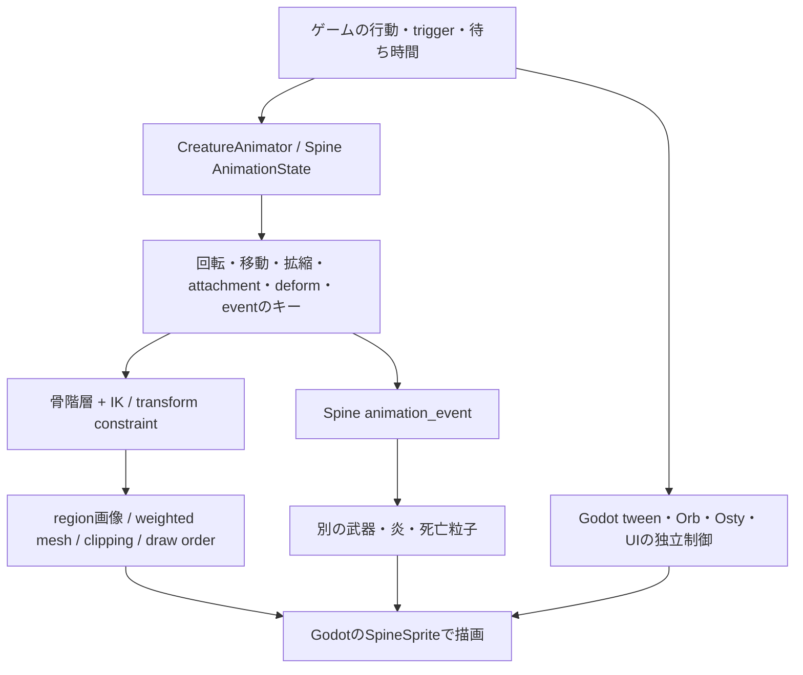

# 元の骨格とモーションを再利用する実装方針

調査日: 2026-10-09。対象はローカル **v0.107.1 / commit 59260271 / Godot 4.5.1**。既存の [動作一覧](../motion/inventory.md) の24個のSpine binaryと50個の選別sceneを再解析し、戦闘用atlas metadata５個だけを追加で読み取った。ゲームの起動・変更、Spine Editorの起動・購入、MOD実装、正式素材制作は行っていない。

ユーザーの問い:

> そもそも、現在のオリジナルのゲームエンジンはアニメーションを動画クリップではなく、物理エンジン的なもので表現している可能性はある？その場合、単純な動画の置き換えでは済まない可能性がある？関節などを設定してモーションは使いまわすのがよさそう。このような方針の選定等もさせること。

デザインは **まだ未承認**。[v0.3方針](../../design/characters/review-v03.md) は、人の顔・髪・表情へ大胆に擬人化し、元の色・モチーフ・人物像を翻訳する案である。以下の「新デザイン」「承認後」は将来の制作条件を指す。元の骨や機械の外見を残すために女性化を弱める案は採用しない。

## 結論

**元のプレイアブルは、動画を貼って動かしている構成ではなく、Spineの２D骨格・キーアニメ・変形メッシュを主に使っている。ユーザー案の「元の関節とモーションを使い、新しい絵を乗せる」を、戦闘の第一検証方針にするのがよい。**

ただし「物理エンジンが全身の動作を自動生成している」という意味ではない。対象24個のSpineに、IKとtransform constraintはあるが、**Spine physics constraintとpath constraintはどちらも０**だった。衣装や髪が揺れて見えても、今回確認した素材では主に骨のキー、meshのweight、deformキー、constraintによる補正で作られている。Godot側には別途、tween、粒子、shader、武器やOrbの配置制御がある。

優先順位を次のように絞る。

1. **既存骨格・アニメを保持し、新しい女性デザインの部位絵を再skin・再weightする。** 顔や衣装を元の外見へ戻す条件は付けない。
2. 新しい体格・髪・衣装に必要な部分だけ、boneの補正、skin constraint、deform、差し替えpose、facial motionを追加する。
3. 元の動きが新しい身体に合わない箇所だけ再作成する。特に死亡pose、Regent本人の体格変更、Necrobinderの骨が崩れる見え方は別判定にする。
4. 以上が品質・工数の条件を満たさない場合に、部分retarget、新rig、AI連番へ進む。５人すべての動作を最初から動画で生成する必要はない。

選択画面はユーザー指定に従って動画AIを使い、戦闘・商人・休憩は元のSpineモーションを優先して再利用する**混成構成**を推奨する。前の [方式比較](options.md) で挙げた新rig作成は、再利用の適合試験をした後の選択肢へ位置付け直す。

## １. 実際に何が動かしているのか

### 層ごとの分担

| 要素 | 役割 | 今回の実物根拠 |
| --- | --- | --- |
| bones | 親子関係のある座標系。人体の関節のほか、衣装、武器、目、死亡用pose、補正用のboneも含む | 戦闘１人84〜141 bones。名称・親・setup値を抽出済み |
| slots / attachments | 部位画像やmeshをboneへ載せる。動作途中で別の絵へ替えたり、描画順を変えたりする | 全員にAttachmentTimeline。攻撃・死亡専用画像がある |
| weighted mesh | 複数boneの影響を重み付けし、１枚の衣装や身体を変形する | 全員に25〜41個のweighted mesh attachment |
| deform | mesh/clipping頂点を直接動かすキー。boneの動きだけではない | 全員にDeformTimeline。新しいmeshへ無条件には移せない |
| IK constraint | 手足のboneをtargetへ届かせる逆運動学 | Ironcladの剣の握り、Defectの脚、Regentの従者等に存在 |
| transform constraint | 別boneの位置・回転・scale等を追従・補正する | Silentの外套、Regentの玉座と本人、Defectの足等に存在 |
| path constraint | pathにboneを並べる制約 | 対象24個では０ |
| physics constraint | 揺れや慣性等の二次運動をSpine側で計算する機能 | Spineには機能があるが、対象24個では０ |
| Godotのtween / particle / shader | 移動、fade、粒子、発光、軌跡など | Sovereign Bladeのtween、Regent/Necrobinderの粒子、Ironcladのslash shader等 |
| ゲームの状態と数値 | damage、block、召喚、Orb数、死亡、通信・乱数 | Spineの見た目から計算する仕組みへ変えない。元のゲーム処理が担当 |

IKはtargetから関節角度を求める計算であり、重力や衝突で身体を倒すrigid-body simulationと同一ではない。[公式IK説明](https://esotericsoftware.com/spine-ik-constraints)、[transform constraint](https://esotericsoftware.com/spine-transform-constraints)。Spineのphysics機能は、boneに慣性や復元力等を与える別のconstraintである。[公式physics説明](https://esotericsoftware.com/spine-physics-constraints)。

選別50sceneにはSpineSprite **30**、SpineSlotNode **12**、SpineBoneNode **5**、CPUParticles2D **28**、GPUParticles2D **40**があり、VideoStreamPlayerと、走査対象にしたRigidBody/CharacterBody/CollisionShape等は０だった。[scene解析](evidence/rig-reuse/scene-features.json)。この結果は当該50sceneの宣言に限定する。ゲーム全体の物理機能や、scriptで動的生成されるすべてのnodeの不存在を証明したものではない。

### Spineの版を混同しない

| 対象 | 確認した版 |
| --- | --- |
| 戦闘の５人 | **全員4.2.43でexportされたbinary** |
| 選択５人 | Ironclad / Silent / Regent / Defectは4.2.40、Necrobinderは4.2.43 |
| 休憩の５人 | Ironclad / Silent / Defectは4.2.37、Regent / Necrobinderは4.2.43 |
| 他の選別資源 | 4.2.08〜4.2.43。Osty、Orb、Regent武器、Sovereign Bladeを含む |
| ゲーム同梱native runtime | DLLから`4.2`文字列を確認。正確なpatch版・build commitは未確定 |
| 今回の解析器 | 公式 `@esotericsoftware/spine-core 4.2.43`。これは解析用packageの版であり、ゲーム同梱runtimeのpatch版を示すものではない |

native DLLのSHA-256は `854d827b8926b00ba6459093033bf0c0898efa2b6e1c85eb0abc78ca153ea58c`。解析器のnpm `gitHead` は `8bca84f46e00d1d0d29ab0dc2406bef3b1248e17`。[source固定情報](evidence/rig-reuse/sources.json)、[公式binary parser](https://github.com/EsotericSoftware/spine-runtimes/blob/8bca84f46e00d1d0d29ab0dc2406bef3b1248e17/spine-ts/spine-core/src/SkeletonBinary.ts)。

runtimeは4.2系に合わせる。Editorへbinaryをimportするときは、まずそのbinaryをexportした版で再構築を試す。現在の最新Editorで開けるはず、という前提にはしない。[Spine versioning](https://esotericsoftware.com/spine-versioning)、[公式import手順](https://esotericsoftware.com/blog/Importing-skeleton-data#Importing-skeleton-data)。

### 戦闘本体の実物の構造

数はbinaryの構造を数えたもので、実行性能・見た目・制作工数の実測ではない。「mesh」はskin内attachment entry数で、Regentのlinked mesh３個も含む。deform列は全収録animationのtimeline数の合計で、同じ部位への別animationのdeformを重複して数える。clippingのdeformも含む。

| キャラ | bones | slots | mesh総数 / weighted | IK | transform | path / physics | deform timeline |
| --- | ---: | ---: | ---: | ---: | ---: | ---: | ---: |
| Ironclad | 84 | 71 | 31 / 25 | 6 | 0 | 0 / 0 | 6 |
| Silent | 141 | 56 | 33 / 31 | 2 | 11 | 0 / 0 | 18 |
| Regent | 103 | 81 | 43 / 41 | 10 | 8 | 0 / 0 | 2 |
| Necrobinder | 135 | 63 | 34 / 27 | 2 | 8 | 0 / 0 | 17 |
| Defect | 101 | 69 | 27 / 25 | 2 | 3 | 0 / 0 | 19 |

全24資源を合わせるとIK **36**、transform **43**、path **0**、physics **0**。選択５人はIK/transformも０だが、boneのキーとmesh/deformを使う。休憩は別rigで、IroncladがIK2/transform1、Silentが2/2、Regentが2/0、Necrobinderが3/1、Defectが0/0だった。[短い構造一覧](evidence/rig-reuse/spine-feature-summary.json)、[全bone・constraint・attachment・timeline](evidence/rig-reuse/spine-features.json)。

この表の収録animationには `_ignore/…` 等も含まれる。本番用に作り直す動作の範囲は [runtime到達を区別した動作一覧](../motion/inventory.md) で決め、収録数をそのまま必要な生成本数にはしない。

## ２. 「絵だけ替える」から「新しく動かす」までの比較

| 方式 | そのまま再利用しやすいもの | 必要な作業 | 破綻しやすい箇所 | 今回の位置付け |
| --- | --- | --- | --- | --- |
| **A. atlasの画素だけ置換** | bones、weights、mesh、deform、全キー、events | 元のregionと同じ位置・寸法・輪郭に新しい部位を描く | mesh外の新しい髪/衣装が切れる。人の顔を元の頭骨・機械頭の変形で歪ませる。pose差分の描き漏れ | 小さい変更に有効。大胆な女性化全体の制約にはしない |
| **B. 元bonesへ新しい部位絵を再skin・再weight** | 骨階層、手足のキー、IK、基本的なタイミング、events | 新しい部位分割、meshとweight、attachment/slot対応、必要なpose差分 | 新meshと旧deformの対応、握り、衣装の重なり、死亡差分 | **第一候補**。見た目を新しくしつつ身体の演技を流用する |
| **C. 同じ名前/階層を基に体格補正・部分retarget** | 基本キーとevent時刻の多く | setup位置/長さ、IK target、constraint order/offset、補正boneを調整 | 比率変更で手が剣に届かない、足が滑る、顔のshear、座面から浮く | Bで体格が合わない部分に限定して使用 |
| **D. 別骨格へanimation import/retarget** | 名前を対応付けられたキー、eventの設計 | bone/slot/attachment/constraintの対応表と、欠落したキーの補修 | 同じ名前でも親・軸・初期姿勢が違えば同じ動きにならない。deformは頂点対応が必要 | 大きく構造を変える部位/キャラで検討 |
| **E. 新rigとanimationを制作** | ゲームのtrigger、時間契約、イベントの意味 | rig、全必要pose/animation、transition、VFXアンカーを作る | 最も多くのauthoring・回帰確認が必要 | 部分流用で品質が満たせない場合 |
| **F. AI動画→連番/動画rendererへ置換** | 生成した映像の演技、元trigger名の設計 | 透過処理、pivot、loop/割込み/死亡/復活/event bridge | Spineのevent、bone追従、死亡時間等が自動では残らない。VRAM/decoder負荷 | 選択には採用方向。戦闘は比較・代替候補 |

Spineのskinは、同じ骨格のアニメを別のattachment集合へ使うための仕組みである。[公式skins](https://esotericsoftware.com/spine-skins)。一方、完成した全身絵１枚を渡すだけで、既存の部位・裏側・関節の描き足し・weightへ自動変換される仕組みではない。

**Bは見た目を原型へ戻す案ではない。** 骨の名前が`head`でも、新しい人の顔・髪を載せられる。身体の色・衣装・表情は新しいデザインで作る。既存キーの意味を保てる範囲で新しいmeshを作り、それを元の関節へ結び付ける。顔の表情や追加した長髪など、元にない動きだけを追加する。

### 再利用の条件を具体化する

| 変更 | 何が保てれば流用できるか | 調整が必要になる理由 |
| --- | --- | --- |
| 画像解像度を上げる | 同じ論理寸法、pivot、trim offset、UV上の部位対応 | textureのpixel数と骨格の座標は別。高解像度画像に合わせてbone全体まで拡大しない |
| torsoや腕の輪郭を変える | 関節位置と親子関係。新meshのweight | 旧meshをそのまま広げると、肩・肘・胸・衣装の曲がり方が不自然になる |
| 髪や裾を追加する | 既存head/bodyへ追従する新しいchild bone等 | 元にない揺れは自動では生まれない。既存の髪/外套chainを再利用する場合も形に合わせて調整する |
| 体格の比率を変える | bone軸とsetup、constraint target/offset/orderの整合 | rotationキーが同じでも手足のworld軌道が変わる。脚の長さだけ変えて足のIK targetを放置できない |
| meshを作り直す | 頂点数・順序・基準形・weightsとdeformの対応 | deformは「肘を曲げる」のような意味情報ではなく頂点配列へ適用されるデータ。新topologyへの自動流用を仮定しない |
| attachment名やslot数を変える | 全到達animationが参照する名前とdraw-order keyの対応 | Attack/Deadに入ったときだけ別画像へ切り替わる。idleだけ直しても完成しない |
| 一部skinだけ作る | setupとAttachmentTimelineの参照先をすべて新skinで満たす | runtime skinに見つからないattachmentはdefault skinへfallbackするため、元の頭骨や機械の絵が瞬間的に戻り得る |
| boneを削除する | mesh weight、constraint、Godot Bone/SlotNode、scriptの参照先を再対応 | 描画上見えないhelper boneも、剣・衣装・particlesの計算に使われる |

skinによる体格調整は公式にも例があり、hipsやlimbsのtransform constraintを使う。ただしconstraintの順序を直す必要があると説明されている。今回の骨格に一律の数値を適用する保証ではない。[体格変更の公式例](https://esotericsoftware.com/blog/Skin-constraints-for-different-proportions)。

animation importは、キーがあるbone/slot/attachment/event/constraintの名前を揃える必要がある。欠落したもののキーは警告付きで落ち、deformは少なくともmesh頂点数が一致しなければならない。実際には頂点順序と形の対応も確認する。[公式Import Animation](https://esotericsoftware.com/spine-import#Animation)。別骨格へのimportを、全身の意味を理解した自動retargetと呼ばない。

runtime Skin APIで部位を組み立てることもできるが、StS2のMegaSpine wrapperで必要操作がすべて利用できるかは未検証。初期実装では、Editor側で新skin/meshを含めたprivate skeleton dataをexportして既存ゲームへ渡す経路を優先する。[Runtime skins](https://esotericsoftware.com/spine-runtime-skins)。

## ３. キャラごとの再利用方針

以下は実データ構造からの**制作上の判断**であり、新デザインで再生して確認した結果ではない。

| キャラ | 実物で分かった構造 | 再利用しやすい範囲 | 新しい女性デザインで重点的に直す範囲 |
| --- | --- | --- | --- |
| **Ironclad** | 剣の`sword_attach_l/r`へ両腕のIK。通常腕とは別の`*_attack_*` chain、`dead_*` chain、攻撃/死亡用attachmentがある | 剣を握る動き、重い踏み込み、attack/cast/hurtの骨キーと剣のevent。人体の関節構造を基本にできる | 顔・髪・女性兵士の体型と鎧を再skin。通常絵だけでなくattack/death版の手・顔・胴を作る。両手の握りを全poseで再確認 |
| **Silent** | `body_1/2/3`、脚IK、外套追従constraint、`hair1…11`等のchain。死亡は別のroot/骨/`death_half_scale/*`画像 | 人体、短剣、外套の軽さ。顔が見える新デザインを既存head/bodyへ接続する試作に向く | 頭蓋骨・hood・髪の新しい配置、顔がshearで歪まないweight。死亡poseにも新しい顔と髪を用意。`right cape`等のdeformは形に合わせて再検証 |
| **Regent** | 本人、玉座、従者が１つのcombat skeletonに入る。`regent_transform_const`が`throne_bone`から`butt_attach`へ追従。従者側にも多数のIK | 玉座の上下・揺れ、従者の動作、本人の指図の基本キー、別武器のevent | 小さい本人を人型女性へ再構成する場合、**本人subrigを中心に**再skin/比率補正。玉座と従者を一括して拡縮しない。座面、肘、袖、足、死亡粒子の位置を再対応 |
| **Necrobinder** | 腕IK、鎌の握りtarget、多数の裾/袖chain。head meshは`head/face/eye_l/eye_r`へweight。死亡はribcage/skullの専用attachment | 鎌、指図・召喚、衣装の動き。元が骨でも、head/torsoへ人の顔・身体のmeshを結ぶことは構造上検討できる | 骨の空隙を埋めた人体と衣装の重なり、顔の旧mesh/deform。**死亡の骨が崩れる見え方は人型女性へそのまま適用しない**。死亡poseを作り直してもtime/event契約は維持 |
| **Defect** | pelvis/torso/shoulder/arms/legs/headの人型に近い構造。両脚IK、足のtransform、torso/headのtwist、cowlのdeform | 自己修繕や機械的な動き、attack/cast/process、脚の位置制御 | 女性型オートマトンの顔・髪・胴・関節を再skin。機械の伸縮/shearを人の顔へ直に伝えない。body内部のorbと、ゲーム上独立したOrb群を区別する |

特にRegentは「玉座上の小さい元キャラを巨大な女性画像１枚へ替える」だけでは、座面と手足の拘束が合わない。本人の`butt_attach → regent_cog → body/head/limbs`を変更対象として、`throne_*`と`minion_*`の関係を保存する案が先になる。本人の体格変更が大きい場合は、そのsubrigだけをretargetする。関連constraintとboneの実名は [構造JSON](evidence/rig-reuse/spine-features.json)。

### idle / attack / hit / die / eventをどこまで流用するか

| 動作 | まず流用するもの | 新しくする候補 | 合格を確認する箇所 |
| --- | --- | --- | --- |
| idle / relaxed | 呼吸、重心、外套・衣装の既存boneキー | 人の表情、追加した髪/装飾の小さな動き | loop接続、顔の歪み、衣装の重なり、本人らしさ |
| attack / cast / 固有技 | 予備動作、剣/短剣/鎌の軌道、接触時刻、元のevent | 新体格で届かない手足、追加した衣装の補正 | weapon grip、足の接地、攻撃専用attachment、発光/斬撃の付着点 |
| hit | 短い反応のタイミングと戻り先 | 胸・顔・髪の過度な潰れの補正 | attack途中の割込み、hurt→hurt、hurt→dieのmix |
| die | game側の待ち時間、終端保持、粒子/音の時刻 | 人型女性に合わない崩れ方、別骨格や別画像のpose | 生存絵への戻り、元画像の残留、最終frame、再ロード時の死体、復活fade |
| event | event名、値、発火時刻、キャンセル時の意味 | 描画対象の新しいanchorへの対応 | １回だけ発火し、ゲームのdamage/召喚処理とは独立していること |

全身のキーを再利用しても、顔の新しい感情表現までは自動で作られない。逆に、表情を足すためにattackの手足まで全部作り直す必要もない。２つを別の制作項目として扱う。

## ４. 武器・Orb・相棒・Godot nodeの接続を保つ

| 接点 | 元sceneで確認した名前 | 再skin/retarget時の条件 |
| --- | --- | --- |
| Ironcladの斬撃 | `SlashVfxSlot` → slot `slash_mesh` | slotとshaderの対象を維持または明示的に再対応。剣だけの新しい画像に斬撃を全部描き込まない |
| Necrobinderの炎 | `HeadBoneNode` → slot `flameattach` | node名にBoneとあるが実型はSpineSlotNode。人の顔にする場合も炎の場所と死亡時visibilityを合わせる |
| Necrobinderの鎌VFX | slot `scythe_vfx_attach_1/2` | 新しい鎌と握りに付着点を移す。鎌の絵だけを大きくして旧particleの位置を残さない |
| Regentの武器 | `Weapons` → slot `shadow`、子に`WeaponAnim1/2` | 独立Spineの武器と本体eventを保つ |
| Regentの死亡粒子 | `arm_particle_attach / chest_particle_attach / leg_particle_attach / leg_particle_attach_l` | 新しい人体の腕・胸・脚に追従点を配置する。旧座標へ放置しない |
| DefectのOrb | 本体skel内の`orb`とは別に、ゲームが生成・増減するOrb node群がある | 本体に描いた宝珠とゲーム上のOrbを一体化しない。数・位置・evoke/clearはゲームが制御 |
| Osty | combat/restともNecrobinder本体とは別skeleton/node | 女体化した本人のmeshにOstyを含めない。召喚・攻撃・size・死亡を独立制御する |
| 全員のUI位置 | `Bounds / CenterPos / IntentPos`、必要なOrb/Talkのmarker | 骨格内部の単位と、画面上のhitbox/HP/intentの配置を別々に検証する |

根拠: [Ironclad scene](../motion/evidence/resources/scenes/creature_visuals/ironclad.tscn)、[Necrobinder scene](../motion/evidence/resources/scenes/creature_visuals/necrobinder.tscn)、[Regent scene](../motion/evidence/resources/scenes/creature_visuals/regent.tscn)、[scene nodeと元行番号](evidence/rig-reuse/scene-features.json)、[ゲームのVFX・trigger IL](../motion/evidence/combat-triggers.il.txt)。

商人は本体のskeletonと`relaxed_loop`を再利用するため、戦闘用の新しいskinから展開しやすい。一方、休憩は**キャラごとに別のskeleton**であり、戦闘用atlasを１枚替えれば休憩も完成する構造ではない。休憩の座った絵・骨格へも新しいデザインを別途合わせ、３Actのloopを使う。[動作一覧の商人・休憩](../motion/inventory.md)。

## ５. 元のEditorプロジェクトがなくても扱えるか

**再構築の公式経路はある。ただし元の作者プロジェクトと完全に同じ編集環境を復元できるとは限らない。**

今回の配布PCK索引15,658 entriesには、拡張子`.spine`の作者プロジェクトは見つからなかった。選別した`.spskel`はSpine binaryとして24個とも解析できた。Godot側の`.spatlas`はJSONで、その`atlas_data`にSpine atlasのregion、trim、回転、page情報が含まれていた。[索引範囲の記録](evidence/rig-reuse/scene-features.json)、[追加で読んだatlas５個のMD5/SHA-256](evidence/rig-reuse/atlas-manifest.json)。原作者の手元や別の配布にprojectがないと断定したものではない。

公式手順は、atlasとpage画像を用意してTexture Unpackerで部位画像へ戻し、対応版EditorのImport DataでJSON/binaryを読み、画像pathを設定して新たなprojectとして保存するもの。[公式の再構築手順](https://esotericsoftware.com/blog/Importing-skeleton-data)。今回、そのEditor import/save/exportは実行していない。

| 確認できたもの | 意味と制限 |
| --- | --- |
| 24個すべて `nonessential=true` | runtimeに必須でない一部Editor metadataも含まれる。復元には有利だが、制作履歴・元PSDのlayer・原寸画像・作者用説明まで含むという意味ではない |
| 戦闘atlasのpack scale | Ironclad/Silent `0.32`、Regent `0.385`、Necrobinder `0.359`、Defect `0.166` | 元絵より縮小されたtextureを使う。unpackしても元の高解像度の画素は戻らない。import時の縮尺合わせを要する |
| 元のregionとtrim/rotation | 部位名と配置を再構築する手掛かりになる | sceneや骨のscaleとは別。費用計算の`Spine bounds × Visuals scale`へpack scaleをもう一度掛けない |
| binaryにdeform/weight/keyがある | 元motionを復元するためのデータが含まれる | 不完全な独自converterや誤った版での再exportで落とす可能性。今回の構造JSONはEditor用JSONではなく、再import素材として使えない |
| Godot import済texture | 配布用の画素を取り出せる場合がある | 正しいalpha方式・色・trimを確認する必要がある。今回はatlas metadataまでの検査で、５人分のEditor用画像再構築は未実施 |

`nonessential`がなければ、例えばmeshのmanual edge等を失う場合があると公式は説明する。今回はflagが立っていることを確認したが、実際のEditor round tripで情報が全部維持されるかは別に試す。[Importのnonessential説明](https://esotericsoftware.com/spine-import#Nonessential-data)。

`.spskel`を作業用`.skel`として渡す段階では、MD5/SHA-256で同じbinary payloadであることを保つ。`.spatlas`を拡張子だけ変えてEditorへ渡さず、`atlas_data`から正しい改行を復元した`.atlas`と対応page画像を組にする。ここで元のゲームファイルを上書きしない。

### Editorとruntimeの利用条件

今回のデータはmeshとconstraintを実際に含む。公式は、**Professionalで作られたmesh/constraintはEssentialではimportされない**と説明し、購入ページでもEssentialはProfessional機能を含むprojectをsave/exportできないとしている。元データを保ったauthoringには **Professional相当の機能**を想定する。[公式import制限](https://esotericsoftware.com/blog/Importing-skeleton-data#Troubleshooting)、[機能比較と購入ページ](https://esotericsoftware.com/spine-purchase)。Trialは評価用であり、本制作のsave/exportを完了させる前提にはしない。

調査時の公式表示はProfessional **$379**（通常表示$449）、Essential $69（通常表示$99）。制作担当者の既存license、適用するlicense区分、税等は未確認。必要な場合の固定費として、動画生成の従量料金と分ける。購入やlicense認証は行っていない。[公式価格](https://esotericsoftware.com/spine-purchase)。

ゲーム同梱runtimeを利用することと、自分がEditorでauthoringする権利や、runtime入りsoftwareを配布する権利は別である。現行Editor契約はnamed user、runtimeを含むproductのintegration/modification/distribution等の条件を定め、Trialにruntime利用権を与えていない。[Editor契約 §1–2](https://esotericsoftware.com/spine-editor-license)、[Runtime契約](https://esotericsoftware.com/spine-runtimes-license)。

modの扱いには日付と範囲に注意が要る。公式スタッフNateの[2020年回答](https://esotericsoftware.com/forum/d/14087-licencing-for-modding)は、runtimeを含まないdata-only modの配布とruntime入りmodを区別した。一方、[2025年回答](https://esotericsoftware.com/forum/d/28190-licencing-for-modders)は、ゲームを変更するmodderのEditor licenseを説明している。古い回答だけから、本MOD全体が無条件に無償で制作・配布できるとは結論しない。今回の実装ではruntime DLLを再配布・交換せず、authoring担当の適切なlicenseを使う構成を前提に検討する。最終的な配布物に対する条件は、実装と配布形態が決まった時点で現行契約に照らして確定する。

## ６. 最小PoCで何を決着させるか

### P0: 絵を変える前に、元データの往復を確かめる

まず１キャラの**元データだけ**を作業用に再構築し、対応版Editorで同じ形式へexportできるかを確かめる。現在の最初の描画確認はSilent予定なので、デザイン承認後の接続試作と資料を共有するならSilentが適する。既にIronclad用の準備が揃う場合も同じ検査を適用できる。

受入条件は、animation名・長さ、bone/slot/constraint名、weights、全到達attachment、event名/値/時刻、mix設定が欠けず、元と同じposeを再現すること。数が一致するだけでは合格にせず、idle/attack/hurt/die/固有技と切替時を表示で比較する。前後比較は同じruntime版・同じ時刻・同じscene scaleを使う。Editor project復元の成功は、ここを通って初めて言える。

### P1: 承認後の１キャラを再skinし、元motionを変更せず通す

1. 今後レビューで承認された１人の顔・髪・衣装・体型を部位に分ける。
2. 元の主要bone階層、animationのキーとevent時刻を保持し、新しいmeshとweightsを合わせる。
3. 到達するsetup/attack/death attachmentの参照集合を取り、変更対象の部位がdefaultの元画像へfallbackしないことを確認する。
4. idle、attack、hurt、die、固有技、cast、relaxedを再生する。通常姿勢だけで女性化が成立したことにしない。
5. 元motionでは成立しない部位を記録し、キー全体の作り直しに進む前に、補正bone・skin constraint・deform再設定・差分poseで直せるかを判定する。

最低限の合格条件:

- 顔・髪・体型が、承認された大胆な女性化・擬人化を保つ。元rigを使う都合で元の顔・骨格表現へ戻していない。
- 剣/鎌/短剣の握りが外れず、足や座面に意図しない滑りがない。暫定的には接続点のずれを1080p相当の論理表示で2px以内から検査し、実際の画風・表示倍率で確定する。
- 同じslotの並びでも、顔・衣装・腕の重なりと遮蔽が全poseで正しい。deformの引き攣れ、meshの裏返り、clip欠けがない。
- `die`専用画像、終端frame、再ロード時の初期Dead、復活fadeが新しいデザインで成立する。
- ゲームが参照するevent名・値・時刻、`TriggerAnim`の待ち契約、固有VFXの発火回数を保つ。秒数は元のanimation全長とdamage delayを混同しない。
- game speed、attack→hit、hit→hit、hit→die、画面離脱時にmix/cleanupが成立する。

この段階では１キャラの１〜２個の動画が再生できるかではなく、**同じ骨格モーションに新デザインを載せられるか**を判定する。

### 成否に応じた次の分岐

| PoCの結果 | 次の方式 |
| --- | --- |
| 新mesh/weightで全必要動作が成立 | Bを採用。商人のrelaxedと別rigの休憩へ展開 |
| 顔・髪・裾等だけが不自然 | その部位の追加bone/deform/poseを作成し、身体のキーは流用 |
| 身長・肩幅・座り方の補正で直る | Cのskin constraint/部分retarget。IK targetと順序まで合わせる |
| 死亡だけが人型女性に不適合 | 死亡pose/画像/部分キーだけ再作成。時間・eventとゲーム側処理は保つ |
| Regent本人だけ大幅に不適合 | 本人subrigを再作成またはretargetし、玉座・従者・別武器を独立して再利用 |
| Editor再構築や再skinが成立しない、または必要工数が大きい | 作者projectの入手可能性、限定した新rig、AI連番＋bridgeを比較。原型へ絵を戻す方法で合格扱いにしない |

正式デザインと制作環境が未確定なので、５人について「何％流用」「何時間で完成」はまだ算定できない。bone数やキー数から単純に成功率を出さない。PoCでは再利用/修正/新規を部位と動作ごとに記録し、その記録から残りの工数を見積もる。

## ７. 選択動画と再利用方式の分担

| 構成 | 選択 | 戦闘・商人・休憩 | 判断 |
| --- | --- | --- | --- |
| **推奨する混成構成** | 動画AIで表情・仕草を制作し、無音video/必要overlayで表示 | 元Spineへ再skin・再weight。合わない部位/動作だけ改修 | ユーザーの動画AI指定と、モーション再利用案を両立しやすい |
| 全画面をSpineで再利用 | 元の選択rig/loopも流用 | 同左 | 技術的には可能性があるが、選択に動画AIを使うという指示を自動的に取り消す理由にはしない |
| 選択も戦闘も生成映像へ | 映像 | 動画または連番＋独自bridge | 人型化の絵は作りやすくても、原作のevent/割込み/独立武器/死亡契約を多数再実装する |
| 全員のrig・animationを新規制作 | 自由に制作 | 新規Spine | 最も自由だが、流用できるモーションが多い今回の初手としては作業が増える |

選択videoは顔・視線・短い芝居が目立つ場所に集中させる。戦闘で元のmotionを流用できれば、その待機・攻撃・被弾・死亡の**本番用動画生成費は不要**になり、必要なら動作参考や比較用の少数clipだけ生成する。部位絵制作、rig/weight調整、Editor費用は別に残る。料金と仮の出力解像度は [動画費用比較](../costs/video-generation.md) へ引き継ぐ。

連番のcanvasを用意する場合も、setup boundsだけを最大描画範囲としない。実表示倍率で全採用animationの描画範囲を測り、同じpivotを保つ固定canvasと余白を決める。Regentの別武器、Osty、Orb、particleはそのcanvasに焼き込まない。今回の解析は構造metadata用で、画像を使った全frame描画範囲の測定はしていない。

## 検証済みと未検証

**検証済み:** 既存24 binaryの構造解析、bone/slot/mesh/weight/deform/constraintの数と実名、全24の`nonessential` flag、選別50sceneのnode型、native DLL hashと`4.2`文字列、５atlas metadataの原本MD5照合、公式の再skin/import/ライセンス資料の確認。

**未検証:** Spine Editorでのimport/save/export、原データのrender round trip、新しい女性デザインへの再skin/retarget、全frameのpixel範囲、ゲーム内動作・mod互換・性能・co-op、最終配布形態の条件。Spine制作担当者のlicense保有も未確認。

解析用の [spine_features.mjs](evidence/rig-reuse/spine_features.mjs) はダミーatlas regionを使って構造だけを読み、ゲームもGodotも起動しない。そこで得た値をrender済みの見た目や品質の証拠には使っていない。結果は [summary](evidence/rig-reuse/spine-feature-summary.json)、詳細は [features](evidence/rig-reuse/spine-features.json)、出典固定は [sources](evidence/rig-reuse/sources.json) に保存した。
