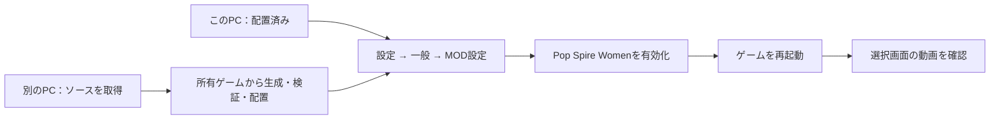

# Pop Spire Women の導入・更新・削除

[外観と動きのプレビュー](../../README.md) / [検証した範囲](../validation/motion-v02.md)

**0.2.0は、今回の制作環境のSteam版 `mods/PopSpireWomen/` へ配置済みです。** このPCでは再ビルドせず、[ゲーム内で有効にする](#ゲーム内で有効にする)から進めます。別のPCへ導入する場合は、下の「初めて導入する」を使って所有ゲームから生成してください。

対象は **Windows版 Slay the Spire 2 v0.107.1 / build 59260271**。５人の画像・動画は同梱され、遊ぶためのAPIキーや動画生成サービスの契約は不要です。



## ゲーム内で有効にする

1. ゲームを起動し、メインメニューの **設定 → 一般** を開きます。
2. 下へスクロールし、**MOD設定** を開きます。
3. **Pop Spire Women** のチェックを有効にします。ゲームが確認を表示した場合は内容を読んで進みます。
4. ゲームを終了して再起動します。新しいプレイの選択画面で、解放済みキャラの絵と動きを確認します。

| MOD設定の場所 | 適用後の選択画面 |
| --- | --- |
| [](../validation/media/install-v02/settings-mods-button.png) | [](../validation/media/motion-v02-runtime/select-silent-candidate01.mp4) |

左は0.2.0・対象ゲーム版の分離した検証環境で撮影した操作案内、右は同版の選択動画の実録です。[操作画面の記録](../validation/media/install-v02/README.md) / [５人の画像・実録](../validation/media/motion-v02-runtime/README.md)。元のSteamディレクトリへの配置は確認済みですが、そのディレクトリからの起動確認とは分けています。

**MODを使うと、通常プレイとは別の進行領域になります。** 通常側の進行・キャラ解放・統計は自動で移りません。キャラが未解放に見えても、元データを消したわけではありません。ゲームのMOD設定で全MODを無効にして再起動すると通常側へ戻ります。このMODの外観設定だけをオフにしても、保存先は切り替わりません。

## 初めて導入する

この節は、別のPCへ導入する人、またはソースから作り直す人向けです。生成と配置はゲームを終了してから行います。

### 1. 必要なものを用意する

| 用意するもの | 確認すること |
| --- | --- |
| 所有するWindows版ゲーム | v0.107.1 / build 59260271。別の版は未対応 |
| [Python 3.11以降のWindows版](https://www.python.org/downloads/windows/) | PowerShellで `py -3 --version` が通ること |
| [通常版Godot 4.5.1 stable](https://godotengine.org/download/archive/4.5.1-stable/) | WindowsのStandardを取得し、展開した `.exe` の場所を控える。エディターでの作業は不要 |
| このMODのソース | [リポジトリ](https://github.com/Motoki0705/slay_the_spire_2_mods)をcloneするか、Code → Download ZIPで取得して展開 |

Spine Professional、RitsuLib、Harmonyの導入は不要です。今回の制作環境には `dist/PopSpireWomen-0.2.0-source.zip` もあります。公開リポジトリに完成PCKは含まれません。PCKは所有ゲームからローカル生成し、別の人へ再配布しないでください。

Steamのライブラリでゲームの **管理 → ローカルファイルを閲覧** を使い、`SlayTheSpire2.exe` があるフォルダーを確認します。通常の配置例は次のとおりです。

```text
C:\Program Files (x86)\Steam\steamapps\common\Slay the Spire 2
```

### 2. 所有ゲームから生成する

展開したMODソースのルート（`scripts` と `mod` がある場所）でPowerShellを開きます。次の３つのパスを自分の環境に合わせて設定してください。`$pswBuild` はまだ存在しない出力先にします。

```powershell
$pswGame = 'C:\Program Files (x86)\Steam\steamapps\common\Slay the Spire 2'
$pswGodot = 'C:\Tools\Godot\Godot_v4.5.1-stable_win64.exe'
$pswBuild = Join-Path $env:TEMP ('PopSpireWomen-0.2.0-' + (Get-Date -Format 'yyyyMMdd-HHmmss'))

py -3 scripts/build_pck_mod.py build --game-dir $pswGame --godot $pswGodot --output $pswBuild
```

画像・動画の取り込みに数分かかる場合があります。エラーが出たら次へ進まず、表示された原因を確認します。出力先が既にある場合は、別の未使用パスへ変更してください。

### 3. 検証して配置する

同じPowerShellで実行します。

```powershell
py -3 scripts/build_pck_mod.py verify --game-dir $pswGame --build-dir $pswBuild

$pswReceipt = Get-Content (Join-Path $pswBuild 'build-receipt.json') -Raw | ConvertFrom-Json
$pswReceipt.skipped.Count
```

`verify` が成功し、最後の数字が **0** なら、５人分の必要な素材を省略せず生成できています。数字が0以外なら、`build-receipt.json` の `skipped` の内容を確認してください。

```powershell
py -3 scripts/build_pck_mod.py install --game-dir $pswGame --build-dir $pswBuild --mods-dir (Join-Path $pswGame 'mods')
```

配置後は次の形になります。既存の別MODはそのまま残ります。

```text
Slay the Spire 2/
  mods/
    PopSpireWomen/
      PopSpireWomen.pck
      PopSpireWomen.json
      LOCAL_ONLY.txt
      psw-install.receipt
```

最後に [ゲーム内で有効にする](#ゲーム内で有効にする)へ進みます。Linux/WSLで生成する場合のコマンドは [開発用PCK手順](../development/pck-only.md#入力とコマンド)を参照してください。

## 更新する・動きを控えめにする

ゲームを終了し、更新したソースと新しい出力先を使って **build → verify → install → 再起動** を行います。installerが既存の管理済み0.1.0／0.2.0を確認して更新します。

選択画面を静止画にし、場面の周期的な動きを抑えるには、ソースの [settings.example.json](../../mod/settings.example.json) を別の名前でコピーし、`ReducedMotion` を `true` にします。上のbuildコマンドに `--settings 'C:\path\to\settings.json'` を追加してください。キャラ単位の切替も同じファイルの `EnabledCharacters` で指定できます。[設定項目の説明](../../mod/README.md#設定変更は再生成する)。

設定は生成物に入るため、JSONを編集するだけでは反映されません。新しい出力先へ再生成・再導入してからゲームを再起動します。

## 削除する・通常プレイへ戻る

ゲームを終了してから、ソースのルートで実行します。

```powershell
$pswGame = 'C:\Program Files (x86)\Steam\steamapps\common\Slay the Spire 2'
py -3 scripts/build_pck_mod.py uninstall --mods-dir (Join-Path $pswGame 'mods')
```

このMODの管理済みファイルだけが削除され、ゲーム原本・他のMOD・保存データは削除されません。他のMODも入っている場合は、ゲームのMOD設定でそれらも無効にして再起動すると通常側の進行へ戻ります。

ゲーム本体が更新された場合も、対応版が確認できるまで無効化または上記の削除を行ってください。削除には元ゲームの版照合は不要です。

## 困ったとき

| 症状 | 確認すること |
| --- | --- |
| MOD一覧に出ない | 実際に起動するゲームの `mods/PopSpireWomen/` にPCKとmanifestがあるか。フォルダーが二重になっていないか |
| チェックを入れても元の姿 | ゲームを完全に終了して再起動したか。他の外観MODとの競合がないか |
| 選択画面が静止画 | `ReducedMotion` 設定を確認。動画が読めない場合も静止画に戻る設計 |
| キャラや進行が消えたように見える | MOD用と通常用の保存先が別。全MODを無効化して再起動し、通常側を確認 |
| ゲームのhash／版が一致しない | 対象版と異なるため生成・導入を停止した状態。版のpinだけを書き換えず、対応版を待つ |
| installerが既存ファイルを拒否する | 編集済み・未管理の同名MODを上書きしないための確認。`psw-install.receipt` を消して回避せず、旧版の手順とフォルダー内容を確認 |

５人の選択・場面別姿勢・代表カードは対象版の分離した検証環境で確認済みです。協力プレイ・再接続・全Act通し・他MODとの組合せは未確認です。[検証結果と残課題](../validation/motion-v02.md)。
