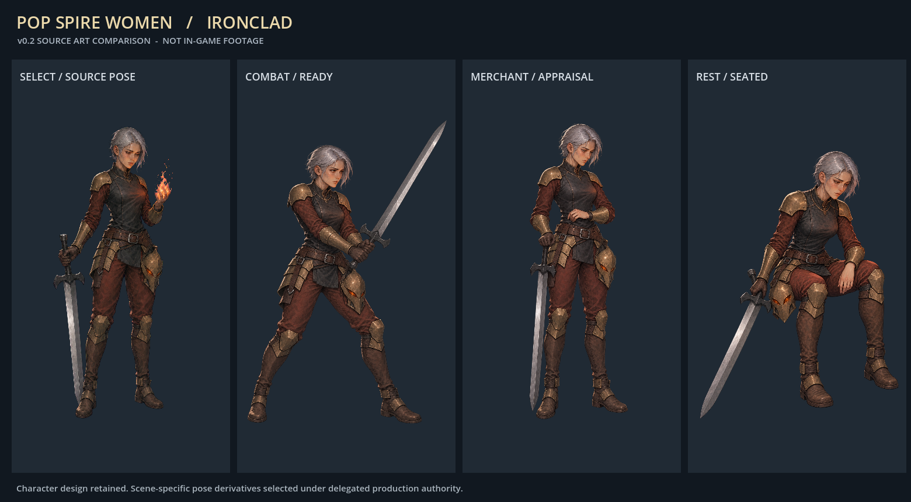
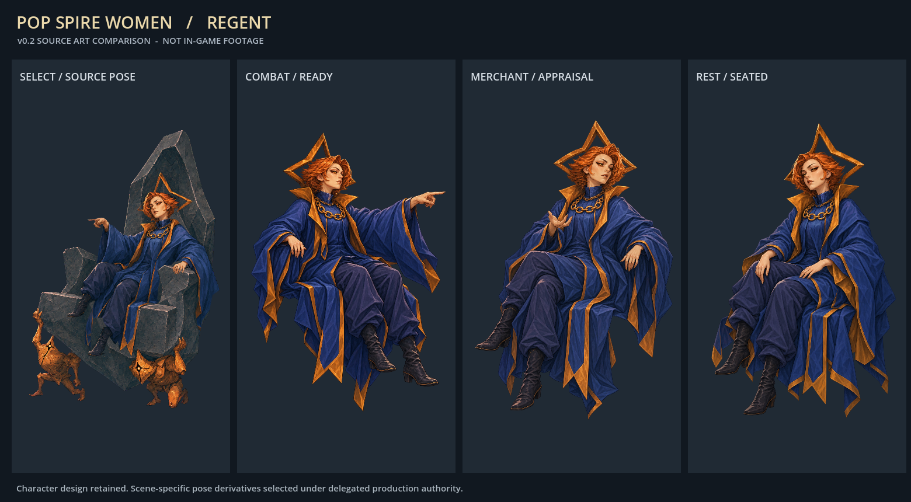
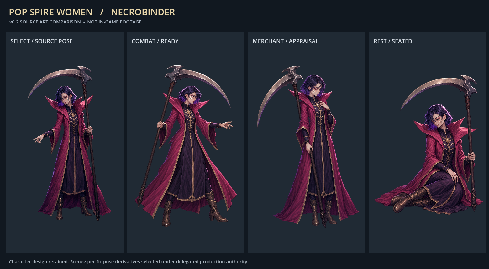
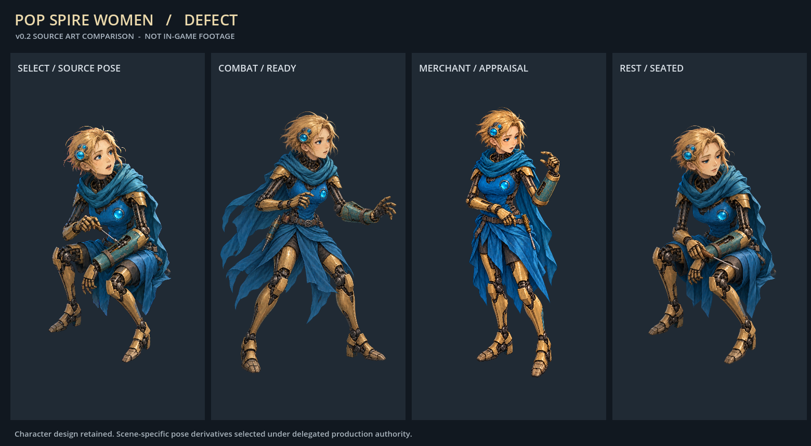

# 場面別ポーズ v0.2 — 制作画像の比較

2026-10-09制作。[Issue #48](https://github.com/Motoki0705/slay_the_spire_2_mods/issues/48) の途中成果。**以下は素材をGodotで並べた比較画像であり、ゲーム実機やモーションの検証画像ではない。** 各列は選択用の元姿勢、戦闘、商人、休憩。

| キャラ | 比較 |
| --- | --- |
| Ironclad |  |
| Silent |  |
| Regent |  |
| Necrobinder |  |
| Defect |  |

戦闘・商人・休憩用を各５点、合計15点に分けた。選択用の本人デザインは保持し、戦闘では右の敵への構え、商人では相手や商品への関心、休憩では座位と力を抜いた手足へ翻案した。Regentの戦闘・商人は別の玉座レイヤーへ合わせる本人だけの画像、休憩は元の休憩座席に座る本人だけの画像で、玉座と運び手を含まない。Regentの休憩の左へ外した視線は、気怠く距離を取る人物像として親が制作採用した。提案時の右向き指定を完全に満たしたとは記録しない。

Silentの承認対象は元のv05デザイン。今回の15姿勢は**自律制作の委任に基づく制作採用**で、個別のユーザー承認ではない。他４人も元v02の顔・衣装・自然な成人体型を基準にした。

画像はCodex内蔵imagegenで制作。16回の出力から15点を採用した。Defectの商人v03は補修された前腕が反対側になったため、v04でその部分を修正。v03も比較可能な履歴として残す。全出力は1024×1536のRGBAで、透明領域はalphaで確認した。透明pixelのRGB色を背景と判定しない。モデル名・品質設定・課金usageは内蔵toolから未公開のため推測しない。

プロンプトは `art/prompts/<character>/{combat,merchant,rest}-v03.txt` とDefectの `merchant-v04-fix.txt`。出力と個別来歴は `output/imagegen/<character>/<character>-<surface>-v03.png` / `.provenance.json`（Defectの採用merchantはv04）。入力画像・prompt・出力hash、採用理由を記録している。

[source-gallery.json](source-gallery.json) は比較画像と入力素材のhash。比較は1560×860、標準Godot 4.5.1でalpha合成し、画像のpixel自体は編集していない。再作成は [render_contextual_gallery.gd](../../../../tools/assets/render_contextual_gallery.gd)。選択列のRegentだけは元の玉座レイヤーを背景へ重ね、元の姿勢を読めるようにしている。

選択動画はMiniMax-H3 / 768Pで５本を生成済み。[無音loopと制作記録](../../../../output/videogen/README.md) / [軽量プレビュー](../motion-v02-runtime/generated/README.md)。上の静止画を動画再生の証拠にしない。

15姿勢のrig・武器・VFXは [通常Godotでの描画と所作](../../../../tests/assets/contextual-evidence/README.md) から比較できる。実ゲームの大きさ・座席・UIとの重なり・場面遷移の確認は [v0.2媒体索引](../motion-v02-runtime/README.md) と [v0.2実機QA](https://github.com/Motoki0705/slay_the_spire_2_mods/blob/19ed278fb58ff1807b7e01e3f6c496133f17a0c9/docs/validation/motion-v02.md) へ進む。素材比較・単独rig実演・実機を同じ証拠として扱わない。
