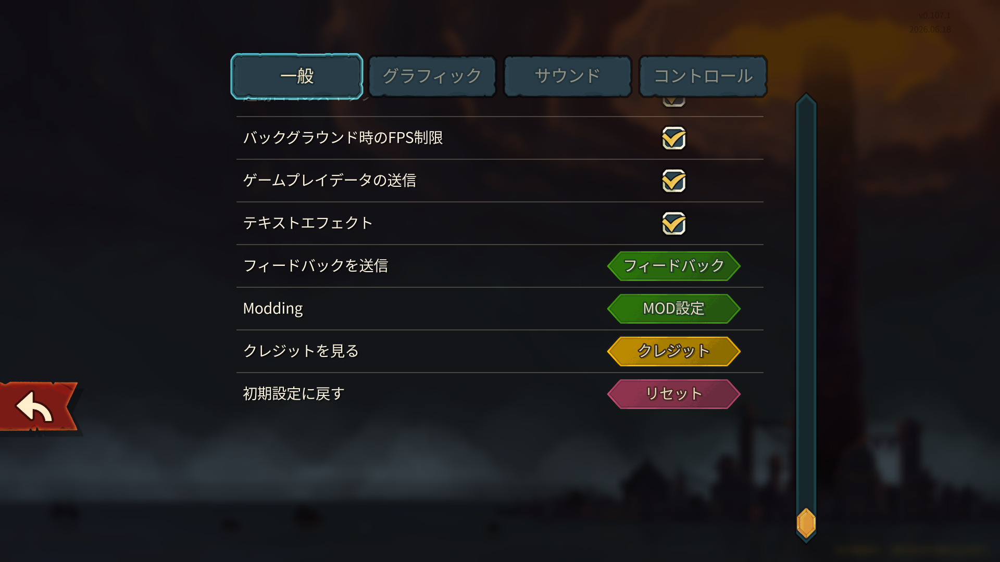
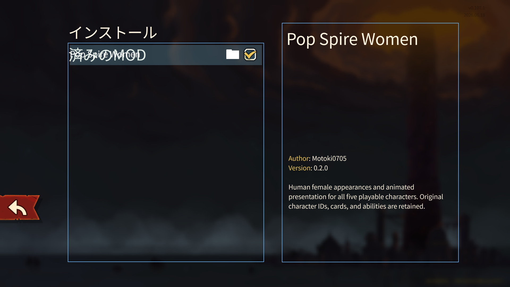

# v0.2.0 導入ガイドの操作画面

[導入・更新・削除の手順](../../../usage/installation.md) / [撮影条件・画像hash](manifest.json)

2026-10-09、Windows版 v0.107.1 / build 59260271、Compatibility renderer。0.2.0の最終PCKを読み込んだ分離ゲーム・QA用プロフィールで撮影した、1920×1080のviewport PNG。元のSteamディレクトリからの起動記録ではない。画像はbyte-copyし、切り抜き・描き直しを行っていない。

| 設定 → 一般を下へスクロール | MOD設定で項目を選択 |
| --- | --- |
|  |  |

右のチェックは撮影開始時点で有効。今回の撮影で元プロフィールのMOD設定を変更したとは扱わない。右側のVersion 0.2.0と左のチェック表示を確認した。対象版では日本語の「インストール済みのMOD」見出しが折り返して先頭行へ重なる表示も観察したため、そのまま残している。

操作後はこの撮影用ゲームだけを終了した。既存の実機QAログ・ゲーム原本・インストール物は変更せず、撮影コマンド・結果・ログは専用の出力先に分けた。
