# v0.2の画像・動画索引

[MODのREADME](../../../../README.md) / [v0.2実機QA](https://github.com/Motoki0705/slay_the_spire_2_mods/blob/19ed278fb58ff1807b7e01e3f6c496133f17a0c9/docs/validation/motion-v02.md) / [媒体・入力SHA-256](manifest.json)

[媒体の通常QA](validation.json) は83バイナリのhash・全decode、実録963フレームの時刻/保持、標本表示を記録します。ゲームの実行・導入は#62担当の結果で、README担当の検証と区別しています。

実ゲームのviewport画像・実録は2026-10-09、所有Windows版 **v0.107.1 / build 59260271 / Compatibility renderer** の隔離コピー・分離プロファイルで収録。５人の選択と15場面の画像20枚、実録MP4は選択５・商人５・休憩５・代表戦闘２の計17本です。最終candidate02の0.2.0は所有installerで導入済みで、導入先からの起動は未確認です。生成素材と通常Godotのrig実演は末尾の独立した入口へ置きます。

- candidate01: 制作基準 `27611c3c388ebf79b24f271f963c885f92774979`、PCK SHA-256 `14005c126351190fa6e38c49e323e8c0398fa12dfe1743673226afddc4cbcb98`。
- candidate02: 制作基準 `27611c3c388ebf79b24f271f963c885f92774979`、PCK SHA-256 `1213c359dc6bee5a129d2f825e876b6ec16a1e8841c4e492c6bfceabbc1b6d94`。

Regentの休憩はcandidate02の画像・録画を使用します。候補間で変わったpack資源は `PopSpireWomen/rigs/regent/rest.json` のみで、旧星形キャラの影を外しました。他の全pack資源のhash一致を根拠に、candidate01の選択と他14場面を引き継ぎます。全試験をcandidate02で再実施したとは記録しません。[QA PR #65](https://github.com/Motoki0705/slay_the_spire_2_mods/pull/65)、固定commit `19ed278fb58ff1807b7e01e3f6c496133f17a0c9` の報告・validation JSONと照合しています。

## 選択画面 — 実ゲーム

PNGは元の1920×1080をbyteコピーし、JPEGは480×270へ比例縮小しています。画像を開くと原寸PNG、MP4を開くと約10秒の実録です。各記録はゲームviewportのみで、デスクトップや課金画面を含みません。

| キャラ | 実機画像 | 無音録画 | 画像の撮影時刻 |
| --- | --- | --- | --- |
| Ironclad | [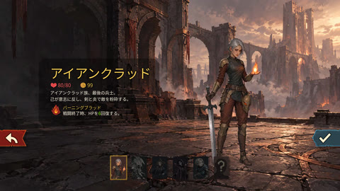](select-ironclad-candidate01.png) | [MP4 · 10.018秒](select-ironclad-candidate01.mp4) | 2026-10-09 18:56:41 JST |
| Silent | [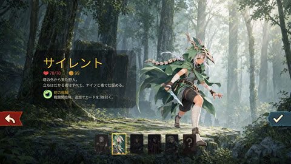](select-silent-candidate01.png) | [MP4 · 10.036秒](select-silent-candidate01.mp4) | 2026-10-09 18:56:56 JST |
| Regent | [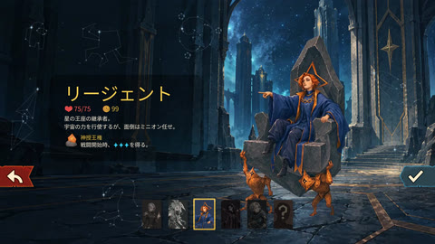](select-regent-candidate01.png) | [MP4 · 10.050秒](select-regent-candidate01.mp4) | 2026-10-09 18:57:08 JST |
| Necrobinder | [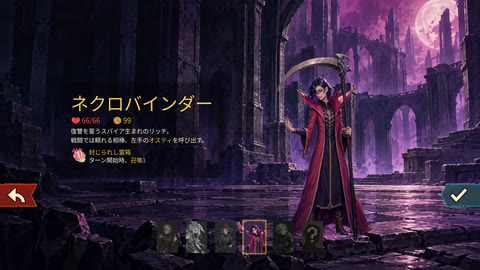](select-necrobinder-candidate01.png) | [MP4 · 10.037秒](select-necrobinder-candidate01.mp4) | 2026-10-09 18:57:22 JST |
| Defect | [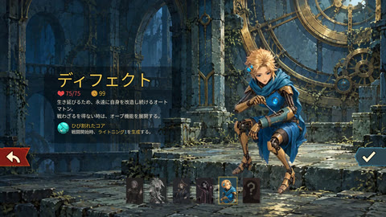](select-defect-candidate01.png) | [MP4 · 10.019秒](select-defect-candidate01.mp4) | 2026-10-09 18:57:35 JST |

選択媒体で見えるのは動画再生・loop・人物puppetがないこと・全身/武器と情報パネルの余白です。最終QAでは切替・退出・再入場、全５人×６fallback遷移、Regent７星座の実入力も確認しました。破損codec・pause/resume・posterもない分岐の網羅は通常Godot fixtureの範囲です。[実機の確認区分](https://github.com/Motoki0705/slay_the_spire_2_mods/blob/19ed278fb58ff1807b7e01e3f6c496133f17a0c9/docs/validation/motion-v02.md#選択画面)。

## 戦闘・商人・休憩 — 実ゲーム

QA用の部屋・カード・エネルギーを準備した実機画像です。PNGリンクは全viewport、以下のJPEGは全viewportの縮小です。root READMEは人物周辺を切り出した別JPEGを使います。休憩はAct 1の `overgrowth_loop`。全Actの通しプレイ・座席構成は未確認です。被弾はDefectだけ通常敵攻撃、他４人はQA console damage。死亡・復活の描画試験と実死亡・協力復活を区別します。

| キャラ | 戦闘 | 商人 | 休憩 |
| --- | --- | --- | --- |
| Ironclad | [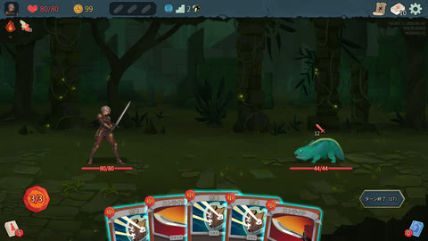](combat-ironclad-candidate01.png) · [所作MP4](combat-ironclad-candidate01.mp4) | [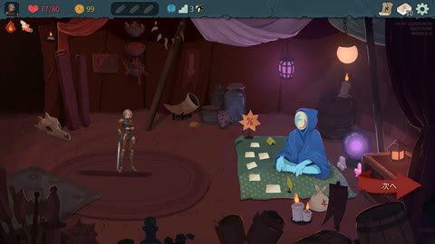](merchant-ironclad-candidate01.png) · [所作MP4](merchant-ironclad-candidate01.mp4) | [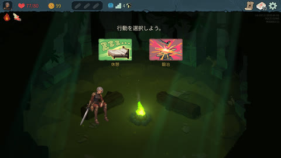](rest-ironclad-candidate01.png) · [所作MP4](rest-ironclad-candidate01.mp4) |
| Silent | [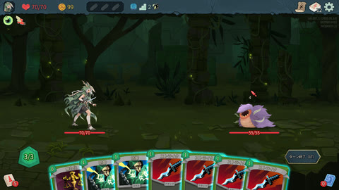](combat-silent-candidate01.png) | [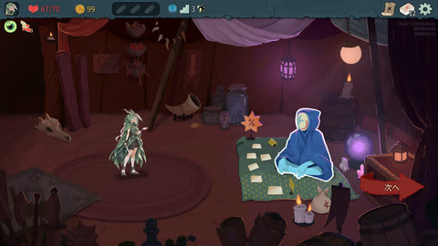](merchant-silent-candidate01.png) · [所作MP4](merchant-silent-candidate01.mp4) | [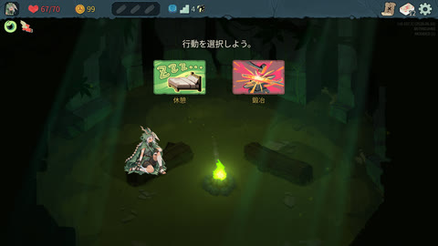](rest-silent-candidate01.png) · [所作MP4](rest-silent-candidate01.mp4) |
| Regent | [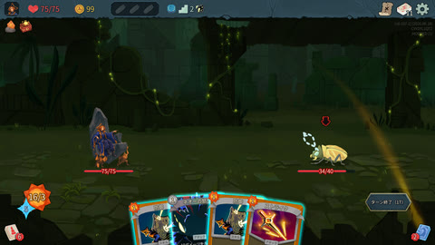](combat-regent-candidate01.png) | [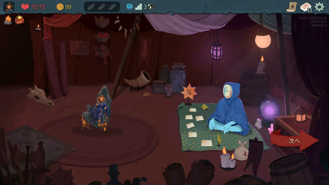](merchant-regent-candidate01.png) · [所作MP4](merchant-regent-candidate01.mp4) | [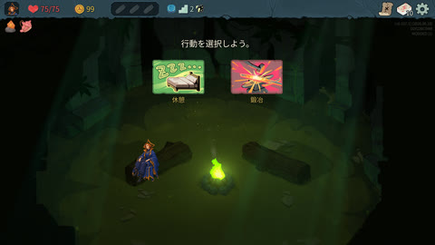](rest-regent-candidate02.png) · [所作MP4](rest-regent-candidate02.mp4) |
| Necrobinder | [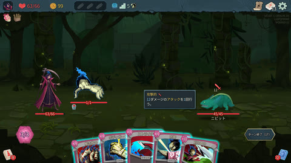](combat-necrobinder-candidate01.png) · [所作MP4](combat-necrobinder-candidate01.mp4) | [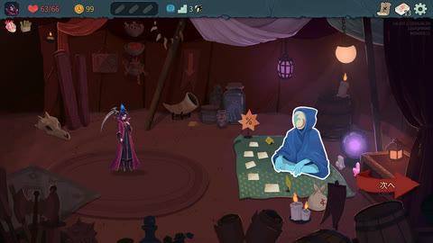](merchant-necrobinder-candidate01.png) · [所作MP4](merchant-necrobinder-candidate01.mp4) | [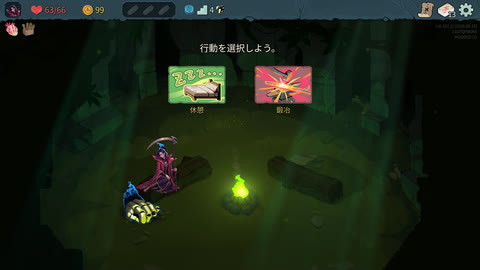](rest-necrobinder-candidate01.png) · [所作MP4](rest-necrobinder-candidate01.mp4) |
| Defect | [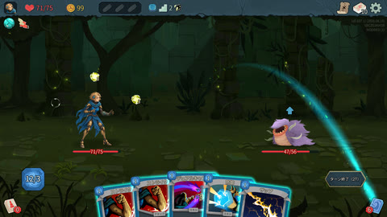](combat-defect-candidate01.png) | [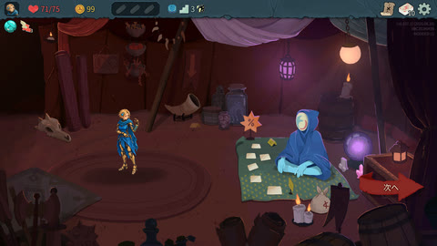](merchant-defect-candidate01.png) · [所作MP4](merchant-defect-candidate01.mp4) | [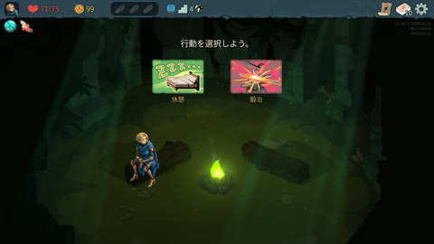](rest-defect-candidate01.png) · [所作MP4](rest-defect-candidate01.mp4) |

## 実録の時間と変換

原寸PNGはbyte-copy、全viewport JPEGは480×270。人物比較用の `*-detail.jpg` は元1920×1080から下記の矩形を切り出し、Lanczos比例縮小・`q:v=3`で保存しました。人物・背景・武器の描き直しやPNG原本の編集は行っていません。切り出し範囲と入出力hashをmanifestに記録します。

| 場面 | 元PNGの切り出し（x, y, 幅, 高さ） | JPEG寸法 |
| --- | --- | --- |
| 戦闘 | 160, 300, 960, 640 | 480×320 |
| 商人 | 160, 360, 960, 640 | 480×320 |
| 休憩 | 320, 500, 800, 500 | 480×300 |

実録の入力はQA担当がゲームviewportをJPEGで採取したフレームと`capture.json`。固定fpsで並べ直さず、各`time_ms`から最初の取得時刻を引いて0に揃え、最後の画像は`actualtime_ms`まで保持しています。映像速度は変更していません。元フレームはローカルに残し、公開の`.timing.json`には元時刻・各保持時間・入力SHA-256を記録します。

MP4は比例縮小1280×720、H.264 CRF24、無音。可変間隔を1msのtime baseで保持し、全入力フレームのpresentation timestampと最後の保持時間をdecode/packet情報で照合しています。カメラの要求10fpsはゲーム描画の実fpsや性能測定を意味しません。

先頭用GIFはSilentのMP4から隔フレームを採り、640×360・128色へ変換しています。101入力から51枚（約5fps）を使い、元の経過時間を維持。GIF形式は時刻を10ms単位へ丸めるため最大5msの差があります。MP4は1ms精度の実時間版、GIFは色数と標本数を落としたプレビューです。実録ファイル自体のループ再開点と、約7.67秒のゲーム素材loopの接続は別です。

| キャラ・場面・候補 | 録画の撮影時刻 | 入力数 | 経過時間→表示時間 | 先頭の取得遅れ / 最後の保持 | 媒体 / 元時刻・hash |
| --- | --- | --- | --- | --- | --- |
| ironclad / select / candidate01 | 2026-10-09 18:56:52 JST | 101 | 10025→10018ms | 7 / 85ms | [MP4](select-ironclad-candidate01.mp4) / [timing](select-ironclad-candidate01.timing.json) |
| silent / select / candidate01 | 2026-10-09 18:57:05 JST | 101 | 10047→10036ms | 11 / 119ms | [MP4](select-silent-candidate01.mp4) / [timing](select-silent-candidate01.timing.json) / [GIF](select-silent-candidate01.gif) |
| regent / select / candidate01 | 2026-10-09 18:57:19 JST | 101 | 10056→10050ms | 6 / 95ms | [MP4](select-regent-candidate01.mp4) / [timing](select-regent-candidate01.timing.json) |
| necrobinder / select / candidate01 | 2026-10-09 18:57:31 JST | 101 | 10049→10037ms | 12 / 116ms | [MP4](select-necrobinder-candidate01.mp4) / [timing](select-necrobinder-candidate01.timing.json) |
| defect / select / candidate01 | 2026-10-09 18:57:46 JST | 101 | 10031→10019ms | 12 / 69ms | [MP4](select-defect-candidate01.mp4) / [timing](select-defect-candidate01.timing.json) |
| defect / merchant / candidate01 | 2026-10-09 19:00:47 JST | 41 | 4035→4029ms | 6 / 112ms | [MP4](merchant-defect-candidate01.mp4) / [timing](merchant-defect-candidate01.timing.json) |
| defect / rest / candidate01 | 2026-10-09 19:00:56 JST | 41 | 4033→4025ms | 8 / 91ms | [MP4](rest-defect-candidate01.mp4) / [timing](rest-defect-candidate01.timing.json) |
| regent / merchant / candidate01 | 2026-10-09 19:03:16 JST | 41 | 4049→4040ms | 9 / 107ms | [MP4](merchant-regent-candidate01.mp4) / [timing](merchant-regent-candidate01.timing.json) |
| ironclad / combat / candidate01 | 2026-10-09 19:08:24 JST | 31 | 3054→3044ms | 10 / 111ms | [MP4](combat-ironclad-candidate01.mp4) / [timing](combat-ironclad-candidate01.timing.json) |
| ironclad / merchant / candidate01 | 2026-10-09（個別時刻未引き渡し） | 41 | 4053→4043ms | 10 / 109ms | [MP4](merchant-ironclad-candidate01.mp4) / [timing](merchant-ironclad-candidate01.timing.json) |
| ironclad / rest / candidate01 | 2026-10-09 19:09:51 JST | 41 | 4048→4041ms | 7 / 91ms | [MP4](rest-ironclad-candidate01.mp4) / [timing](rest-ironclad-candidate01.timing.json) |
| silent / merchant / candidate01 | 2026-10-09 19:11:45 JST | 41 | 4054→4047ms | 7 / 113ms | [MP4](merchant-silent-candidate01.mp4) / [timing](merchant-silent-candidate01.timing.json) |
| silent / rest / candidate01 | 2026-10-09 19:11:55 JST | 41 | 4052→4041ms | 11 / 91ms | [MP4](rest-silent-candidate01.mp4) / [timing](rest-silent-candidate01.timing.json) |
| necrobinder / merchant / candidate01 | 2026-10-09 19:17:47 JST | 36 | 4009→3988ms | 21 / 62ms | [MP4](merchant-necrobinder-candidate01.mp4) / [timing](merchant-necrobinder-candidate01.timing.json) |
| necrobinder / rest / candidate01 | 2026-10-09 19:17:58 JST | 40 | 4071→4067ms | 4 / 97ms | [MP4](rest-necrobinder-candidate01.mp4) / [timing](rest-necrobinder-candidate01.timing.json) |
| necrobinder / combat / candidate01 | 2026-10-09 19:21:42 JST | 23 | 4054→4047ms | 7 / 103ms | [MP4](combat-necrobinder-candidate01.mp4) / [timing](combat-necrobinder-candidate01.timing.json) |
| regent / rest / candidate02 | 2026-10-09 19:45:17 JST | 41 | 4032→4021ms | 11 / 88ms | [MP4](rest-regent-candidate02.mp4) / [timing](rest-regent-candidate02.timing.json) |

SilentのMP4は10.036秒、GIFは10.040秒（形式上の差4ms）、約2.80MB。全媒体のSHA-256と変換引数は [manifest](manifest.json)。原PNG/生成MP4/OGVや元ゲームの資源は編集していません。

Ironclad商人の録画だけは引き渡しに個別の絶対撮影時刻がなく、QAセッション日と実測`time_ms`を記録しました。ファイル時刻から推測して埋めていません。元handoffのclip単位review statusは原記録として保持し、媒体担当のdecode/hash/時刻照合と標本表示確認を別に記録しています。

## 確認範囲と未確認

最終QAで５人の代表カード・独立Osty/剣/Orb、15場面の姿勢・支持点・所作、Regent休憩の修正を確認しています。導入後はreceipt・実ファイルhashと原gameの４pinが一致し、今回あらためて採取した元プロフィール400ファイルは不変でした。[確認・納品の原記録](https://github.com/Motoki0705/slay_the_spire_2_mods/blob/19ed278fb58ff1807b7e01e3f6c496133f17a0c9/docs/validation/motion-v02.md)。

導入先からの起動、v0.2の通常死亡～結果、実co-op復活/再接続、全カード・速度・Act・別renderer/他MOD・厳密な性能は未確認です。Compatibilityのparticle非対応警告と終了時の資源解放ログも未切り分け。旧v0.1の記録を現在の実プレイ合格へ流用していません。[#45](https://github.com/Motoki0705/slay_the_spire_2_mods/issues/45) / [#46](https://github.com/Motoki0705/slay_the_spire_2_mods/issues/46)。

## 生成素材・単独rig・旧版を読む

| 媒体 | 日付・対象 | 見て確認できる範囲 |
| --- | --- | --- |
| [H3生成動画の軽量プレビュー](generated/README.md) | 2026-10-09、MiniMax-H3 / 768P、５本 | 選択演技の素材。ゲームUI・星座操作を含まない |
| [場面別の制作画像](../contextual-v02/README.md) | 2026-10-09、15採用姿勢 | 選択の元姿勢／戦闘／商人／休憩のデザイン比較 |
| [通常Godotの15rig実演](../../../../tests/assets/contextual-evidence/README.md) | 2026-10-09、contextual_v02 | 武器・支持点と局所的な所作。実ゲームの動作時間や性能は示さない |
| [v0.1の実機画像・録画](../progress-2026-10-09/README.md) | 2026-10-09、production-candidate-02〜05 | 旧版の履歴。H3や新15姿勢の実機証拠へ流用しない |

Silent v05の個別ユーザー承認は基準デザインに限ります。他４人v02・新15姿勢・H3動画は委任に基づく制作採用です。
