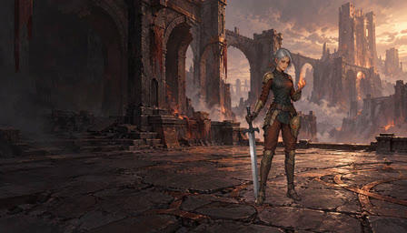
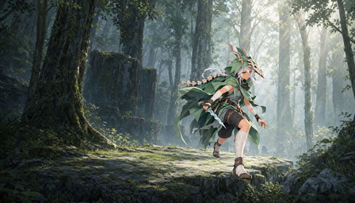
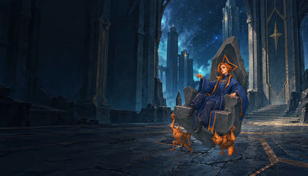
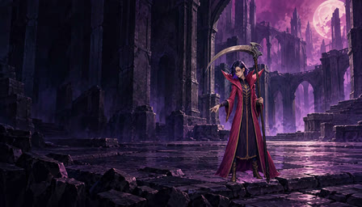
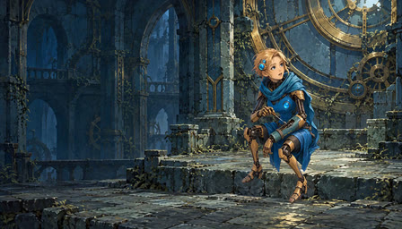

# H3選択動画 v0.2 — 軽量プレビュー

2026-10-09制作。以下は **MiniMax-H3 / 768Pで生成した素材**です。選択UIを含むゲーム実録とは別の入口です。[実機媒体と確認範囲](../README.md) / [原動画・制作記録](../../../../../output/videogen/README.md)。

クリックで無音MP4を開きます。５本とも672×384、24fps、184frame、約7.67秒。生成済みの無音loopを比例縮小し、時間と7:4の比率を保持しました。５本のMP4の合計は約0.93MB、ポスターJPEGの合計は約0.19MBです。静止thumbnailだけを表示し、動画は個別に開く構成です。

| キャラ | ポスター → 無音MP4 | 演技 |
| --- | --- | --- |
| Ironclad |  | 掌の炎を抑え、視線を上げて戻す |
| Silent |  | 気配に反応し、短剣を右へ構え直す |
| Regent |  | 指図する手と顔、玉座・運び手の重心 |
| Necrobinder |  | 自由な掌に小さい魔力を集め、収める |
| Defect |  | 腕と工具へ視線を下げ、手元を確かめる |

原生成は各８秒・192frame・1344×768。元の制作工程で音声を除去し、終端８frameを始端８frameへ重ねた184frameの配布loopを、このプレビューの入力にしています。README担当は再生成や追加のloop編集をしていません。実ゲームではviewportに中央aspect-coverで表示されるため、上の素材だけからUIとの重なりや見切れを判断しないでください。

[manifest.json](../manifest.json) に入力PNG・無音loop・posterのSHA-256、縮小した出力のSHA-256、寸法・decode結果・変換コマンドを残しています。MP4はH.264 CRF25、JPEGはLanczos縮小・`q:v=3`。原PNG/MP4/OGVは変更していません。Silent v05の個別承認は基準デザインに限り、今回の動画は親への委任に基づく制作採用です。
