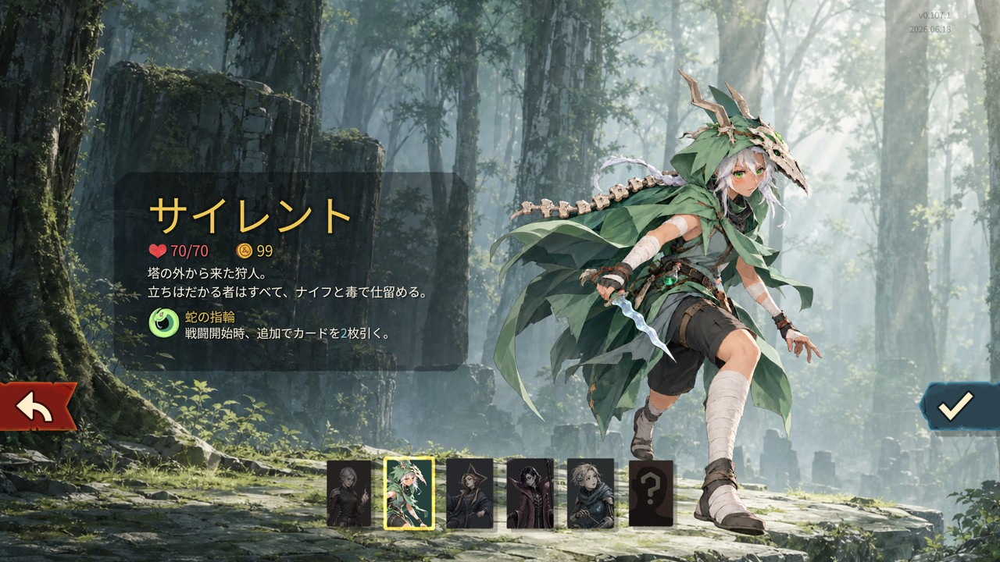
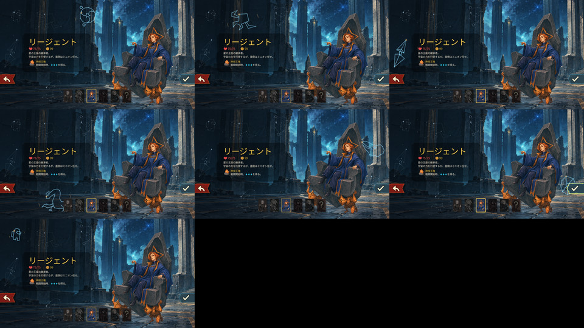

# 実機媒体索引 — 2026-10-09

[プロジェクトREADME](../../../../README.md) / [デザイン画と過去版](../../../design/characters/review-gallery.md) / [寸法・サイズ・SHA-256](manifest.json)

このフォルダーには、親担当が所有Windows版 **v0.107.1 / 59260271** で取得した実ゲームの画面を選定して保存しています。撮影日は **2026-10-09（JST）**。ゲーム右上の `2026.06.18` はゲーム自身の版表示で、撮影日とは別です。

PNGは指定入力の同一バイトコピー、README用JPEGは画面全体を960×540へ縮小したものです。切り抜き・人物の修整・表示不具合の消去・AIによる補完はしていません。入力の原本は変更していません。デザイン画・生成履歴・不採用の過去版は、この実機記録に混在させず上記のギャラリーから参照します。

## 選択画面の５人

**production-candidate-04** へ再起動して撮影した５人の選択時の外観とUI表示です。基本の操作確認は先行候補02/03の記録に基づき、候補04での再確認箇所は下の表に分けています。候補04の全場面を確認済みとは扱いません。

| キャラ | 原寸実機PNG | README用JPEG | デザイン基準・採用状態 |
| --- | --- | --- | --- |
| Ironclad | [1920×1080](select-ironclad-candidate04.png) | [960×540](select-ironclad-candidate04.jpg) | v02・委任に基づく制作採用 |
| Silent | [1920×1080](select-silent-candidate04.png) | [960×540](select-silent-candidate04.jpg) | v05・基準デザインのユーザー承認済み |
| Regent | [1920×1080](select-regent-candidate04.png) | [960×540](select-regent-candidate04.jpg) | v02・委任に基づく制作採用 |
| Necrobinder | [1920×1080](select-necrobinder-candidate04.png) | [960×540](select-necrobinder-candidate04.jpg) | v02・委任に基づく制作採用 |
| Defect | [1920×1080](select-defect-candidate04.png) | [960×540](select-defect-candidate04.jpg) | v02・委任に基づく制作採用 |

基準デザインの承認と、ゲーム内派生素材の表示・動作の検証は別です。原寸PNGでも静止画だけから動作の合否は判断しません。

## Silentの選択画面の実録

[MP4（1280×720、約６秒、無音）](silent-selection-candidate04.mp4) / [GIF（640×360）](silent-selection-candidate04.gif) / [親担当のcapture.jsonの同一バイトコピー](silent-selection-candidate04-capture.json) / [各フレームの時刻・寸法・SHA-256](silent-selection-candidate04-frames.json)

**candidate04** のゲームviewportを親担当が実際に収録したJPEG **61フレーム**から作成しました。髪・外套の揺れと、約3.85秒のまばたきを目視で確認。画像・動画AIは使用していません。選択画面の待機動作の記録であり、攻撃や協力プレイの映像ではありません。

入力は1280×720、収録全体は6,034ms。最初のフレームの時刻13msを先頭にそろえた動画の対象時間は **6,021ms** です。各 `time_ms` の差をそのまま表示時間に使い、最後の画像を収録終了時刻まで保持しました。MP4の全入力フレームの表示時刻は元記録とms単位で一致し、コンテナーの終端は6,022ms。GIFは同じ可変間隔を1/100秒単位で保持し、元記録との差は最大10ms、末尾の71msは70msとなります。GIF全体は6,020msです。動きの補間・加速・スロー化はしていません。

MP4はH.264、元と同じ1280×720、CRF18。GIFは640×360・128色で軽量化しています。実ファイルのサイズ・フレーム数・hashはmanifestを参照。収録の要求値10fpsは**記録頻度**であり、ゲーム本体のFPS測定値ではありません。サムネイルは最初のJPEGの同一バイトコピーです。元のJPEG入力は親担当の保存先に保持されています。

## Regentの７星座の入力確認

**candidate03**。親担当が７つの星座それぞれにカーソルを合わせた実機画面を、３列の比較画像にしたものです。各星座の反応を並べて確認できます。下段の黒い２枠は比較画像の空き枠で、ゲームの黒画面や失敗した撮影ではありません。この比較は静止画であり、時間順の動きの代わりにはしません。

## 修正確認・修正前の実機画像

| 画像 | 撮影候補 | 読み取れること |
| --- | --- | --- |
| Silentの休憩 [PNG](silent-rest-candidate03.png) / [JPEG](silent-rest-candidate03.jpg) | candidate03・休憩修正確認用 | 座り姿の大きさと位置。親担当は元表示との切替、休憩選択、放棄時の結果画面も確認。静止画だけから操作の成功を判定したわけではない |
| Necrobinderの商人 [PNG](necrobinder-merchant-before-fix-candidate03.png) / [JPEG](necrobinder-merchant-before-fix-candidate03.jpg) | candidate03・修正前 | 青い炎が頭から離れて高い位置に残る。修正済みの画像として使用しない |
| Necrobinderの商人 [PNG](necrobinder-merchant-after-fix-candidate04.png) / [JPEG](necrobinder-merchant-after-fix-candidate04.jpg) | candidate04・中間修正 | 頭から離れた炎を解消した時点の画像。高さは調整前。現行の修正結果は候補05を参照 |
| Necrobinderの休憩 [PNG](necrobinder-rest-after-fix-candidate04.png) / [JPEG](necrobinder-rest-after-fix-candidate04.jpg) | candidate04・中間修正 | 本人と独立したOstyを表示。Osty側の炎も残る。本人の炎の高さは調整前 |
| Necrobinderの商人 [PNG](necrobinder-merchant-final-candidate05.png) / [JPEG](necrobinder-merchant-final-candidate05.jpg) | candidate05・高さ調整後 | 小さい炎を髪のすぐ上へ調整。最新のREADME比較に使用 |
| Necrobinderの休憩 [PNG](necrobinder-rest-final-candidate05.png) / [JPEG](necrobinder-rest-final-candidate05.jpg) | candidate05・高さ調整後 | 本人の頭上の小さい炎と、独立したOsty側の炎を表示 |
| Necrobinderの戦闘 [PNG](necrobinder-combat-final-candidate05.png) / [JPEG](necrobinder-combat-final-candidate05.jpg) | candidate05・高さ調整後 | 本人の頭上の炎と独立したOstyを表示。親担当は元の表示との切替で位置・倍率の復元、手動のdeath→revive描画で炎の消灯・再点灯も確認。実際の協力プレイ復活とは別 |

## 戦闘・戦闘外の表示

| 画像 | 撮影候補 | 読み取れること |
| --- | --- | --- |
| Defectの戦闘 [PNG](defect-combat-two-orbs-candidate03.png) / [JPEG](defect-combat-two-orbs-candidate03.jpg) | candidate03 | 本体と２個のオーブを表示。実機QAでカードを確認するためエナジーを補充した場面であり、画面の `13/3` は通常プレイのバランス変更を示さない。親担当はStrike・Zap・Dualcastとオーブ数を確認 |
| Defectの休憩 [PNG](defect-rest-candidate03.png) / [JPEG](defect-rest-candidate03.jpg) | candidate03 | 休憩画面で座った姿を表示。商人・休憩の表示確認も親担当の記録にある |
| Regentの商人 [PNG](regent-merchant-candidate03.png) / [JPEG](regent-merchant-candidate03.jpg) | candidate03 | 商人画面で本人・玉座・担ぎ手を表示。画面遷移の暗転が終わった後の撮影 |
| Ironcladの休憩 [PNG](ironclad-rest-candidate04.png) / [JPEG](ironclad-rest-candidate04.jpg) | candidate04 | 休憩姿と大きさを実機で再確認 |
| Ironcladの刀身 [PNG](ironclad-sword-check-candidate04.png) / [JPEG](ironclad-sword-check-candidate04.jpg) | candidate04・手動の描画試験 | 元ゲームのdeath→revive描画を手動で発生させ、刀身の形を確認した際の戦闘画面。画像で見られるのは刀身の形状。エナジー補充あり。実死亡から結果画面への進行や、協力プレイの復活確認とは別 |

協力プレイは、分離検証環境でSteam初期化を必要とする試験を開始できず、実プレイ未確認です。保存再開はIroncladの戦闘・SilentのNeowで確認されています。他の保存場面・協力プレイの再開、最終負荷測定、Defectの通常被弾は未確認です。個別の動作確認を、ゲーム全体の互換性・完成判定へ拡張しません。

## 版と来歴

文書制作の基準commitは `91f60b681aceccb6ab1d1cacca833a7252806738`。これは撮影に使ったコードやPCKの完全同一版を表すものではありません。候補04の選択画面・録画に使ったPCKの親担当記録SHA-256は `f03df72299be4de68eb5c6d5cba2a879cbf90649d88d9de69c5811d1a660ee2f`。先行候補03の画面にこのhashを割り当てません。候補番号は親担当の指定に従い、撮影入力・変換後出力のSHA-256、実寸法、byte数を [manifest.json](manifest.json) に記録します。

候補05の変更はNecrobinderの炎の高さのみで、親担当から候補04の選択画像と実録は引き続き使用可との引き渡しです。候補05のPCK SHA-256は `da0bafc06f85520b61f2550fdb2f2bef0cc3f8d1be6023764c0891d5301a1781`。候補04と候補05のhashは各媒体へ別々に記録しています。

指定入力のルートは `PopSpireWomenQA/20261009/results`。manifestの `source.file` が親担当の入力ファイル名、`original_copy` がこのフォルダーに保存した原寸コピー、`preview` がREADME用の派生です。`qa_status` は親担当のキャラ別確認状態、`parent_handoff` は引き渡し記録のhashです。媒体索引の内容は親担当の記録を説明する文書制作であり、担当がゲームを操作して検証した結果ではありません。validator評価は指定0回・試行0回です。
