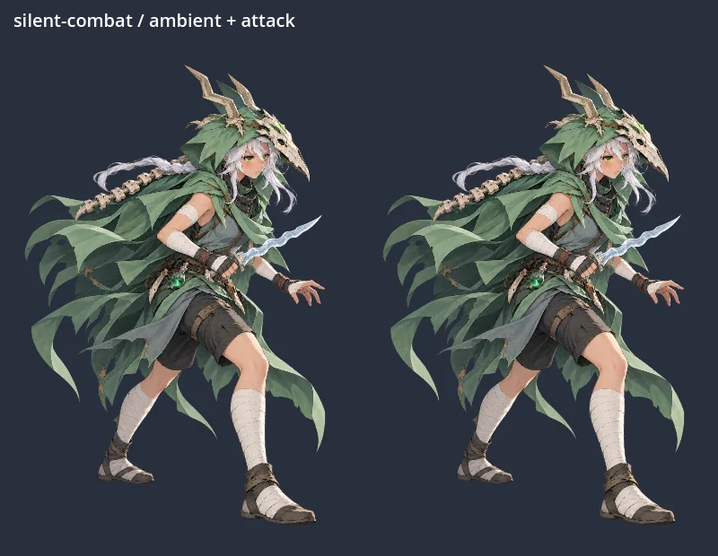

# 場面別rigの実描画 — Issue #53

通常Godot 4.5.1の一時PCKで、親から受領した15枚を描画した実装担当の通常検証。**ゲームの画面・H3動画ではない。validatorは0回。** 元PNGは再保存せず、hashを保持した。制作採用は親への委任に基づき、Silent v05以外をユーザーが個別承認したとは扱わない。

記録日時（UTC）: 2026-10-09T08:41:44.078861+00:00

[検証値・入力/rig/媒体hash](validation.json)、[設計・再現手順・未確認](../../../docs/development/contextual-rigs-v02.md)。静止一覧はlossless WebP、所作は実rendererの24frameを4.08秒のanimated WebPへ変換した。元animationの位相0〜1をゆっくり見せる検査映像であり、実ゲームの動作尺や性能を示さない。表示はcanvasまたは支持物boundsの高さを540pxへ揃えており、実際の場面の倍率とは異なる。

| 人物 | 場面 | 静止一覧 | 動き |
| --- | --- | --- | --- |
| ironclad | combat | [代表姿勢](ironclad-combat-states.webp) | [所作ループ](ironclad-combat-motion.webp) |
| ironclad | merchant | [代表姿勢](ironclad-merchant-states.webp) | [所作ループ](ironclad-merchant-motion.webp) |
| ironclad | rest | [代表姿勢](ironclad-rest-states.webp) | [所作ループ](ironclad-rest-motion.webp) |
| silent | combat | [代表姿勢](silent-combat-states.webp) | [所作ループ](silent-combat-motion.webp) |
| silent | merchant | [代表姿勢](silent-merchant-states.webp) | [所作ループ](silent-merchant-motion.webp) |
| silent | rest | [代表姿勢](silent-rest-states.webp) | [所作ループ](silent-rest-motion.webp) |
| regent | combat | [代表姿勢](regent-combat-states.webp) | [所作ループ](regent-combat-motion.webp) |
| regent | merchant | [代表姿勢](regent-merchant-states.webp) | [所作ループ](regent-merchant-motion.webp) |
| regent | rest | [代表姿勢](regent-rest-states.webp) | [所作ループ](regent-rest-motion.webp) |
| necrobinder | combat | [代表姿勢](necrobinder-combat-states.webp) | [所作ループ](necrobinder-combat-motion.webp) |
| necrobinder | merchant | [代表姿勢](necrobinder-merchant-states.webp) | [所作ループ](necrobinder-merchant-motion.webp) |
| necrobinder | rest | [代表姿勢](necrobinder-rest-states.webp) | [所作ループ](necrobinder-rest-motion.webp) |
| defect | combat | [代表姿勢](defect-combat-states.webp) | [所作ループ](defect-combat-motion.webp) |
| defect | merchant | [代表姿勢](defect-merchant-states.webp) | [所作ループ](defect-merchant-motion.webp) |
| defect | rest | [代表姿勢](defect-rest-states.webp) | [所作ループ](defect-rest-motion.webp) |

戦闘の一覧はidle / hurt / attack / die。商人・休憩はambient２位相 / attack / dieで、戦闘動作は姿勢を壊さないかの負荷確認でもある。休憩の元ゲーム側の椅子・岩・火はfixtureに含めない。RegentのthroneだけはMODが所有する既存画像の独立mesh。

15場面・計90動作を51位相で数値検査。武器/顔/指/靴probeの変換差は最大0.000259 source px未満、同一骨上の２点間距離差は0.000367px未満、固定接点の差は0.000031px未満。閾値は各0.03px。静止時の差は16階調を超える画素が最大3/1,572,864画素で、他は0。入力保護、mesh面積/重み、schema、mix、死亡保持、復活、reduced motion、NecrobinderのVFX位置/倍率復帰を含む。

実際のカード・音/event・Osty/独立剣/Orbのゲーム処理、座席と炎の最終配置は親の実機QAが残る。既存compilerのテスト１件には全rigをlegacyとする古い期待値が残り、所有外の修正として親に引き継いだ。新15rigはsourceとcompiledの一致、profileの独立、選択sourceの保全を検査済み。
