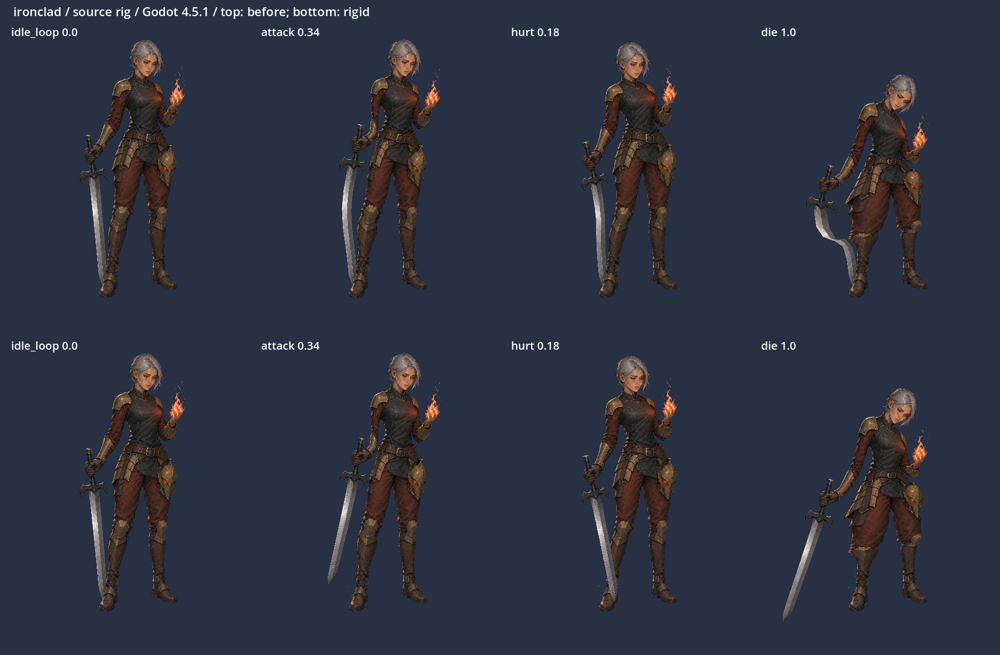
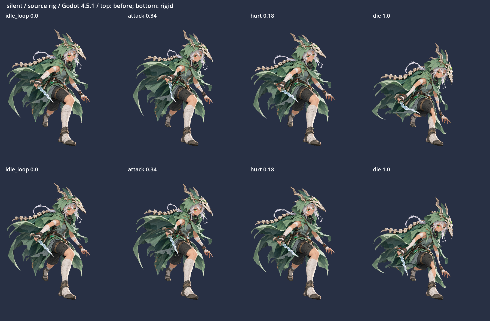
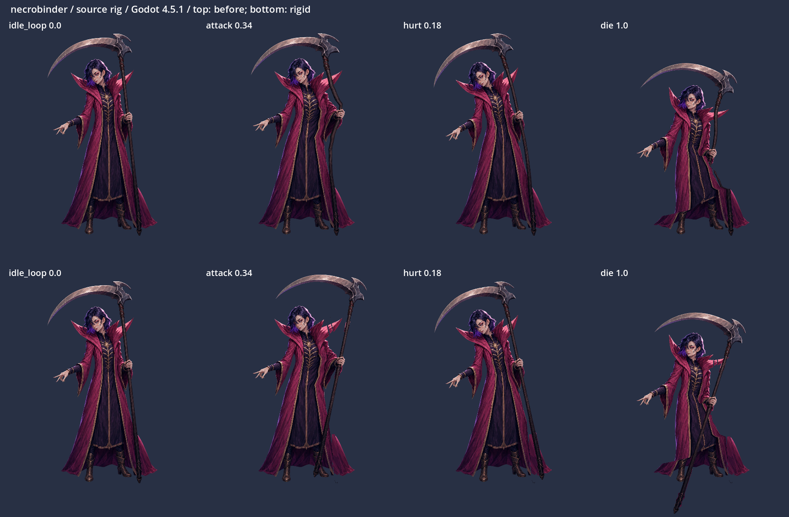

# 武器meshの通常検証 — 2026-10-09

[方式・座標・再生成手順](../../../docs/development/weapon-rig.md)。担当自身による実装修正の検証。**validatorは指定0 / 試行0 / 完了0。ゲーム未起動、修正後の実機確認は親担当。** ユーザーの個別デザイン承認や独立評価を示すものではない。

## 固定した対象と検証

`mesh-receipt.json` にPNG、非mesh metadata、ルール、生成器、３つの生成rigのhashを記録。`validation-inputs.json` に実renderer・schema・motion library・検証コード・Godot binary・証拠のhashを記録した。原画像３枚のSHA-256は変更前と同じ。元rigの `meshes` 以外は基準commitと同じ。共有renderer、schema、overrides、compiler、compiled rigsは変更していない。

- Godot 4.5.1 Linux / OpenGL compatibility / Mesa llvmpipe。原textureを持つ独立PCKをexportし、空のhostから読み込んで描画した。
- **CHECKS=5114 / FAILURES=0**。`attack / attack_heavy / shiv / hurt / die / cast / select / idle_loop` 各101位相、attack→dieのmix、死亡保持、revive reset。`weapon-render.log` と `metrics.json` に結果を保存。
- 追加のPython検査: 再生成byte一致、PNG mismatch時の全rig書込み前拒否、canvas被覆・重複、武器三角形の手100%固定、下地の位置とUV範囲、静止画差分。`geometry.json` と `neutral-images.json` を参照。
- 全PNG・PCK・生ログはローカルの `/tmp/sts2-autonomous/weapon_rig/final-validation/`。PCKとneutral前後画像はこのフォルダーへ再配布せず、hashのみ記録した。PR内のPNGは自作素材をGodotで描いた検証画像。元ゲームのrawcodeは含めない。

## 数値の前後比較

距離誤差は、ルールに記した握り・刃・柄のprobe全組の元の長さに対する相対誤差。曲がった刃の輪郭を直線だと仮定しない。「手の変換との差」は実際の描画三角形内で補間した点と `T_hand p` の差。修正後は８動作・101位相中の最大値。

| キャラ | 修正前dieの最大距離誤差 | 修正後の最大距離誤差 | 手の変換との差 source px | 身体denseサンプルの最大差 source / 高さ300の表示px |
| --- | ---: | ---: | ---: | ---: |
| ironclad | 32.460% | 0.000203% | 0.000290 | 1.692 / 0.330 |
| silent | 24.975% | 0.000305% | 0.000136 | 14.103 / 2.755 |
| necrobinder | 42.227% | 0.000118% | 0.000261 | 13.544 / 2.645 |

顔・胴・足の名前付き基準点は全動作で差0.00025 source px未満、握りの差は0.00014 source px未満。身体denseサンプルはIronclad 2,254点、Silent 3,575点、Necrobinder 2,697点。可視画素を12px間隔で採り、武器と手首の接続帯を除いた。各動作の位相0 / .16 / .18 / .34 / .50 / .72 / 1で比較した。

細分割した境界付近には重み補間に由来する位置差が残る。最大はSilentの外套 `(306,642)` 付近、Necrobinderの袖 `(726,726)` 付近。既存の全画素の動きが完全一致するという検証ではない。検査上限は武器位置0.01 source px、距離相対誤差0.00001、名前付き身体点0.01 source px、身体dense点16 source px（表示高300で3.125px）。目視で棄却した連続mesh案の、靴・裾が刀身まで大きく伸びる現象はこの上限を大幅に超える。

neutral前後で色差16/255超のpixelは３人とも0。最大channel差はIronclad 0、Silent 1、Necrobinder 6。下地が静止時に見えて衣装を描き変えていないことを確認した。数値だけで模様・陰影の自然さを保証しない。

## 目視した比較

上段が従来grid、下段が修正。左からneutral、attack .34、hurt .18、die 1。画像は比較のためcanvas高さ500で描画している。

Ironcladは死亡・攻撃で剣先まで同じ回転に従う。握りを維持し、剣先に近い靴を引っ張らない。剣と靴が重なる境界は元の可視輪郭で分けた。床への着地を作る修正ではない。

Silentは短い武器でも刃先が腰の重みに近く、死亡時の相対距離誤差が約25%あったため修正対象にした。波形を維持し、旧位置の布には隣の布UVによる下地を置く。

Necrobinderは刃・長い柄・下端の金具まで一体に動く。襟・裾の旧遮蔽域には小さな下地がある。隠れていた模様を正確に復元したものではなく、袖・襟付近の継ぎ目と裾の見え方は親の実機QAにも残す。

輪郭とprobeの位置: [Ironclad](ironclad-outline.png) / [Silent](silent-outline.png) / [Necrobinder](necrobinder-outline.png)。透明余白上の粗い輪郭と、靴・衣装に接する細かい境界を区別している。

## 費用・性能・残課題

画像/動画生成、API課金、Spine Editorは使用していない。textureは既存PNGを共有し、下地にも新しいtextureを作らない。元のbodyは247頂点 / 432三角形。以下はbodyと下地の合計で、既存の目layerを除く。

| キャラ | 修正後 頂点 / 三角形 | 追加Polygon2D | CPU pose sample参考値 旧 → 新 |
| --- | ---: | ---: | ---: |
| ironclad | 434 / 636 | +0 | 376.3 → 526.2 μs |
| silent | 608 / 807 | +1 | 330.7 → 814.2 μs |
| necrobinder | 621 / 820 | +2 | 339.3 → 729.0 μs |

CPU値はこのLinux実行で100回のpose sampleを計った参考値。再生成するrigの内容とは独立し、環境・負荷で変わる。GPUやWindowsゲームのFPSを測った値ではない。runtimeのmesh上限4096頂点 / 8192三角形以内。

残る確認は親のcompiled rigs・overrideを重ねた配布PCK、Windowsゲーム内の表示位置・床・VFX・他MODとの組合せ。既存clipの大きい回転は保つため、剣・鎌の先端が元の柔らかいmeshより大きく動く。別の死亡キー、衝突、IK、ゲーム状態制御は追加していない。
